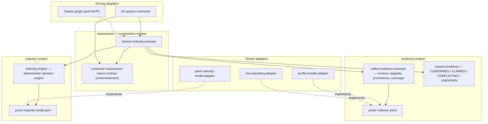

# INSTALL.md - AIDD Assessment

Technical vision and installation guide.

*Working product name. The repository is `laivel-up`; no architecture decision derives from that name.*

## Vision

An evidence-based AIDD assessment that shows developers their current AI-driven development maturity, explains why, and gives them concrete steps to reach the next level.

The governing principle is **don't ask what you can observe, and don't pretend to know what you can't prove**.

The tool inspects a repository, its harness configuration and its Git activity before asking anything, then classifies every piece of evidence as `CONFIRMED`, `CLAIMED`, `CONFLICTING` or `UNKNOWN`.

Target users are developers working with AI coding agents; tech leads and organisations are a later audience the core must not preclude.

The differentiator is that the maturity level is **calculated deterministically and explained, never inferred by a language model**. An LLM may narrate the result, never decide it.

The deterministic decision chain is:

```text
raw observations
      ↓
normalised evidence
      ↓
evidence resolution
      ↓
axis satisfaction
      ↓
level satisfaction
      ↓
highest proven maturity level
```

Every transition in this chain is deterministic, independently testable and explainable in the final assessment report.

## Decision semantics

The assessment follows two conservative rules:

> **A level is earned by evidence, never inferred from missing information.**
>
> **AIDD must never recommend changing a practice merely because it failed to prove that practice.**

This distinction separates a **maturity gap** from an **evidence gap**:

* `NOT_MET` means observed evidence proves that the practice does not meet the requirement. AIDD may recommend improving the practice.
* `UNPROVEN` means the requirement could not be established because evidence is `UNKNOWN`, `CLAIMED` or `CONFLICTING`. AIDD must explain what evidence is missing or conflicting, not assume the practice itself is deficient.

### Evidence statuses

Every requirement resolves to exactly one evidence status:

| Status        | Meaning                                                                                                      | Can satisfy a requirement? |
| ------------- | ------------------------------------------------------------------------------------------------------------ | -------------------------- |
| `CONFIRMED`   | Observable evidence proves the requirement                                                                   | Yes                        |
| `CLAIMED`     | The developer or repository documentation claims the requirement, but it could not be independently observed | No                         |
| `CONFLICTING` | Available observations disagree                                                                              | No                         |
| `UNKNOWN`     | Insufficient evidence is available to decide                                                                 | No                         |

`UNKNOWN` is not a negative result. It means **not proven**.

`CONFLICTING` is also not a negative result. It means contradictory evidence exists and the requirement cannot safely be considered satisfied.

`CLAIMED` remains visible and useful in the explanation, but a claim alone cannot increase the deterministic maturity level.

Only `CONFIRMED` evidence satisfies a maturity requirement.

### Axis satisfaction

Each maturity level defines minimum requirements for four axes:

* Taille
* Harness
* Intervention
* En parallèle

A requirement is satisfied only when its resolved evidence is `CONFIRMED` and meets or exceeds the minimum defined by the maturity model.

Values in `aidd.yml` are **minimum thresholds, never exact values**.

An axis is satisfied only when every requirement belonging to that axis is satisfied.

If any required evidence is `CLAIMED`, `CONFLICTING` or `UNKNOWN`, the axis is not proven for that level.

The report must preserve the distinction:

```text
NOT_MET     → evidence proves the minimum is not reached
UNPROVEN    → evidence is CLAIMED, CONFLICTING or UNKNOWN
MET         → evidence CONFIRMED the minimum
```

These are assessment outcomes, not additional evidence statuses.

### Level satisfaction

A level is reached only when **all four axes are satisfied**.

Formally:

```text
levelSatisfied(level) =
  size(level) &&
  harness(level) &&
  intervention(level) &&
  parallelism(level)
```

The reported maturity is the **highest fully satisfied level**.

Levels are cumulative minimum thresholds. Reaching level `N` therefore implies that the requirements represented by lower levels are also satisfied by the observed values; the engine must not infer satisfaction from the level number itself.

If a higher level contains an `UNKNOWN`, `CLAIMED` or `CONFLICTING` requirement, the assessment remains at the highest lower level that is fully proven.

Example:

```text
Red     → all axes MET
Blue    → all axes MET
Green   → 3 MET + 1 UNKNOWN

result  → Blue
next    → Green
reason  → Green cannot yet be proven
```

The report must expose the blocking axis and its evidence status so that **"not mature enough" and "we don't know yet" are never presented as the same conclusion**.

## Decisions

| Decision     | Choice                                                                                                                            | Why                                                                                                                                                                         |
| ------------ | --------------------------------------------------------------------------------------------------------------------------------- | --------------------------------------------------------------------------------------------------------------------------------------------------------------------------- |
| Architecture | Modular monolith, one package, vertical slices by bounded context (`maturity` · `evidence` · `assessment`), hexagonal within each | Solo developer, ~60 hours, four parallel agents in Git worktrees. Contexts give agents non-overlapping territory without the 4–6h setup cost of an npm-workspaces monorepo. |
| Front-end    | None. CLI renderers only: `json.renderer` (contract) + `human.renderer`                                                           | CLI-first developer tool, no web surface in the MVP.                                                                                                                        |
| Back-end     | TypeScript strict, Node.js 24 LTS, ESM. No framework, no DI container — explicit composition in `cli/`                            | Team's strongest language; strong JSON/YAML/CLI ecosystem; a future IDE or Claude adapter reuses the core directly. Deal-breakers exclude NestJS and heavy DI.              |
| Database     | None. YAML maturity model + repository observations read from disk                                                                | Deal-breaker: no ORM, no database. The tool owns no persistent state; the assessed repository is the input.                                                                 |
| Auth         | None                                                                                                                              | Local-first tool, no identity, no network, no telemetry.                                                                                                                    |
| Hosting      | None, and **not published**. `package.json` is `private: true`; the tool is built and run locally as `aidd-audit assess .`. Claude plugin as a second driving adapter, post-MVP | Assessment execution must work fully offline. `aidd` is already taken on npm by an unrelated package, hence `aidd-audit`. Publishing later needs only dropping `private` and adding `files`. |

## Stack summary

* **Runtime:** Node.js 24 LTS, ESM
* **Package manager:** pnpm, pinned through `packageManager` in `package.json`
* **Language:** TypeScript 5.x, `strict: true`
* **Tests:** Vitest
* **Bundling:** tsup/esbuild — one bundled entrypoint, `dist/cli.js`
* **Boundary enforcement:** dependency-cruiser, wired into the test command
* **Model format:** YAML (built-in `aidd.yml`, overridable via `--model path/to/custom.yml`)
* **Key integrations:** none required. Local filesystem and Git are the core evidence sources. A Claude plugin/tool adapter is post-MVP and must remain a thin adapter over the same deterministic core. GitHub/GitLab, Sonar and any LLM are post-MVP and optional.

## Architecture



`maturity` and `evidence` are peers that never import each other, and never import `assessment` or `cli`.

`assessment` is the only context allowed to depend on both. It composes their public use cases and domain models into one assessment result.

**Assessment owns orchestration, not business rules.**

`assess-maturity.usecase.ts` may sequence collection, resolution and maturity calculation, but:

* evidence resolution rules belong to `evidence`;
* maturity and threshold rules belong to `maturity`;
* collection behaviour belongs to `evidence`;
* rendering belongs to driving adapters.

A new business rule must not be placed in `assessment` merely because it needs data from both contexts. If orchestration begins making domain decisions itself, the boundary has failed.

Infrastructure dependencies cross inward through ports.

Driving adapters (`cli`, later the Claude plugin) hold no business logic whatsoever: they parse input, invoke the assessment use case, and render its public contract.

### Evidence sources

The evidence sources converge on the same normalised observation contracts.

`profile-bundle.adapter` consumes deterministic fixture data used by acceptance tests.

`live-repository.adapter` derives the same observations from an actual repository using the filesystem and local Git history.

The collector port contract contains normalised observations, never raw Git commits.

Therefore acceptance fixtures do not pretend to exercise the live Git implementation.

The live repository collector must have its own integration tests against temporary Git repositories.

A minimal live collector is **part of the MVP**, because repository observation is part of the core product promise.

Broader integrations — GitHub/GitLab APIs, Sonar, hosted telemetry or LLM-based evidence extraction — remain post-MVP.

## Folder structure

```text
laivel-up/
├── aidd.yml                        # canonical maturity model (built-in default)
├── levels/
│   └── aidd.md                     # model documentation — never loaded at runtime
├── profiles/                       # acceptance fixtures: arthur, bohort, leodagan, perceval
├── src/
│   ├── maturity/
│   │   ├── models/
│   │   │   ├── maturity.model.ts
│   │   │   ├── level.model.ts
│   │   │   ├── level-requirement.model.ts
│   │   │   └── requirement-result.model.ts
│   │   ├── engine/
│   │   │   └── maturity-engine.ts
│   │   ├── ports/
│   │   │   └── maturity-model.port.ts
│   │   └── adapters/
│   │       └── yaml-maturity-model.adapter.ts
│   │
│   ├── evidence/
│   │   ├── models/
│   │   │   ├── observation.model.ts
│   │   │   ├── evidence.model.ts
│   │   │   ├── evidence-status.model.ts
│   │   │   └── coverage.model.ts
│   │   ├── usecases/
│   │   │   └── collect-evidence.usecase.ts
│   │   ├── resolution/
│   │   │   └── resolve-evidence.ts
│   │   ├── ports/
│   │   │   └── evidence-collector.port.ts
│   │   └── adapters/
│   │       ├── profile-bundle.adapter.ts
│   │       └── live-repository.adapter.ts
│   │
│   ├── assessment/
│   │   ├── models/
│   │   │   ├── assessment.model.ts
│   │   │   └── axis-result.model.ts
│   │   ├── contracts/
│   │   │   └── assessment-report.contract.ts
│   │   └── usecases/
│   │       └── assess-maturity.usecase.ts
│   │
│   └── cli/
│       ├── assess.command.ts
│       └── renderers/
│           ├── json.renderer.ts
│           └── human.renderer.ts
│
└── tests/
    ├── maturity/
    │   └── maturity-engine.test.ts
    ├── evidence/
    │   └── resolve-evidence.test.ts
    ├── integration/
    │   └── live-repository.adapter.test.ts
    └── acceptance/
        └── profiles.test.ts
```

Conventions:

**folder = business context · subfolder = architectural grouping · name = concept · suffix (when present) = architectural role and searchable metadata.**

## Decision engine tests

Before acceptance fixtures or parallel implementation begin, freeze the semantics of the deterministic engine with small decision tests.

These tests are the executable specification of the product.

At minimum:

```text
CONFIRMED + threshold reached
→ requirement MET

CONFIRMED + threshold not reached
→ requirement NOT_MET

UNKNOWN
→ requirement UNPROVEN

CLAIMED
→ requirement UNPROVEN

CONFLICTING
→ requirement UNPROVEN
```

Axis behaviour:

```text
all requirements MET
→ axis MET

one requirement NOT_MET
→ axis NOT_MET

no NOT_MET + at least one UNPROVEN
→ axis UNPROVEN
```

Level behaviour:

```text
4 axes MET
→ level satisfied

3 MET + 1 NOT_MET
→ level not satisfied

3 MET + 1 UNPROVEN
→ level not proven

lower level satisfied + higher level unproven
→ report lower level
```

These tests must not touch the filesystem, Git, YAML or CLI.

They test only the deterministic decision semantics.

## Install steps

Manual install — the framework does not yet scaffold these automatically.

### 1. Initialise the package

`pnpm init`, ESM, Node 24, `private: true`, package name `aidd-audit`, bin `aidd-audit` → `./dist/cli.js`.

```bash
pnpm add -D "typescript@^5" vitest tsup dependency-cruiser yaml
```

Nothing else — no framework, no DI container.

esbuild ships a postinstall script that pnpm blocks by default. Approve it once in `pnpm-workspace.yaml`:

```yaml
allowBuilds:
  esbuild: true
```

Without it every `pnpm exec` fails: the deps-status check re-runs `pnpm install`, which exits non-zero on `ERR_PNPM_IGNORED_BUILDS`.

The YAML parser is a dependency of `maturity/adapters/` only, never of a domain or use-case file.

### 2. Author `aidd.yml` — blocking

`levels/aidd.md` is documentation.

Its frontmatter lists the seven levels but the 7 levels × 4 axes grid (`Taille` · `Harness` · `Intervention` · `En parallèle`) lives in a markdown table the runtime will not read.

Transcribe that grid into one canonical YAML file.

The YAML model must encode minimum thresholds only.

The deterministic semantics belong to the engine, not to prose hidden in the YAML:

* requirements are minimums;
* only confirmed evidence satisfies them;
* every axis must be satisfied;
* every axis must be satisfied for the level;
* the highest fully proven level wins.

Until this exists there is no model to load and the engine cannot run.

### 3. Freeze the decision semantics — blocking

Implement the minimal domain types and decision tests described in **Decision engine tests**.

Do this before parallel work begins.

This prevents different agents from independently interpreting:

* `UNKNOWN`;
* `CONFLICTING`;
* claims;
* minimum thresholds;
* partial axis satisfaction;
* level progression.

The decision tests are more authoritative than explanatory prose if implementation ambiguity appears.

### 4. Freeze `assessment-report.contract.ts`

Freeze the public contract before any parallel work starts.

Include `schemaVersion` from day one.

The contract must distinguish at least:

```text
evidence status
requirement result
axis result
current proven level
next level
blocking requirements
coverage
provenance
```

This is the type the acceptance tests, `--json` and future adapters bind to.

It is versioned and stable, distinct from the internal `assessment.model.ts`.

Reshaping it later invalidates every fixture at once, and no folder structure prevents four agents from each reshaping it independently.

### 5. Wire the boundary rules into `pnpm test`

Configure dependency-cruiser so that:

* `maturity/` cannot import `evidence/`, `assessment/` or `cli/`;
* `evidence/` cannot import `maturity/`, `assessment/` or `cli/`;
* domain and use-case files cannot import `node:fs`;
* domain and use-case files cannot import `node:child_process`;
* domain and use-case files cannot import vendor SDKs;
* `assessment/` may compose public APIs but may not import concrete adapters.

This is the wall parallel worktree agents are most likely to breach, so it must fail mechanically.

### 6. Write the four acceptance tests

One per profile, asserting against the frozen public contract:

```text
perceval → Red
bohort   → Blue
leodagan → Green
arthur   → Copper
```

Their deliberate holes are part of the specification:

* `arthur` has no `declaratif.md`;
* `leodagan` has no `session.md`;
* `perceval` has no `repo-context/`.

Each test must therefore also assert collection coverage.

Missing input yields `UNKNOWN`, never a fabricated negative observation.

The tests must additionally verify that an unproven higher level does not erase a fully proven lower level.

### 7. Implement the minimal live repository collector

Implement enough of `live-repository.adapter.ts` for:

```bash
aidd-audit assess .
```

to inspect a real local repository.

The first version should remain deliberately narrow.

It only needs the filesystem and local Git evidence required by the canonical maturity model.

Do not add GitHub/GitLab APIs.

Add integration tests that create temporary Git repositories with controlled history and verify the normalised observations produced by the adapter.

Fixture acceptance tests and live collector integration tests serve different purposes and must remain separate.

### 8. Split the worktrees along context lines

Once the model, semantics, public contract and dependency rules are frozen, split implementation work.

Suggested ownership:

```text
agent 1 → maturity
agent 2 → evidence resolution + fixture collector
agent 3 → live repository collector
agent 4 → assessment + CLI
```

Contracts first, implementations in parallel.

Agents must not redefine shared semantics inside their context.

### 9. Verify offline before the deadline

Disable the network.

Run:

```bash
aidd-audit assess ./profiles/arthur
aidd-audit assess ./profiles/arthur --json
aidd-audit assess .
aidd-audit assess . --json
```

A complete assessment of both a fixture and a real local repository must succeed with zero network access.

That is a product constraint, not a degraded mode.

## Definition of done

The MVP core is done when all of the following are true:

```text
✓ canonical aidd.yml exists
✓ deterministic decision semantics are covered by unit tests
✓ public assessment contract is versioned
✓ architecture boundaries fail mechanically when violated
✓ four profile acceptance tests pass
✓ missing evidence remains UNKNOWN
✓ conflicting evidence cannot silently satisfy a requirement
✓ lower proven levels survive uncertainty at higher levels
✓ live local repository collection works
✓ live Git collection has integration tests
✓ human output explains the result
✓ JSON output conforms to the frozen contract
✓ full assessment execution succeeds offline
✓ no LLM participates in maturity calculation
```

The Claude adapter is not part of this definition of done.

## Audit summary

The multi-agent audit of action 03 was **not run**.

Three candidate stacks were derived and compared (`layered single package` · `npm-workspaces monorepo` · `pipeline over one bundle`), then superseded by a target architecture supplied directly by the developer before any agent was spawned.

Auditing rejected candidates would have consumed budget from a ~60-hour deadline for no decision value.

The supplied architecture was reviewed inline instead; its findings are recorded below.

| Candidate                              | Verdict       | Notes                                                                                                                                   |
| -------------------------------------- | ------------- | --------------------------------------------------------------------------------------------------------------------------------------- |
| A · Layered single package             | ⚠️ superseded | Fast to build, but boundary advisory only — domain could import `fs` with nothing failing.                                              |
| B · npm-workspaces monorepo            | ⚠️ superseded | Strongest mechanical guardrail for parallel agents, but ~4–6h setup is 10% of the budget, plus bundling work to stay one `npx` install. |
| C · Pipeline over one bundle           | ⚠️ superseded | Least ceremony, weakest guardrail; the "no business logic in adapters" rule would have had nothing enforcing it.                        |
| D · Vertical slices by bounded context | ✅ adopted     | Gets B's isolation benefit at A's setup cost and matches the evidence → resolve → calculate → explain flow.                             |

### Findings against candidate D

| #  | Finding                                                                                 | Resolution                                                                                                                                                                                                                                                                                   |
| -- | --------------------------------------------------------------------------------------- | -------------------------------------------------------------------------------------------------------------------------------------------------------------------------------------------------------------------------------------------------------------------------------------------- |
| 1  | `maturity-model.port.ts` had no implementation                                          | Added `yaml-maturity-model.adapter.ts`, reading one canonical YAML format only. Markdown is documentation.                                                                                                                                                                                   |
| 2  | The CLI had no home, though a deal-breaker governs it                                   | Added `cli/` as a driving adapter with renderers and no business logic.                                                                                                                                                                                                                      |
| 3  | `--json` was implied by the domain model                                                | Added `assessment/contracts/assessment-report.contract.ts` with `schemaVersion`, versioned separately from `assessment.model.ts`.                                                                                                                                                            |
| 4  | `git-activity.adapter.ts` was ambiguous between fixture and live collector              | Renamed `live-repository.adapter.ts`; fixture reading stays in `profile-bundle.adapter.ts`.                                                                                                                                                                                                  |
| 5  | Per-collector timeout and degradation had nowhere to live                               | Collector-level ports; `collect-evidence.usecase.ts` owns timeout, failure normalisation, provenance and coverage aggregation. Collector execution status stays separate from evidence status — an unavailable collector leaves evidence `UNKNOWN`; it does not create a new evidence state. |
| 6  | `UNKNOWN`, `CLAIMED` and `CONFLICTING` did not have explicit maturity semantics         | Only `CONFIRMED` evidence may satisfy a requirement. The other statuses produce an `UNPROVEN` assessment outcome and cannot increase maturity.                                                                                                                                               |
| 7  | Axis and level calculation were described but not formally frozen                       | Added explicit deterministic semantics and decision-engine tests before acceptance tests.                                                                                                                                                                                                    |
| 8  | `assessment` could become a catch-all business layer                                    | Explicitly constrained it to orchestration. Evidence and maturity decisions remain inside their respective contexts.                                                                                                                                                                         |
| 9  | Fixture tests could give false confidence about repository inspection                   | Added dedicated integration tests for `live-repository.adapter` against temporary Git repositories.                                                                                                                                                                                          |
| 10 | Live repository collection was a stretch goal despite being part of the product promise | Promoted a minimal offline live collector into MVP scope. External repository integrations remain post-MVP.                                                                                                                                                                                  |

## Architectural invariant

The architecture exists to protect one product property:

> **Given the same maturity model and the same observable repository evidence, AIDD must always return the same maturity result — offline, without an LLM, and with enough provenance to explain exactly why.**

Everything else is replaceable.
