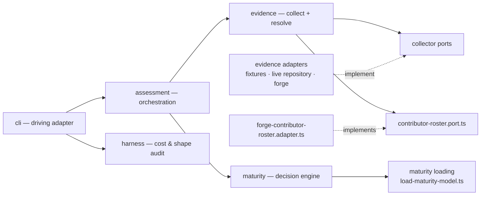

# Architecture

The macro technical shape: contexts, dependencies, and architectural boundaries.

What exists and what is still planned is in `codebase-map.md`. `aidd_docs/INSTALL.md` holds the implementation plan; this file defines the architecture the code must preserve.

## Stack

* TypeScript `strict`, Node.js LTS, ESM. **Held at 5.x deliberately.** 7.0 is the native-port compiler and a full major; nothing in this codebase needs it, and taking it would be its own change measured against `pnpm check`, never a line in a dependency bump. `pnpm outdated` naming it is expected, not a finding.
* No framework or DI container — explicit composition in `cli/`.
* pnpm, pinned through `packageManager`.
* tsup/esbuild bundles one entrypoint, `dist/cli.js`.
* dependency-cruiser mechanically enforces context boundaries.
* YAML is the runtime format of the maturity model. Its parser belongs to `maturity/loading/`.
* No database, ORM or auth of its own. The assessed repository is the input; AIDD owns no persistent state.
* **Network at runtime, through one collector only.** `forge-repository` spawns `gh` and reads the subject's merged pull requests; nothing else in the tool opens a socket. It is built only when the subject declares a GitHub origin, and its failure is an evidence gap rather than a broken run, so every other subject is still assessed with no network at all.

## Shape

A modular monolith with bounded contexts and hexagonal boundaries:



No `maturity-model.port.ts` exists, and the loader is therefore **not** an adapter: nothing asks `maturity` for a model through an abstraction yet, so there is no port to implement. It lives in `loading/` and is named for what it does. When a use case needs "give me a maturity model", the port appears with that consumer and this file becomes its YAML implementation. A port with one implementation and no consumer would be a wall with no door.

`harness` hangs directly off `cli`, never off `assessment`: it is a second command with its own JSON shape, and the diagram's missing arrow from `assessment` to `harness` — or the reverse — is the point, not an omission. See `harness-is-a-peer` and `assessment-never-depends-on-harness` below.

## Contexts

### `maturity`

Owns maturity calculation: requirements, axes, levels and thresholds. `loading/` turns a YAML file into a model the engine may trust; `assessment` is barred from importing it, as it is from any concrete infrastructure.

`checkMaturity` lives in `engine/`, not in `usecases/`. It takes domain values and returns a domain value; it loads nothing, collects nothing, and sequences no application workflow. Filing it as a use case only forced use-case rules onto a pure decision function — it is the deterministic decision engine the brief names, and the folder says so.

It knows nothing about evidence collection, assessment orchestration, or CLI concerns.

### `evidence`

Owns observation collection and evidence resolution, including collector ports and their adapters. It now also owns the enumeration of the people a forge attributes work to: `ports/contributor-roster.port.ts` and its one adapter, `forge-contributor-roster.adapter.ts`.

`resolveEvidence` lives in `resolution/`, not in `usecases/`, for the same reason `checkMaturity` lives in `engine/`: it takes domain values and returns a domain value, loading and collecting nothing.

**A roster answers no axis, and this is why it is a second port rather than a second collector.** `EvidenceCollector` emits observations that `resolveEvidence` compares one axis at a time; N contributors each emitting `size` would be N values of one axis, which resolution turns into `CONFLICTING` and destroys that axis for the repository and for every person at once. A roster answers a different question — who was active, and what does each person's own sample prove — so nothing it returns ever reaches `resolveEvidence`, and no collector learns that it exists.

It knows nothing about maturity calculation, assessment orchestration, or CLI concerns.

### `harness`

Owns harness measurement: what a Claude repository loads at session opening, how heavy each part is, how much repeats, and how it is written. A third peer of `maturity` and `evidence`, not a third input to `assessment` — it feeds no axis and no field of the assessment report, so it is reached directly by `cli` through a second command rather than through `assess-maturity.usecase`.

`composeHarnessAudit` lives in `measurement/`, alongside `models/`, `contracts/`, `ports/` and `usecases/`, for the reason `checkMaturity` and `resolveEvidence` live outside theirs: it takes domain values — a tool name, the files a source read, an encoder — and returns one, loading and collecting nothing. `measurement/` was added to the same folder-name-matched dependency-cruiser rules `models/`, `usecases/`, `contracts/`, `engine/`, `resolution/` and `composition/` already sat inside, rather than earning its own rule — it needed its own sentinel in its own folder for exactly that reason; see `coding-assertions.md`.

`auditHarness` in `usecases/` is the sequencer: it reads through the port it is handed, then composes, nothing else. It chooses no adapter and loads no configuration — both belong to `cli/`, which builds `ClaudeHarnessAdapter` and `GptTokenizerEncoderAdapter` and passes them in, the same composition-root discipline `assessment` follows for its own collectors.

`HarnessSourcePort` is one port, `HarnessTree` is not one. `harness/adapters/claude/harness-tree.ts` names the same shape `evidence/adapters/harness/harness-tree.ts` already names for the maturity axis — `entries` and `read` over one directory — and this context declares its own copy rather than importing that one. Reusing it would make a new context depend on another context's concrete infrastructure, which is exactly what `harness-is-a-peer` forbids; forbidding it after the fact would cost another rule and another sentinel. Re-declaring a thirteen-line interface here is cheaper than the wall it would otherwise need. Like its counterpart, this seam is **not** a port: it crosses no context boundary, it abstracts nothing the domain knows about, and both its implementations — a real directory walk, a fixture in its own suite — are adapters. It is named for what it is and lives beside them.

It knows nothing about maturity calculation, evidence collection, assessment orchestration, or CLI concerns.

### `assessment`

Composes `evidence` and `maturity` to produce an assessment.

It owns orchestration, **not business rules**. Resolution rules remain in `evidence`; maturity rules remain in `maturity`.

Coverage is its own. `axesRequested`, `axesObserved` and `axesConfirmed` describe the report, not the collection: `assessment` derives all three from the axes it requested and the evidence it got back. `evidence` owns collector execution, provenance and resolution, and stops there — it never counts on behalf of a report it does not build.

`composeAssessmentReport` lives in `composition/`, not `usecases/`, for the same reason `checkMaturity` and `resolveEvidence` live outside theirs: it takes domain values — a model, evidence, provenance — and returns one, loading and sequencing nothing. It is also where `evidence/models/collector-provenance.model.ts`'s `CollectorProvenance` is projected to the contract's `ProvenanceEntry`; `assessment` owns that mapping because `evidence` was kept from importing `assessment/contracts` on purpose. `composition/axis-vocabulary.ts` is the peer-to-peer translation in the other direction: it projects the model's `scales` into `evidence`'s `AxisVocabulary`, so a collector never has to know the maturity domain's own types.

`assess-maturity.usecase.ts` is the sequencer: it takes an already-loaded `MaturityModel`, a subject path, a collector set, an optional `ContributorRoster` and an `AbortSignal`, and calls `axisVocabularyOf`, then `collectEvidence`, then `readRoster`, then `composeAssessmentReport` — nothing else. It does **not** load the model itself.

**The roster is read after collection, never beside it, and its failure never leaves the sequencer.** Overlapping the two forge round trips would buy a latency nobody has measured, so the order is the sequencer's own statement. `readRoster` is a private function of that file, and it is where a roster that threw becomes a `FAILED` — or a `TIMED_OUT` where the signal is aborted — `ContributorRosterRun` carrying the reason, handed to the composer like any other. That is the same footing `collectEvidence` already gives a failing collector, and it is what keeps the exit code answering *did the assessment run* rather than *did every source answer*. A roster absent from the request is `null` to the composer, which is a different statement from one that ran and enumerated nobody. `assessment-composes-never-adapts` forbids `assessment/` from importing `*/loading/`, and `scripts/prove-boundary-rules.mjs` proves that exact rule from `src/assessment/usecases/` with a dedicated sentinel — a sequencer that called `loadMaturityModel` would breach a wall the gate actively tests, not just a convention. Resolving `--model` or the packaged default is argument parsing, and belongs to the driving adapter that owns argv: `cli/`. This corrects the earlier prediction, right above, that `assess-maturity.usecase` "will load the model": it never does.

`composition/` and `usecases/` both sit inside the same dependency-cruiser domain rules as `models/`, `contracts/`, `engine/` and `resolution/` — those match by folder name, so a rule widened to reach either folder needed its own sentinel per rule, per folder; see `coding-assertions.md`.

`composition/compose-contributor-roster.ts` runs `checkMaturity` once per record — twice per record, for the sustained and the demonstrated reading, on the same footing `compose-assessment-report.ts` already runs it twice for the repository — and projects the result into the contract's `ContributorRosterReport`. The projection belongs here rather than in `evidence`, on the same footing as the existing `CollectorProvenance`-to-`ProvenanceEntry` sentence just above: `evidence` was kept from importing `assessment/contracts` on purpose, so a shape that names the contract is `assessment`'s to produce. Each record is resolved by its own call, alone, over its own observations only — two records' observations meeting in one call is exactly the `CONFLICTING` trap the roster's own port exists to avoid, so this function never concatenates records and never falls back to another record's, or the report's own, evidence for an axis a record did not answer.

If orchestration starts deciding domain semantics because it has access to both contexts, the boundary has failed.

### `cli`

Driving adapter and composition root.

It parses input, wires concrete adapters, invokes `assess-maturity.usecase`, and renders the public contract.

It contains no business logic.

## Dependency rules

```text id="6e4trr"
cli
 ↓         ↘
assessment  harness
 ↙       ↘
evidence  maturity
```

* `maturity`, `evidence` and `harness` are peers and never import one another.
* None of the three imports `assessment` or `cli`.
* `assessment` depends on `evidence` and `maturity`'s public APIs, never their concrete adapters, and never on `harness` at all — `assessment-never-depends-on-harness` makes that second rule explicit, since the folder-name pattern the first three rules share would not otherwise catch a peer reached by a different route.
* Domain and use-case files never depend on filesystem, Git processes, YAML parsers, or vendor SDKs.
* Concrete infrastructure stays behind ports.
* dependency-cruiser enforces these rules mechanically, widened by `harness-is-a-peer` and `assessment-never-depends-on-harness` when this context landed — nine rules became eleven, and the boundary-proving script went from proving eight of them to ten, with sentinel count rising from 25 to 47; see `coding-assertions.md`.

## Public boundary

`assessment-report.contract.ts` is the versioned public contract and includes `schemaVersion`.

It remains distinct from internal assessment models.

Driving adapters consume this contract; they do not reshape domain semantics themselves.

`AssessmentReport` gains `contributors: ContributorRosterReport | null`, required and nullable like `demonstrated` before it, and `schemaVersion` stays 1 for the same reason `demonstrated` did not move it: a consumer reading `proven` alone sees exactly what it saw before the field existed. Three values sit on the block rather than on a row — `windowDays`, `harnessObserved` and `harnessPaths` — because every row is measured over one window against one harness set, and a per-row copy is two rows free to disagree about a fact neither of them owns.

**Two fields of a row landed after the rest, both additive and both asked of that row's own evidence alone.** `observed` carries one `ContributorAxisObservation` per axis the model declares, resolved or not, `value` null on anything but `CONFIRMED` — so a row that reached no level still publishes what it measured, which is the thing a reader of that row most wants. `next` is a `LevelReport` for the level above that row's `proven`, and its requirements pair every threshold with **this row's** observed value rather than the repository's: the same threshold read off the report's own `next` would be paired with a value the repository met, so the row's own is the only place its shortfall exists as a fact. Neither moves `schemaVersion`, on the footing `contributors` and `demonstrated` already sit on.

`harness/contracts/harness-audit-report.contract.ts` is a second, unrelated versioned public shape with its own `schemaVersion`, starting at `1` independently of the assessment contract's own count. The MVP keeps it at `1` while the contract evolves. Its named chosen findings are advice, not maturity: the assessment contract gains no level, requirement, or verdict from them.

## Runtime boundaries

The maturity model is loaded through `maturity/loading/load-maturity-model.ts` (`loadMaturityModel` / `parseMaturityModel`), the only place in `maturity` that may import `yaml` or `node:fs`. It parses YAML, checks shape and vocabulary, verifies every level covers every declared axis, and guarantees cumulativity before returning a `MaturityModel` the engine may trust without re-checking. A rejection throws `InvalidMaturityModelError`, naming what is wrong.

Evidence is collected through collector ports. Fixture and live-repository collectors implement the same boundary and produce normalised observations.

The live-repository adapter may access the real filesystem and local Git. The fixture-bundle adapter may access the real filesystem, and reads a directory holding a `profile.json`. The forge-repository adapter may spawn `gh` and reach the network; it is the only one that may, and it is constructed only for a subject whose origin declares a GitHub repository.

They share every rule that decides a value: the `harness` scan between the two that read a tree, and `size-buckets.ts`, `delivery-sample.ts`, `intervention-scale.ts` and `autonomy.ts` across all three. The port promises they are interchangeable, and a rule two of them computed differently would break that promise. `autonomy.ts` holds the zero-touch share and the single `intervention` value either may reach: the live collector grants it from authorship, the bundle from its record, and the two must agree on the bar and on what clearing it is called. The scan reads a tree through `adapters/harness/harness-tree.ts`, which each adapter supplies — `git ls-files` on one side, a directory walk on the other. That seam is **not** a port: it crosses no context boundary, it abstracts nothing the domain knows about, and both its implementations are adapters. It is nevertheless the scan's complete input contract: consumer tests may use a faithful in-memory tree, while each production translation owns integration tests for the source-specific facts it emits. It lives beside the adapters and is named for what it is.

Inside `adapters/harness/`, the split is by question answered, not by size. `harness-scan.ts` decides the four capabilities and delegates every one of them; recognising a coding agent, reading a shell loop's continuation, and matching a context file are three unrelated problems that happened to share a file. The layering is one-way — `shell-loop` over `agent-invocation` over `shell-tokens` — so someone correcting how `CLAUDE.md` is found never opens the tokeniser, and someone working on retry loops cannot reach the context-engineering table. There is deliberately no `shell/` subtree: one file per question is the whole of it, and a lexer, a parser and a variable analysis filed separately would be a framework nobody asked for.

### The contributor roster

`ForgeContributorRosterAdapter` may reach `gh` for the commit walk and the account dictionary — `commit-history.ts` — and local Git for harness authorship — `harness-authorship.ts`. The ordering follows from what each needs: the dictionary is the only identity authority this feature has, so a forge walk that failed ends the roster there and the local authorship walk is **never run at all** — spending a `git log` whose result nothing could attribute is work for nothing, and the empty section already says what a reader needs.

**A read that failed is `FAILED`, never a `COMPLETED` roster holding no rows.** Both walks answer `null` for a refusal rather than throwing — `commit-history.ts` for an unparseable page, a payload carrying no connection, the page cap reached with more offered, or a window end that is not finite; `harness-authorship.ts` when `git` refuses — so classifying only what was *thrown* would assemble zero records and publish a document stating no account was active in the window: a statement about people made out of a read nobody completed, which is this product's central failure mode reached by omission rather than decision. `null` from either walk is `FAILED`, with a reason naming which walk returned it; only an abort is `TIMED_OUT`; `COMPLETED` with no records is the one value entitled to say the window held nobody.

**What the composition root hands the adapter, and why nothing else could.** `ForgeContributorRosterAdapter` is constructed with four things: the repository slug, the subject path, a delivery reader memoised on its walk, and a `HarnessTree` from `trackedTree`. A constructor cannot reach a walk, and no context below `cli/` is entitled to decide what the subject is — so `cli/` builds all four. The reader is the same object `ForgeRepositoryEvidenceCollector` holds: phase 1 of the per-person attribution work split `readForgeDerivedMetrics` into `readDeliveredChanges` and `deriveForgeMetrics` so one windowed sample could be derived twice, and a roster walking the pages a second time would make that split decorative and cost a third forge round trip — so "one walk" is a fact of the call graph, not a sentence in a comment. **The cost, stated rather than hidden:** the tracked tree is scanned twice per assessment, once by the live collector and once by the roster, because handing one scan to both would move `LiveRepositoryEvidenceCollector`'s constructor, which nothing in this feature otherwise touches. Revisit it when a measurement says the second scan costs something.

The roster emits the harness observation on every record itself, from its own `scanHarness` run over the tree it was handed — deterministically identical to the live collector's own reading rather than a value borrowed from it, so nothing ever falls back to the repository's evidence.

## Maturity model transcription

`aidd.yml` transcribes the 7x4 grid of `levels/aidd.md`. Three readings were forced, and none is derivable from the grid alone:

* **`L-XL` is a minimum of `L`.** Size therefore stops discriminating above Green: Copper, Silver and Gold all require `L`. What separates Green from Copper is parallelism, not size.
* **Harness is set containment, and the sets cumulate explicitly.** Blue requires `prompts` *and* `context-engineering`, Green adds `behavior`, Silver adds `loops`. The grid's cells name only what each level adds; the model spells out the full set so the engine never infers satisfaction from rank alone.
* **The scales live in the model file, not the engine.** `--model` may change scale values and thresholds within the canonical AIDD model schema. It is not a generic rules engine.

Three more were forced by the code rather than by the grid, and went unrecorded until 2026-08-29. Each changes the level of every subject:

* **The bucket bounds of the size axis are invented.** `levels/aidd.md` defines size qualitatively — `S` petite ou triviale, `M` complexité moyenne, `L` multi-étapes, `XL` multi-modules — and `size-buckets.ts` decides with `<100 / <400 / <1000` lines and `<5 / <10 / <25` files. Those six numbers appear nowhere in the model. Reading `XL` as multi-modules was tried and abandoned: what counts as a module is an architectural judgement, its depth in the tree differs between a monorepo and a single application, and no repository declares it machine-readably. On a subject where everything lives under `src/`, counting top-level directories says nothing, and counting one level down made four deliveries in five multi-module. The bounds stay because nothing better-founded is observable, not because the model licenses them. The measurement is in `aidd_docs/tasks/2026_08/2026_08_29_dual-reading-and-forge-collector/size-transcription.md`.
* **The aggregate is a median.** The model says only *"la taille habituelle des features livrées, pas la plus grosse jamais faite"*, which excludes a maximum and names nothing else. A median is one central measure among several, and on a bimodal distribution it lands in the valley between the two modes and describes neither.
* **The window is 180 days.** The model states no period at all. `habituelle` and `un pic isolé ne compte pas` constrain the aggregate, never the span it is taken over.

The grid's "Ce qu'on observe" column is deliberately not encoded: it illustrates, it does not decide.

## Levels are cumulative, and that is checked

A higher rank never asks less than the rank below it, on any axis. `checkMaturity` reports the highest level whose outcome is `MET` and does not re-check the levels beneath it, so a model that dipped would name a level whose predecessors are `NOT_MET` and "highest proven level" would stop meaning what it says.

The AIDD domain is cumulative, so a custom `--model` that is not is not an AIDD model.

`load-maturity-model.ts` enforces it: a level asking less than the rank below it on any axis is rejected before the engine ever sees the model.

## Frozen before the split

Nothing below may be redefined inside a context. Each was frozen because more than one worktree binds to it, and a divergence would only surface at composition time.

* `assessment/contracts/assessment-report.contract.ts` — the versioned public shape. Self-contained on purpose. Its numbers must be finite, and the type cannot say so: `number` admits `NaN`, and branding it would force every producer to change a shape frozen before the split. JSON renders a non-finite number as `null`, which this contract reads as absence, so the invariant is enforced where that ambiguity is created — `cli/renderers/json.renderer.ts` refuses the report rather than publishing a fabricated evidence gap. A producer-side check would be additional, never a replacement: the renderer is the last boundary before publication.
* `evidence/ports/evidence-collector.port.ts` — one interface, three adapters: the fixture bundle, the live repository and the forge. They must stay interchangeable, which is why the window, the sample floors, the size table, the intervention scale and the demonstrated share all live in `adapters/` rather than in any one of them. A collector **must honour `context.signal`**: exceeding its budget is reported as `TIMED_OUT`, never as a silent hang. The type cannot express that duty and `CollectorRun` only records the outcome, so it is written here.
* `evidence/models/observation.model.ts` — a collector emits observations and never resolves a status. `OBSERVED` can prove a requirement, `DECLARED` cannot; that distinction is what separates a fact from a claim. **Reopened on 2026-08-30**, deliberately: an observation now carries the `reading` it answers, `SUSTAINED` or `DEMONSTRATED`, and the `Demonstration` a demonstrated one is weighed by. The alternative was to emit two values for one axis, which `resolveEvidence` would resolve to `CONFLICTING` and lose both — so the model had to change, or the second reading could not exist at all.
* `evidence/models/axis.model.ts` — the vocabulary a collector may speak, handed down by `assessment` from the loaded model. A collector that invents a value off its scale is rejected rather than ranked, at the boundary that maps observations into maturity input — not by resolution, which only decides agreement, and not by the model loader, which answers whether the model itself is valid. A collector that invents a whole *axis* off that vocabulary gets no such error: `resolveEvidence` maps strictly over the requested axes, so an observation naming an undeclared one is silently dropped before `UndeclaredAxisError` could ever see it — the guard exists for a hand-built `Evidence` array, not for anything a real collector can produce.
* `maturity/engine/` and its tests — the decision semantics, split by concept: `maturity-engine.ts` walks levels and picks the proven one, `requirement-outcome.ts` holds the conservative rule, `scale-comparison.ts` compares a value to a threshold. The tests decide when prose disagrees.
* `evidence/ports/contributor-roster.port.ts` — a second port, on the footing `evidence-collector.port.ts` sits here, carrying the duties its own type cannot express: a read that failed is `FAILED`, never a `COMPLETED` roster holding no rows (see **Runtime boundaries** above for the five refusals this covers). A collector emits observations for one subject; a roster emits one record per account, and **each record resolves alone** — two contributors are never resolved together, because N people answering one axis is N observations of that axis, which `resolveEvidence` turns into `CONFLICTING` and destroys for everyone. This is the reason the roster is a second port rather than a second collector. `read` must honour `context.signal`, reporting `TIMED_OUT` rather than hanging, on the same terms `evidence-collector.port.ts` already freezes. `account: null` is the unattributed bucket — commits whose email GitHub maps to no account — never merged into a named row and never dropped. Bots are excluded on the `[bot]` login suffix: a **string rule, not a typed fact**, since `GitActor.user` is typed `User` and carries no `__typename` discriminator the way a pull request's author does, so a human account ending in `[bot]` would be wrongly dropped.

## Gotchas

* `levels/aidd.md` documents the maturity model but is never loaded at runtime. Runtime reads `aidd.yml`.
* `profiles/` contains acceptance fixture payloads, not AIDD's own configuration.
* Content inside fixture `repo-context/` must never be interpreted as configuration or evidence about the AIDD repository itself.
