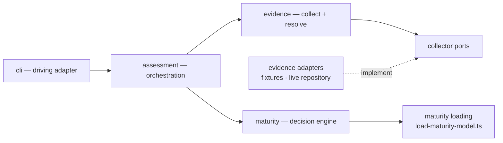

# Architecture

The macro technical shape: contexts, dependencies, and architectural boundaries.

What exists and what is still planned is in `codebase-map.md`. `aidd_docs/INSTALL.md` holds the implementation plan; this file defines the architecture the code must preserve.

## Stack

* TypeScript `strict`, Node.js LTS, ESM.
* No framework or DI container — explicit composition in `cli/`.
* pnpm, pinned through `packageManager`.
* tsup/esbuild bundles one entrypoint, `dist/cli.js`.
* dependency-cruiser mechanically enforces context boundaries.
* YAML is the runtime format of the maturity model. Its parser belongs to `maturity/loading/`.
* No database, ORM, auth, or network at runtime. The assessed repository is the input; AIDD owns no persistent state.

## Shape

A modular monolith with bounded contexts and hexagonal boundaries:



No `maturity-model.port.ts` exists, and the loader is therefore **not** an adapter: nothing asks `maturity` for a model through an abstraction yet, so there is no port to implement. It lives in `loading/` and is named for what it does. When a use case needs "give me a maturity model", the port appears with that consumer and this file becomes its YAML implementation. A port with one implementation and no consumer would be a wall with no door.

## Contexts

### `maturity`

Owns maturity calculation: requirements, axes, levels and thresholds. `loading/` turns a YAML file into a model the engine may trust; `assessment` is barred from importing it, as it is from any concrete infrastructure.

`checkMaturity` lives in `engine/`, not in `usecases/`. It takes domain values and returns a domain value; it loads nothing, collects nothing, and sequences no application workflow. Filing it as a use case only forced use-case rules onto a pure decision function — it is the deterministic decision engine the brief names, and the folder says so.

It knows nothing about evidence collection, assessment orchestration, or CLI concerns.

### `evidence`

Owns observation collection and evidence resolution, including collector ports and their adapters.

`resolveEvidence` lives in `resolution/`, not in `usecases/`, for the same reason `checkMaturity` lives in `engine/`: it takes domain values and returns a domain value, loading and collecting nothing.

It knows nothing about maturity calculation, assessment orchestration, or CLI concerns.

### `assessment`

Composes `evidence` and `maturity` to produce an assessment.

It owns orchestration, **not business rules**. Resolution rules remain in `evidence`; maturity rules remain in `maturity`.

Coverage is its own. `axesRequested`, `axesObserved` and `axesConfirmed` describe the report, not the collection: `assessment` derives all three from the axes it requested and the evidence it got back. `evidence` owns collector execution, provenance and resolution, and stops there — it never counts on behalf of a report it does not build.

`composeAssessmentReport` lives in `composition/`, not `usecases/`, for the same reason `checkMaturity` and `resolveEvidence` live outside theirs: it takes domain values — a model, evidence, provenance — and returns one, loading and sequencing nothing. It is also where `evidence/models/collector-provenance.model.ts`'s `CollectorProvenance` is projected to the contract's `ProvenanceEntry`; `assessment` owns that mapping because `evidence` was kept from importing `assessment/contracts` on purpose. `assess-maturity.usecase.ts` remains the later sequencer: it will load the model, run collection, and call this function.

`composition/` sits inside the same dependency-cruiser domain rules as `models/`, `usecases/`, `contracts/`, `engine/` and `resolution/` — those match by folder name, so a rule widened to reach it needed its own sentinel per rule; see `coding-assertions.md`.

If orchestration starts deciding domain semantics because it has access to both contexts, the boundary has failed.

### `cli`

Driving adapter and composition root.

It parses input, wires concrete adapters, invokes `assess-maturity.usecase`, and renders the public contract.

It contains no business logic.

## Dependency rules

```text id="6e4trr"
cli
 ↓
assessment
 ↙       ↘
evidence  maturity
```

* `maturity` and `evidence` are peers and never import each other.
* Neither imports `assessment` or `cli`.
* `assessment` depends on their public APIs, never their concrete adapters.
* Domain and use-case files never depend on filesystem, Git processes, YAML parsers, or vendor SDKs.
* Concrete infrastructure stays behind ports.
* dependency-cruiser enforces these rules mechanically.

## Public boundary

`assessment-report.contract.ts` is the versioned public contract and includes `schemaVersion`.

It remains distinct from internal assessment models.

Driving adapters consume this contract; they do not reshape domain semantics themselves.

## Runtime boundaries

The maturity model is loaded through `maturity/loading/load-maturity-model.ts` (`loadMaturityModel` / `parseMaturityModel`), the only place in `maturity` that may import `yaml` or `node:fs`. It parses YAML, checks shape and vocabulary, verifies every level covers every declared axis, and guarantees cumulativity before returning a `MaturityModel` the engine may trust without re-checking. A rejection throws `InvalidMaturityModelError`, naming what is wrong.

Evidence is collected through collector ports. Fixture and live-repository collectors implement the same boundary and produce normalised observations.

The live-repository adapter may access the real filesystem and local Git. Network-backed collectors are post-MVP.

## Maturity model transcription

`aidd.yml` transcribes the 7x4 grid of `levels/aidd.md`. Three readings were forced, and none is derivable from the grid alone:

* **`L-XL` is a minimum of `L`.** Size therefore stops discriminating above Green: Copper, Silver and Gold all require `L`. What separates Green from Copper is parallelism, not size.
* **Harness is set containment, and the sets cumulate explicitly.** Blue requires `prompts` *and* `context-engineering`, Green adds `behavior`, Silver adds `loops`. The grid's cells name only what each level adds; the model spells out the full set so the engine never infers satisfaction from rank alone.
* **The scales live in the model file, not the engine.** `--model` may change scale values and thresholds within the canonical AIDD model schema. It is not a generic rules engine.

The grid's "Ce qu'on observe" column is deliberately not encoded: it illustrates, it does not decide.

## Levels are cumulative, and that is checked

A higher rank never asks less than the rank below it, on any axis. `checkMaturity` reports the highest level whose outcome is `MET` and does not re-check the levels beneath it, so a model that dipped would name a level whose predecessors are `NOT_MET` and "highest proven level" would stop meaning what it says.

The AIDD domain is cumulative, so a custom `--model` that is not is not an AIDD model.

`load-maturity-model.ts` enforces it: a level asking less than the rank below it on any axis is rejected before the engine ever sees the model.

## Frozen before the split

Nothing below may be redefined inside a context. Each was frozen because more than one worktree binds to it, and a divergence would only surface at composition time.

* `assessment/contracts/assessment-report.contract.ts` — the versioned public shape. Self-contained on purpose. Its numbers must be finite, and the type cannot say so: `number` admits `NaN`, and branding it would force every producer to change a shape frozen before the split. JSON renders a non-finite number as `null`, which this contract reads as absence, so the invariant is enforced where that ambiguity is created — `cli/renderers/json.renderer.ts` refuses the report rather than publishing a fabricated evidence gap. A producer-side check would be additional, never a replacement: the renderer is the last boundary before publication.
* `evidence/ports/evidence-collector.port.ts` — one interface, two adapters: the fixture bundle and the live repository. They must stay interchangeable. A collector **must honour `context.signal`**: exceeding its budget is reported as `TIMED_OUT`, never as a silent hang. The type cannot express that duty and `CollectorRun` only records the outcome, so it is written here.
* `evidence/models/observation.model.ts` — a collector emits observations and never resolves a status. `OBSERVED` can prove a requirement, `DECLARED` cannot; that distinction is what separates a fact from a claim.
* `evidence/models/axis.model.ts` — the vocabulary a collector may speak, handed down by `assessment` from the loaded model. A collector that invents a value off its scale is rejected rather than ranked, at the boundary that maps observations into maturity input — not by resolution, which only decides agreement, and not by the model loader, which answers whether the model itself is valid.
* `maturity/engine/` and its tests — the decision semantics, split by concept: `maturity-engine.ts` walks levels and picks the proven one, `requirement-outcome.ts` holds the conservative rule, `scale-comparison.ts` compares a value to a threshold. The tests decide when prose disagrees.

## Gotchas

* `levels/aidd.md` documents the maturity model but is never loaded at runtime. Runtime reads `aidd.yml`.
* `profiles/` contains acceptance fixture payloads, not AIDD's own configuration.
* Content inside fixture `repo-context/` must never be interpreted as configuration or evidence about the AIDD repository itself.
