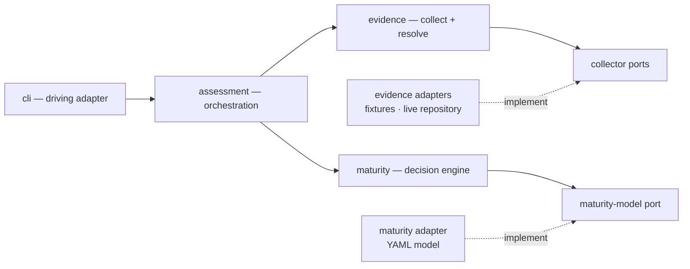

# Architecture

The macro technical shape: contexts, dependencies, and architectural boundaries.

**Status: manifest and toolchain exist; no `src/` does.** `aidd_docs/INSTALL.md` holds the implementation plan; this file defines the architecture the code must preserve.

## Stack

* TypeScript `strict`, Node.js LTS, ESM.
* No framework or DI container — explicit composition in `cli/`.
* pnpm, pinned through `packageManager`.
* tsup/esbuild bundles one entrypoint, `dist/cli.js`.
* dependency-cruiser mechanically enforces context boundaries.
* YAML is the runtime format of the maturity model. Its parser belongs to `maturity/adapters/`.
* No database, ORM, auth, or network at runtime. The assessed repository is the input; AIDD owns no persistent state.

## Shape

A modular monolith with bounded contexts and hexagonal boundaries:



## Contexts

### `maturity`

Owns maturity calculation: requirements, axes, levels, thresholds, and the maturity-model port.

It knows nothing about evidence collection, assessment orchestration, or CLI concerns.

### `evidence`

Owns observation collection and evidence resolution, including collector ports and their adapters.

It knows nothing about maturity calculation, assessment orchestration, or CLI concerns.

### `assessment`

Composes `evidence` and `maturity` to produce an assessment.

It owns orchestration, **not business rules**. Resolution rules remain in `evidence`; maturity rules remain in `maturity`.

If orchestration starts deciding domain semantics because it has access to both contexts, the boundary has failed.

### `cli`

Driving adapter and composition root.

It parses input, wires concrete adapters, invokes `assess-maturity.usecase`, and renders the public contract.

It contains no business logic.

## Dependency rules

```text id="6e4trr"
cli
 ↓
assessment
 ↙       ↘
evidence  maturity
```

* `maturity` and `evidence` are peers and never import each other.
* Neither imports `assessment` or `cli`.
* `assessment` depends on their public APIs, never their concrete adapters.
* Domain and use-case files never depend on filesystem, Git processes, YAML parsers, or vendor SDKs.
* Concrete infrastructure stays behind ports.
* dependency-cruiser enforces these rules mechanically.

## Public boundary

`assessment-report.contract.ts` is the versioned public contract and includes `schemaVersion`.

It remains distinct from internal assessment models.

Driving adapters consume this contract; they do not reshape domain semantics themselves.

## Runtime boundaries

The maturity model is loaded through `maturity-model.port`; YAML is only one driven adapter.

Evidence is collected through collector ports. Fixture and live-repository collectors implement the same boundary and produce normalised observations.

The live-repository adapter may access the real filesystem and local Git. Network-backed collectors are post-MVP.

Runtime assessment is fully offline.

## Maturity model transcription

`aidd.yml` transcribes the 7x4 grid of `levels/aidd.md`. Three readings were forced, and none is derivable from the grid alone:

* **`L-XL` is a minimum of `L`.** Size therefore stops discriminating above Green: Copper, Silver and Gold all require `L`. What separates Green from Copper is parallelism, not size.
* **Harness is set containment, and the sets cumulate explicitly.** Blue requires `prompts` *and* `context-engineering`, Green adds `behavior`, Silver adds `loops`. The grid's cells name only what each level adds; the model spells out the full set so the engine never infers satisfaction from rank alone.
* **The scales live in the model file, not the engine.** `--model` may change scale values and thresholds within the canonical AIDD model schema. It is not a generic rules engine.

The grid's "Ce qu'on observe" column is deliberately not encoded: it illustrates, it does not decide.

## Frozen before the split

Nothing below may be redefined inside a context. Each was frozen because more than one worktree binds to it, and a divergence would only surface at composition time.

* `assessment/contracts/assessment-report.contract.ts` — the versioned public shape. Self-contained on purpose.
* `evidence/ports/evidence-collector.port.ts` — one interface, two adapters: the fixture bundle and the live repository. They must stay interchangeable.
* `evidence/models/observation.model.ts` — a collector emits observations and never resolves a status. `OBSERVED` can prove a requirement, `DECLARED` cannot; that distinction is what separates a fact from a claim.
* `evidence/models/axis.model.ts` — the vocabulary a collector may speak, handed down by `assessment` from the loaded model. A collector that invents a value off its scale is rejected downstream rather than ranked.
* `maturity/ports/maturity-model.port.ts` — one adapter, but the YAML parser must stay behind it.
* `maturity/usecases/check-maturity.usecase.ts` and its tests — the decision semantics. The tests decide when prose disagrees.

## Gotchas

* `levels/aidd.md` documents the maturity model but is never loaded at runtime. Runtime reads `aidd.yml`.
* `profiles/` contains acceptance fixture payloads, not AIDD's own configuration.
* Content inside fixture `repo-context/` must never be interpreted as configuration or evidence about the AIDD repository itself.
