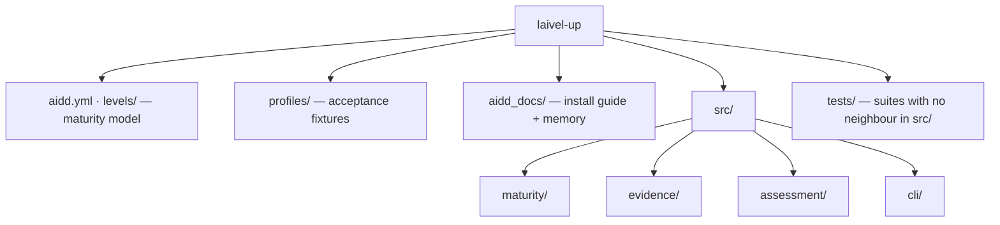

# Codebase Map

The macro layout: the top-level areas and what each holds. A map to navigate, not the full tree.

**Status: `levels/`, `profiles/`, `aidd_docs/`, `aidd.yml`, `src/` and `tests/` all exist as frozen in `aidd_docs/INSTALL.md`, under its "Folder structure" section.** One production `EvidenceCollector` exists — the live repository one, wired into `assess.command.ts`. No reference profile reaches its expected level yet: a bundle is not its subject, and the bundle adapter and the acceptance suite over `profiles/` are both still owed — see `cli.md` and `testing.md`.

## Areas

- `aidd.yml`: the canonical maturity model — the only form the runtime reads. Overridable with `--model`.
- `levels/aidd.md`: human documentation of the model — the seven levels, four axes, and 7×4 grid. Never loaded at runtime.
- `profiles/`: acceptance fixtures — `perceval` → Red, `bohort` → Blue, `leodagan` → Green, `arthur` → Copper. Their deliberate holes are part of the specification; see `testing.md`.
- `aidd_docs/`: `INSTALL.md` holds the frozen technical vision and execution plan; `memory/` is this bank.
- `tests/`: only the suites that exercise no single file — the conformance of `aidd.yml`, the conformance of the three status vocabularies, `cli/process-contract.test.ts` (the exit-code and stream contract, observed by spawning the built `dist/cli.js`), and the acceptance run over `profiles/` **(planned)**. Every other suite sits beside its subject in `src/`; see `testing.md`.
- `scripts/`: gate tooling, not product code. `prove-boundary-rules.mjs` proves every dependency-cruiser rule still bites; see `coding-assertions.md`.
- `src/maturity/`: `engine/` decides, and keeps the guards that refuse an invalid hand-built model; `loading/` turns a YAML file into a model the engine may trust — shape, then invariants; `models/` holds the types and the rules shared by both.
- `src/evidence/`: `resolution/resolve-evidence.ts`, its models, `ports/evidence-collector.port.ts` and `usecases/collect-evidence.usecase.ts` exist; `adapters/` holds the two collector doubles and `live-repository.adapter.ts`, whose `live-repository/` folder keeps the four files it alone uses — `git-process.ts`, the single `git` spawn, with `git-command-failed.error.ts` beside it; `harness-scan.ts`, the exact-name table; `git-history.ts`, the first-parent walk. The fixture bundle adapter is still **(planned)**. The use case runs collectors and resolves what they observed; it owns no axis semantics and no coverage arithmetic. What each axis accepts as evidence — normalisation tables, the harness scan set, what is admissible for nothing — is decided in `aidd_docs/tasks/2026_08/2026_08_28_observable-evidence-spec/`, and belongs in the collectors' tests once they land. Read it before writing a collector; delete it once the tests pin it.
- `src/assessment/`: `contracts/assessment-report.contract.ts` exists; `composition/compose-assessment-report.ts` derives coverage and projects `CollectorProvenance` into `ProvenanceEntry`, and `composition/axis-vocabulary.ts` projects the model's scales into `evidence`'s `AxisVocabulary`; `usecases/assess-maturity.usecase.ts` sequences `axisVocabularyOf`, `collectEvidence` and `composeAssessmentReport` over a model it receives already loaded. Owns no maturity or evidence rules.
- `src/cli/`: one folder per responsibility, each named so the layout says what lives there. `commands/assess.command.ts` (`runAssess(argv, io)`) is the whole `assess` command — parse, load, assess, render — and imports nothing that runs on load, which is what lets `commands/assess.command.test.ts` drive it in process. `parsing/` turns argv into an `AssessArguments`, `bootstrap/` locates the packaged `aidd.yml` without consulting the cwd, and `renderers/` holds the two output surfaces plus the error guarding the JSON boundary. `usage.error.ts` sits at the root because both `parsing/` and `commands/` throw it — one class for every caller fault, which is what lets the exit code stay a statement about responsibility. `main.ts` is the thin executable shell: the only file that touches `process`, and the tsup entry.

## Entry points

- `src/cli/main.ts` — the only executable entry point in the MVP, and the only file that calls into `process`. It is split from `commands/assess.command.ts` on purpose: importing a module that acts on import (`process.argv`, `process.exit`) would run the CLI inside `vitest` the moment the suite imported it, so the command itself stays a plain async function the suite calls directly.
- A Claude plugin adapter is post-MVP and must remain a thin driving adapter over the same core.

## Conventions

**folder = business context · name = concept · suffix (when present) = architectural role and searchable metadata.** The full list of suffixes and their placement rules is `.claude/rules/01-standards/1-file-naming.md`, loaded when a source file is edited.

`engine/maturity-engine.ts` · `resolution/resolve-evidence.ts` · `composition/compose-assessment-report.ts` · `assess-maturity.usecase.ts` · `load-maturity-model.ts` · `evidence-collector.port.ts` · `assessment-report.contract.ts` · `assess.command.ts` · `main.ts`

`engine/maturity-engine.test.ts` · `engine/maturity-model.test-fixture.ts` · `adapters/fake-in-memory-evidence-collector.test-adapter.ts`
