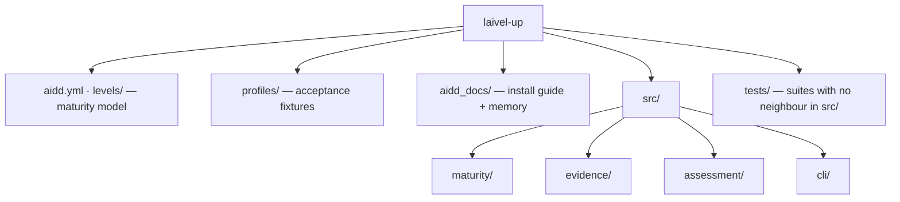

# Codebase Map

The macro layout: the top-level areas and what each holds. A map to navigate, not the full tree.

**Status: `levels/`, `profiles/`, `aidd_docs/`, `aidd.yml`, `src/` and `tests/` exist, including both `src/cli/renderers/` and `src/assessment/composition/`; `src/assessment/usecases` and `src/cli/assess.command.ts` are still planned** — the target layout is frozen in `aidd_docs/INSTALL.md` under **Folder structure**.

## Areas

- `aidd.yml`: the canonical maturity model — the only form the runtime reads. Overridable with `--model`.
- `levels/aidd.md`: human documentation of the model — the seven levels, four axes, and 7×4 grid. Never loaded at runtime.
- `profiles/`: acceptance fixtures — `perceval` → Red, `bohort` → Blue, `leodagan` → Green, `arthur` → Copper. Their deliberate holes are part of the specification; see `testing.md`.
- `aidd_docs/`: `INSTALL.md` holds the frozen technical vision and execution plan; `memory/` is this bank.
- `tests/`: only the suites that exercise no single file — the conformance of `aidd.yml`, the conformance of the three status vocabularies, and the acceptance run over `profiles/` **(planned)**. Every other suite sits beside its subject in `src/`; see `testing.md`.
- `scripts/`: gate tooling, not product code. `prove-boundary-rules.mjs` proves every dependency-cruiser rule still bites; see `coding-assertions.md`.
- `src/maturity/`: `engine/` decides, and keeps the guards that refuse an invalid hand-built model; `loading/` turns a YAML file into a model the engine may trust — shape, then invariants; `models/` holds the types and the rules shared by both.
- `src/evidence/`: `resolution/resolve-evidence.ts`, its models, `ports/evidence-collector.port.ts` and `usecases/collect-evidence.usecase.ts` exist; `adapters/` holds the two collector doubles, while the fixture and live-repository adapters are still **(planned)**. The use case runs collectors and resolves what they observed; it owns no axis semantics and no coverage arithmetic. What each axis accepts as evidence — normalisation tables, the harness scan set, what is admissible for nothing — is decided in `aidd_docs/tasks/2026_08/2026_08_28_observable-evidence-spec/`, and belongs in the collectors' tests once they land. Read it before writing a collector; delete it once the tests pin it.
- `src/assessment/`: `contracts/assessment-report.contract.ts` and `composition/compose-assessment-report.ts` exist — the latter derives coverage and projects `CollectorProvenance` into `ProvenanceEntry`; `usecases/assess-maturity.usecase.ts`, the sequencer that will load the model, run collection and call it, is still **(planned)**. Owns no maturity or evidence rules.
- `src/cli/`: `renderers/json.renderer.ts` and `renderers/human.renderer.ts` exist, with `renderers/unrenderable-report.error.ts` guarding the JSON boundary. The `assess` command is still **(planned)**.

## Entry points

- `src/cli/assess.command.ts` **(planned)** — the only executable entry point in the MVP.
- A Claude plugin adapter is post-MVP and must remain a thin driving adapter over the same core.

## Conventions

**folder = business context · name = concept · suffix (when present) = architectural role and searchable metadata.** The full list of suffixes and their placement rules is `.claude/rules/01-standards/1-file-naming.md`, loaded when a source file is edited.

`engine/maturity-engine.ts` · `resolution/resolve-evidence.ts` · `composition/compose-assessment-report.ts` · `assess-maturity.usecase.ts` · `load-maturity-model.ts` · `evidence-collector.port.ts` · `assessment-report.contract.ts`

`engine/maturity-engine.test.ts` · `engine/maturity-model.test-fixture.ts` · `adapters/fake-in-memory-evidence-collector.test-adapter.ts`
