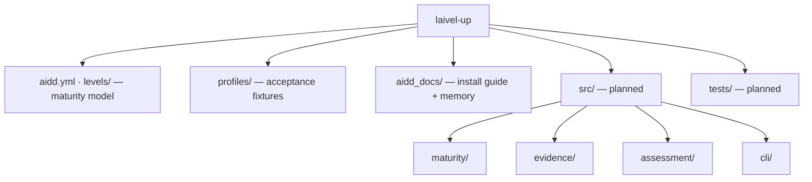

# Codebase Map

The macro layout: the top-level areas and what each holds. A map to navigate, not the full tree.

**Status: `levels/`, `profiles/`, `aidd_docs/` and `aidd.yml` exist. `src/` and `tests/` are planned** — the target layout is frozen in `aidd_docs/INSTALL.md` under **Folder structure**.

## Areas

- `aidd.yml`: the canonical maturity model — the only form the runtime reads. Overridable with `--model`.
- `levels/aidd.md`: human documentation of the model — the seven levels, four axes, and 7×4 grid. Never loaded at runtime.
- `profiles/`: acceptance fixtures — `perceval` → Red, `bohort` → Blue, `leodagan` → Green, `arthur` → Copper. Their deliberate holes are part of the specification; see `testing.md`.
- `aidd_docs/`: `INSTALL.md` holds the frozen technical vision and execution plan; `memory/` is this bank.
- `src/maturity/` **(planned)**: deterministic maturity decision engine and maturity-model port.
- `src/evidence/` **(planned)**: evidence collection and resolution, collector ports, fixture adapter, and live-repository adapter.
- `src/assessment/` **(planned)**: orchestration between maturity and evidence, plus the versioned public report contract. Owns no maturity or evidence rules.
- `src/cli/` **(planned)**: `assess` command and `json` / `human` renderers.

## Entry points

- `src/cli/assess.command.ts` **(planned)** — the only executable entry point in the MVP.
- A Claude plugin adapter is post-MVP and must remain a thin driving adapter over the same core.

## Conventions

**folder = business context · suffix = architectural role and searchable metadata**

Examples:

`check-maturity.usecase.ts` · `yaml-maturity-model.adapter.ts` · `evidence-collector.port.ts` · `assessment-report.contract.ts`
