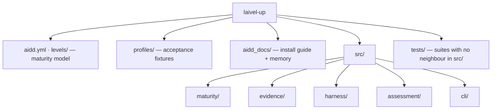

# Codebase Map

The macro layout: the top-level areas and what each holds. A map to navigate, not the full tree.

**Status: `levels/`, `profiles/`, `aidd_docs/`, `aidd.yml`, `src/` and `tests/` all exist as frozen in `aidd_docs/INSTALL.md`, under its "Folder structure" section.** Three production `EvidenceCollector`s exist — the live repository one and the fixture bundle one — both wired into `assess.command.ts`. Each reference profile reaches the level `profiles/README.md` gives it, proven by `tests/cli/reference-profiles.test.ts`. `src/harness/` exists alongside it as a fourth top-level context, wired into a second command, `harness.command.ts` — it feeds no `EvidenceCollector` and no axis; see `architecture.md`.

## Areas

- `aidd.yml`: the canonical maturity model — the only form the runtime reads. Overridable with `--model`.
- `levels/aidd.md`: human documentation of the model — the seven levels, four axes, and 7×4 grid. Never loaded at runtime.
- `profiles/`: acceptance fixtures — `perceval` → Red, `bohort` → Blue, `leodagan` → Green, `arthur` → Copper. Their deliberate holes are part of the specification; see `testing.md`.
- `aidd_docs/`: `INSTALL.md` holds the frozen technical vision and execution plan; `memory/` is this bank.
- `tests/`: only the suites that exercise no single file — the conformance of `aidd.yml`, the conformance of the three status vocabularies, the conformance of the two harness vocabularies (`harness/vocabulary-conformance.test.ts`), `cli/process-contract.test.ts` (the exit-code and stream contract, both commands), `cli/self-assessment.test.ts` (AIDD assessed by its own shipped binary), `cli/self-harness-audit.test.ts` (AIDD's own harness audited by that same binary), `cli/harness-determinism.test.ts` (the same subject spelled two ways, compared byte for byte), and `cli/reference-profiles.test.ts` (the four reference profiles assessed through `runAssess`). The suites that spawn `dist/cli.js` share `cli/spawn-cli.test-fixture.ts`; `build-cli-bundle.test-setup.ts` is the vitest `globalSetup` that builds the bundle once for the run, because no suite may. Every other suite sits beside its subject in `src/`; see `testing.md`.
- `scripts/`: gate tooling, not product code. `prove-boundary-rules.mjs` proves every dependency-cruiser rule still bites, `check-comment-tags.mjs` makes the comment rule a verdict; see `coding-assertions.md`.
- Root configs: `vitest.config.ts` is the ordinary run, `vitest.mutation.config.ts` the sweep's own narrower view, `stryker.config.json` the sweep itself. All three are governed by `pnpm comments`.
- `src/maturity/`: `engine/` decides, and keeps the guards that refuse an invalid hand-built model; `loading/` turns a YAML file into a model the engine may trust — shape, then invariants; `models/` holds the types and the rules shared by both — `threshold-on-scale.ts` for what a requirement may ask, `scale-for-axis.ts` for the prototype-safe lookup its four callers would otherwise each write.
- `src/evidence/`: `resolution/resolve-evidence.ts`, its models, `ports/evidence-collector.port.ts` and `usecases/collect-evidence.usecase.ts` exist; `adapters/` holds the two collector doubles and the three production collectors. `live-repository.adapter.ts` reads a work tree root; its `live-repository/` folder holds `git-process.ts`, the single `git` spawn, with `git-command-failed.error.ts` beside it — **no longer its alone**, since `mostRecentCommitDate` and `isRepositoryRoot` are read by the forge adapter and by the composition root, which is what lets both collectors measure the same window; `git-history.ts`, the first-parent walk; `tracked-tree.ts`, the tree `git ls-files` reports. `fixture-bundle.adapter.ts` reads a directory holding a `profile.json`, and its `fixture-bundle/` folder holds `bundle-tree.ts`, the recorded tree, and `recorded-activity.ts`, the delivery record. `harness/` is theirs jointly, one file per question it answers: `harness-scan.ts` orders the four capability decisions over the `harness-tree.ts` seam each adapter supplies and holds nothing else; `capability-signals.ts` keeps the exact-name tables for `prompts`, `context-engineering` and `behavior`; `script-candidate.ts` decides what is a script worth reading; `agent-invocation.ts` recognises a coding agent in command position; `shell-loop.ts` decides whether a loop's continuation hangs on an exit status, over the token view `shell-tokens.ts` gives it — **each has its own suite, and the reason is in `testing.md`**; `member-scan.ts` carries the three answers a member can have, and `decided-capabilities.ts` spends an undecidable one on the whole axis. `forge-repository.adapter.ts` reads merged pull requests through `gh`, and its `forge-repository/` folder holds `gh-process.ts`, the single `gh` spawn, with `gh-command-failed.error.ts` beside it; `repository-slug.ts`, the owner and name its origin declares; `pull-request-history.ts`, the paginated query and the medians it derives. `size-buckets.ts` is the shared size table, `delivery-sample.ts` the window and the sample floors, `intervention-scale.ts` the corrections-to-scale reading, and `autonomy.ts` the zero-touch share, all four for the same reason. The use case runs collectors and resolves what they observed; it owns no axis semantics and no coverage arithmetic. What each axis accepts as evidence — normalisation tables, the harness scan set, what is admissible for nothing — is decided in `aidd_docs/tasks/2026_08/2026_08_28_observable-evidence-spec/`, and belongs in the collectors' tests once they land. Read it before writing a collector; delete it once the tests pin it.
- `src/harness/`: measures what a Claude harness costs and how it is shaped, judging none of it. `contracts/harness-audit-report.contract.ts` is the second, self-contained versioned public shape; `models/loading-tier.model.ts` and `models/reading-scope.model.ts` carry the same two closed sets the contract repeats, `loaded-file.model.ts` the internal shape both scopes share. `ports/harness-source.port.ts` is the one port a tool's own loading convention implements; `ports/token-encoder.port.ts` is the other, implemented by `adapters/token-encoder.adapter.ts` over `gpt-tokenizer`'s `o200k_base`. `adapters/claude-harness.adapter.ts` is Claude's own convention: it reads the subject once for `SUBJECT` scope, the machine's `~/.claude` once for `MACHINE` scope, then walks the subject's ancestors for further `MACHINE`-scoped files — deduplicated by resolved absolute path in one shared `seen` set, since the machine scan and the ancestor walk can otherwise reach the same file under two different spellings and double it. Its `claude/` folder holds one file per question: `context-imports.ts` follows `@`-imports to the tool's own documented depth of four; `declaration-front-matter.ts` and `rule-tier.ts` split a skill, agent, command or rule's frontmatter from its body and decide which tier each half loads in; `directory-tree.ts` is the real-filesystem implementation of `harness-tree.ts`, the seam this context declares for itself rather than importing `evidence/adapters/harness/harness-tree.ts` — see `architecture.md` for why. `measurement/` composes the report: `file-length.ts` counts lines and tokens, `prose-share.ts` counts list lines against prose ones under one stated reading, `shared-passages.ts` finds exact eight-word repeats, `compose-harness-audit.ts` assembles all three plus the per-tier, per-scope totals into the contract. `usecases/audit-harness.usecase.ts` sequences reading then composing, nothing else.
- `src/assessment/`: `contracts/assessment-report.contract.ts` exists; `composition/compose-assessment-report.ts` derives coverage and projects `CollectorProvenance` into `ProvenanceEntry`, and `composition/axis-vocabulary.ts` projects the model's scales into `evidence`'s `AxisVocabulary`; `usecases/assess-maturity.usecase.ts` sequences `axisVocabularyOf`, `collectEvidence` and `composeAssessmentReport` over a model it receives already loaded. Owns no maturity or evidence rules.
- `src/cli/`: one folder per responsibility, each named so the layout says what lives there. `commands/assess.command.ts` (`runAssess(argv, io)`) is the whole `assess` command — parse, load, assess, render — and imports nothing that runs on load, which is what lets `commands/assess.command.test.ts` drive it in process. `commands/harness.command.ts` (`runHarness(argv, io)`) is the harness command, same shape: parse, read, audit, render, with `HarnessOptions` standing in for the fixture-injecting `AssessOptions` its sibling carries. `parsing/command-name.ts` (`commandOperandsFor`) is the one place that decides what counts as no command word and what counts as an unknown one, named once so a second command never needed its own copy of that rejection; `parsing/assess-arguments.ts` and `parsing/harness-arguments.ts` each call it first, naming the command they expect. `bootstrap/` locates the packaged `aidd.yml` without consulting the cwd, and `renderers/` holds both commands' output surfaces — `harness-human.renderer.ts` and `harness-json.renderer.ts` beside `human.renderer.ts` and `json.renderer.ts` — plus the error guarding the JSON boundary either renderer may throw. `usage.error.ts` sits at the root because both parsers and both commands throw it — one class for every caller fault, which is what lets the exit code stay a statement about responsibility. `main.ts` is the thin executable shell: the only file that touches `process`, dispatching on `argv[0]` between the two commands, and the tsup entry.

## Entry points

- `src/cli/main.ts` — the only executable entry point in the MVP, and the only file that calls into `process`. It is split from `commands/assess.command.ts` on purpose: importing a module that acts on import (`process.argv`, `process.exit`) would run the CLI inside `vitest` the moment the suite imported it, so the command itself stays a plain async function the suite calls directly.
- A Claude plugin adapter is post-MVP and must remain a thin driving adapter over the same core.

## Conventions

**folder = business context · name = concept · suffix (when present) = architectural role and searchable metadata.** The full list of suffixes and their placement rules is `.claude/rules/01-standards/1-file-naming.md`, loaded when a source file is edited.

`engine/maturity-engine.ts` · `resolution/resolve-evidence.ts` · `composition/compose-assessment-report.ts` · `assess-maturity.usecase.ts` · `load-maturity-model.ts` · `evidence-collector.port.ts` · `assessment-report.contract.ts` · `assess.command.ts` · `main.ts` · `measurement/compose-harness-audit.ts` · `harness-source.port.ts` · `harness-audit-report.contract.ts` · `harness.command.ts`

`engine/maturity-engine.test.ts` · `engine/maturity-model.test-fixture.ts` · `adapters/fake-in-memory-evidence-collector.test-adapter.ts`
