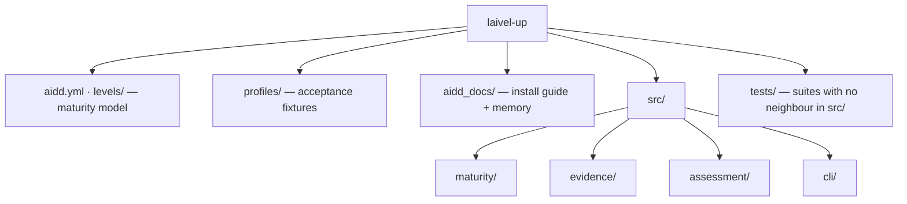

# Codebase Map

The macro layout: the top-level areas and what each holds. A map to navigate, not the full tree.

**Status: `levels/`, `profiles/`, `aidd_docs/`, `aidd.yml`, `src/` and `tests/` all exist as frozen in `aidd_docs/INSTALL.md`, under its "Folder structure" section.** The tree holds three production `EvidenceCollector`s behind one port, all wired into `assess.command.ts`, and one contributor roster behind a second port, wired beside them for a subject with a GitHub origin. Each reference profile reaches the level `profiles/README.md` gives it, proven by `tests/cli/reference-profiles.test.ts`.

## Areas

- `aidd.yml`: the canonical maturity model — the only form the runtime reads. Overridable with `--model`.
- `levels/aidd.md`: human documentation of the model — the seven levels, four axes, and 7×4 grid. Never loaded at runtime.
- `profiles/`: acceptance fixtures — `perceval` → Red, `bohort` → Blue, `leodagan` → Green, `arthur` → Copper. Their deliberate holes are part of the specification; see `testing.md`.
- `aidd_docs/`: `INSTALL.md` holds the frozen technical vision and execution plan; `memory/` is this bank.
- `tests/`: only the suites that exercise no single file — the conformance of `aidd.yml`, the conformance of the three status vocabularies, `cli/process-contract.test.ts` (the exit-code and stream contract), `cli/self-assessment.test.ts` (AIDD assessed by its own shipped binary), and `cli/reference-profiles.test.ts` (the four reference profiles assessed through `runAssess`). The two suites that spawn `dist/cli.js` share `cli/spawn-cli.test-fixture.ts`; `build-cli-bundle.test-setup.ts` is the vitest `globalSetup` that builds the bundle once for the run, because no suite may. Every other suite sits beside its subject in `src/`; see `testing.md`.
- `.claude/`: the rules loaded when a source file is edited. `plugins/aidd-evaluation/` is the versioned Claude plugin: its manifest, narration layer and standalone bundle stay together.
- `.claude-plugin/marketplace.json`: the marketplace catalogue. It names the plugin and points only at `./plugins/aidd-evaluation`; it carries no plugin runtime files.
- `scripts/`: gate tooling, not product code. `prove-boundary-rules.mjs` proves every dependency-cruiser rule still bites, `check-comment-tags.mjs` makes the comment rule a verdict; see `coding-assertions.md`.
- Root configs: `vitest.config.ts` is the ordinary run, `vitest.mutation.config.ts` the sweep's own narrower view, `stryker.config.json` the sweep itself. All three are governed by `pnpm comments`.
- `src/maturity/`: `engine/` decides, and keeps the guards that refuse an invalid hand-built model; `loading/` turns a YAML file into a model the engine may trust — shape, then invariants; `models/` holds the types and the rules shared by both — `threshold-on-scale.ts` for what a requirement may ask, `scale-for-axis.ts` for the prototype-safe lookup its four callers would otherwise each write.
- `src/evidence/`: `resolution/resolve-evidence.ts`, its models, `ports/evidence-collector.port.ts` and `usecases/collect-evidence.usecase.ts` exist; `adapters/` holds the two collector doubles and the three production collectors. `live-repository.adapter.ts` reads a work tree root; its `live-repository/` folder holds `git-process.ts`, the single `git` spawn, with `git-command-failed.error.ts` beside it — **no longer its alone**, since `mostRecentCommitDate` and `isRepositoryRoot` are read by the forge adapter and by the composition root, which is what lets both collectors measure the same window; `git-history.ts`, the first-parent walk; `tracked-tree.ts`, the tree `git ls-files` reports. `fixture-bundle.adapter.ts` reads a directory holding a `profile.json`, and its `fixture-bundle/` folder holds `bundle-tree.ts`, the recorded tree, and `recorded-activity.ts`, the delivery record. `harness/` is theirs jointly, one file per question it answers: `harness-scan.ts` orders the four capability decisions over the `harness-tree.ts` seam each adapter supplies. Its `HarnessScan` carries three fields, not two — `capabilities`, `undecidable`, and `provenBy`, what proved each member, as files, a commit trailer, or nothing — and `provenBy`'s paths are what `harness-authorship.ts` reads authorship over; `capability-signals.ts` keeps the exact-name tables for `prompts`, `context-engineering` and `behavior`; `script-candidate.ts` decides what is a script worth reading; `agent-invocation.ts` recognises a coding agent in command position; `shell-loop.ts` decides whether a loop's continuation hangs on an exit status, over the token view `shell-tokens.ts` gives it — **each has its own suite, and the reason is in `testing.md`**; `member-scan.ts` carries the three answers a member can have, and `decided-capabilities.ts` spends an undecidable one on the whole axis. `harness-authorship.ts` sits beside `harness-scan.ts`, unlike its neighbours, and imports nothing from it: only a Git work tree can answer who authored a proving path, and the scan itself must keep answering for a bundle, which has no such history. `forge-repository.adapter.ts` reads merged pull requests through `gh`, and its `forge-repository/` folder holds `gh-process.ts`, the single `gh` spawn, with `gh-command-failed.error.ts` beside it; `repository-slug.ts`, the owner and name its origin declares; `pull-request-history.ts`, the paginated query and the medians it derives; `delivery-reader.ts`, which declares `ForgeDeliveryReader` and holds the memoised windowed sample for one slug — the forge collector and the contributor-roster adapter are handed the same instance, which is what makes one walk a fact of the call graph rather than a sentence in a plan; `commit-history.ts`, the commit walk, the email-to-account dictionary and the windowed counts per account; `contributor-deliveries.ts`, the per-account delivery metrics and their observations; `derived-observations.ts`, the one projection of `ForgeDerivedMetrics` onto observations that both the repository collector and the roster adapter call. `size-buckets.ts` is the shared size table, `delivery-sample.ts` the window and the sample floors, `intervention-scale.ts` the corrections-to-scale reading, and `autonomy.ts` the zero-touch share, all four for the same reason. `ports/contributor-roster.port.ts` is the roster's own boundary, and `adapters/forge-contributor-roster.adapter.ts` its one implementation — constructed with a slug, a subject path, the shared `ForgeDeliveryReader` and a `HarnessTree`, none of which it computes itself. The use case runs collectors and resolves what they observed; it owns no axis semantics and no coverage arithmetic. What each axis accepts as evidence — normalisation tables, the harness scan set, what is admissible for nothing — is decided in `aidd_docs/tasks/2026_08/2026_08_28_observable-evidence-spec/`, and belongs in the collectors' tests once they land. Read it before writing a collector; delete it once the tests pin it.
- `src/harness/`: owns the independent Claude-context audit. It measures loading tiers and scopes, token estimates, prose share, repeated passages and unread configuration; `advice/` turns those observations into named chosen Findings without affecting maturity.
- `src/assessment/`: `contracts/assessment-report.contract.ts` exists; `composition/compose-assessment-report.ts` derives coverage, projects the model scales into a `vocabulary` block, and projects `CollectorProvenance` into `ProvenanceEntry` alongside the per-axis diagnostics a collector reported, and `composition/axis-vocabulary.ts` projects the model's scales into `evidence`'s `AxisVocabulary`; `composition/compose-contributor-roster.ts` resolves each contributor record alone — twice, for the sustained and the demonstrated reading — and projects the result into `ContributorRosterReport`; `composition/report-projection.ts` is the projection both composers share, from a `LevelResult` to a `LevelReport` and the rest of the shapes that ride with it. `usecases/assess-maturity.usecase.ts` sequences `axisVocabularyOf`, `collectEvidence` and `composeAssessmentReport` over a model it receives already loaded. Owns no maturity or evidence rules.
- `src/cli/`: one folder per responsibility, each named so the layout says what lives there. `commands/assess.command.ts` (`runAssess(argv, io)`) is the whole `assess` command — parse, load, assess, render — and imports nothing that runs on load, which is what lets `commands/assess.command.test.ts` drive it in process. It is also the composition root for the contributor roster: it resolves the slug and a shared `ForgeDeliveryReader` once, and builds `ForgeContributorRosterAdapter` from them plus the subject path and a `HarnessTree` from `trackedTree`, beside the collector set it already builds. `parsing/` turns argv into an `AssessArguments`, `bootstrap/` locates the packaged `aidd.yml` without consulting the cwd, and `renderers/` holds the two output surfaces, `text-style.ts` — the only file in the tree that knows an escape sequence, and which the human renderer addresses by meaning rather than by colour — plus the error guarding the JSON boundary. `usage.error.ts` sits at the root because both `parsing/` and `commands/` throw it — one class for every caller fault, which is what lets the exit code stay a statement about responsibility. `main.ts` is the thin executable shell: the only file that touches `process`, and the tsup entry.

## Entry points

- `src/cli/main.ts` — the only executable entry point in the MVP, and the only file that calls into `process`. It is split from `commands/assess.command.ts` on purpose: importing a module that acts on import (`process.argv`, `process.exit`) would run the CLI inside `vitest` the moment the suite imported it, so the command itself stays a plain async function the suite calls directly.
- `plugins/aidd-evaluation/skills/aidd-evaluation/SKILL.md` — the narration layer, and **not** an entry point: it spawns the bundled binary and reads `--json`. It was predicted here as a second driving adapter and is not one; see `cli.md`, **Boundary**.

## Conventions

**folder = business context · name = concept · suffix (when present) = architectural role and searchable metadata.** The full list of suffixes and their placement rules is `.claude/rules/01-standards/1-file-naming.md`, loaded when a source file is edited.

`engine/maturity-engine.ts` · `resolution/resolve-evidence.ts` · `composition/compose-assessment-report.ts` · `assess-maturity.usecase.ts` · `load-maturity-model.ts` · `evidence-collector.port.ts` · `assessment-report.contract.ts` · `assess.command.ts` · `main.ts`

`engine/maturity-engine.test.ts` · `engine/maturity-model.test-fixture.ts` · `adapters/fake-in-memory-evidence-collector.test-adapter.ts`
