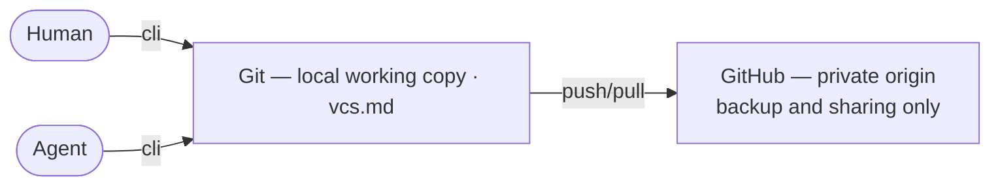

# Ecosystem

```mermaid
flowchart LR
  Human([Human])
  Agent([Agent])
  Git["Git — local working copy · vcs.md"]
  Origin["GitHub — private origin<br/>backup and sharing only"]

  Human -- cli --> Git
  Agent -- cli --> Git
  Git -- push/pull --> Origin
```
