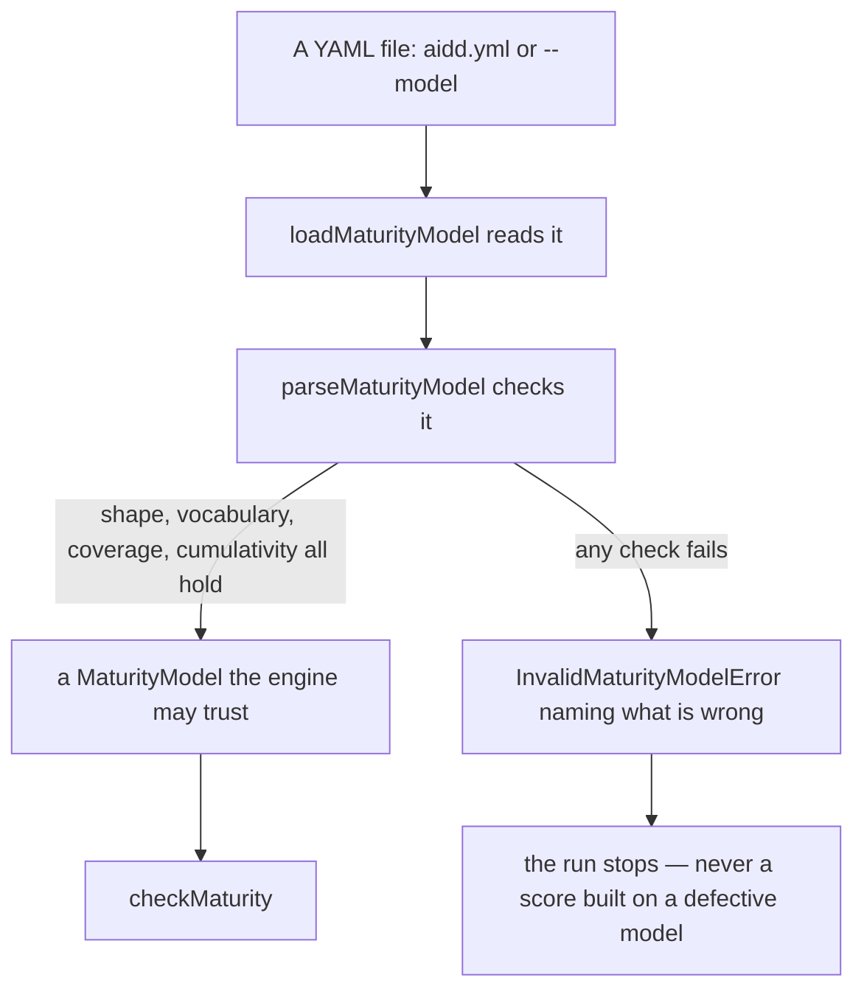
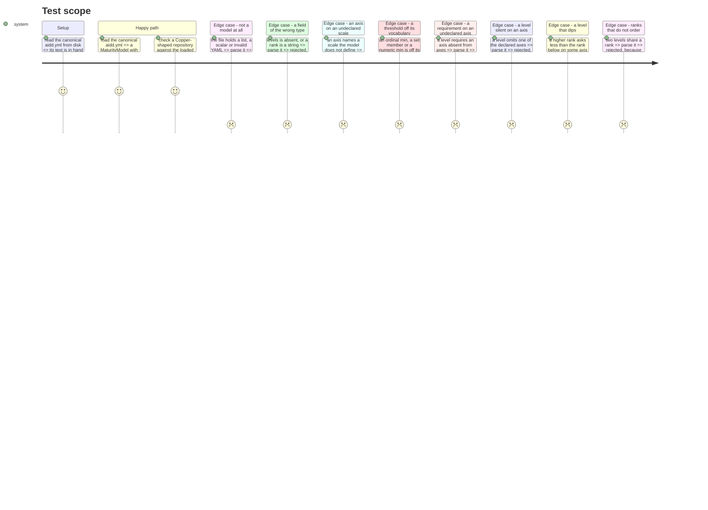

# Instruction: the loader refuses what the engine trusts

## Architecture projection

```txt
.
├── src/maturity/
│   ├── adapters/
│   │   └── yaml-maturity-model.adapter.ts   ✅ parse YAML text, check it, return a MaturityModel
│   ├── models/
│   │   └── invalid-maturity-model.error.ts  ✅ moved from engine/ — a domain error both sides throw
│   └── engine/
│       ├── invalid-maturity-model.error.ts  ❌ moved to models/
│       ├── maturity-engine.ts               ✏️ import the error from models/
│       └── scale-comparison.ts              ✏️ import the error from models/
└── tests/maturity/
    └── yaml-maturity-model.adapter.test.ts  ✅ the seven acceptance criteria, as behaviour
```

## User Journey



## Test Scope



## Tasks to do

### `1)` Move the error where both sides can throw it

> The adapter must reject a model without importing the decision engine.

1. `git mv src/maturity/engine/invalid-maturity-model.error.ts src/maturity/models/`.
2. Fix the two importers: `engine/maturity-engine.ts`, `engine/scale-comparison.ts`.
3. `pnpm typecheck` and `pnpm architecture` stay green.

### `2)` Write the rejection tests first

> Every criterion is a sentence about behaviour, not about a function.

1. Create `tests/maturity/yaml-maturity-model.adapter.test.ts`.
2. Build each invalid case as YAML **text**, from a minimal valid document defined once in the file — a
   two-axis, two-level model, not a copy of `aidd.yml`. One `describe` per family of rejection.
3. Assert `InvalidMaturityModelError` **and** that the message names the offending id — a bare throw
   leaves the operator to bisect a hand-edited file.
4. Assert the happy path against the real `aidd.yml` on disk: four axes, seven distinct ranks, and a
   Copper-shaped observation set proving Copper.
5. Run: they fail. That is the point.

### `3)` Write the adapter

> `src/maturity/adapters/yaml-maturity-model.adapter.ts`. The only production file that may import `yaml` or `node:fs`.

1. `loadMaturityModel(path: string): MaturityModel` — `readFileSync(path, 'utf8')`, hand to `parseMaturityModel`.
2. `parseMaturityModel(source: string): MaturityModel` — `YAML.parse`, then check **in this order**, so a
   later check never reads a field an earlier one has not established:
   1. **Shape** — the document is an object; `schemaVersion` is a number and equals 1; `id` is a non-empty
      string; `scales` is an object of `{kind: 'ordinal', values: string[]}` \| `{kind: 'set', members: string[]}`
      \| `{kind: 'numeric'}`; `axes` is a non-empty array of `{id, label, scale}` strings with distinct ids;
      `levels` is a non-empty array of `{id, rank, label, requirements}` with distinct ids, numeric ranks,
      and each requirement an object carrying `axis` plus exactly one of `min` (string \| number) or `includes` (string[]).
   2. **Vocabulary** — every `axis.scale` names a declared scale; every requirement's threshold sits on its
      axis's scale, with the same three rules `requireThresholdOnScale` already applies.
   3. **Coverage** — ranks are distinct; every level declares exactly one requirement per declared axis,
      and none for an axis the model does not declare.
   4. **Cumulativity** — sort levels by rank; for each axis, walking ascending, the higher threshold is
      never below the lower: ordinal by index in `values`, numeric by `>=`, set by superset of `includes`.
3. Narrow with type guards returning `value is T`. **No `as MaturityModel`, anywhere** —
   `.claude/rules/02-programming-languages/2-typescript-domain-modeling.md` already forbids it.
4. Every rejection throws `InvalidMaturityModelError` with a sentence naming the level, axis or scale at fault.
5. Run the tests: green.

### `4)` Prove the boundary still bites

> A new folder under `src/maturity/` must not quietly sit outside the wall.

1. `pnpm architecture`. The adapter is a legal home for `yaml` and `node:fs`; the engine is not, and its
   sentinels must still fire.
2. `no-orphans` is a **warning** and exempts only `contracts/` and `ports/`. The adapter has no production
   consumer until `cli` lands, so a warning is expected and correct. Do **not** widen the exemption to
   `adapters/` — that would disarm the rule for every future adapter. Report the warning; change nothing.
3. `pnpm check`.

## Test acceptance criteria

| Task | Acceptance criteria |
| ---- | ------------------- |
| 1 | The engine still refuses an invalid model exactly as before the move; `pnpm check` is green. |
| 2, 3 | Loading the canonical `aidd.yml` returns a model with four axes and seven distinct ranks, and grading a Copper-shaped repository against it proves Copper. |
| 2, 3 | A document that is not a model object, or whose field carries the wrong type, is refused with a message naming the field. |
| 2, 3 | A threshold off its axis's vocabulary is refused — ordinal value, set member, and non-numeric minimum alike. |
| 2, 3 | A requirement naming an axis the model does not declare is refused, naming the axis. |
| 2, 3 | A level that omits a declared axis is refused, naming the level and the axis; so is a level naming one axis twice. |
| 2, 3 | A model where a higher rank asks less than a lower rank on any axis is refused, naming both levels and the axis; so are two levels sharing a rank. |
| 3 | `grep -rn "as MaturityModel" src/` returns nothing. |
| 4 | `pnpm check` passes, and the engine's sentinels for `domain-has-no-vendor-sdk` and `domain-has-no-filesystem` still fire. |
