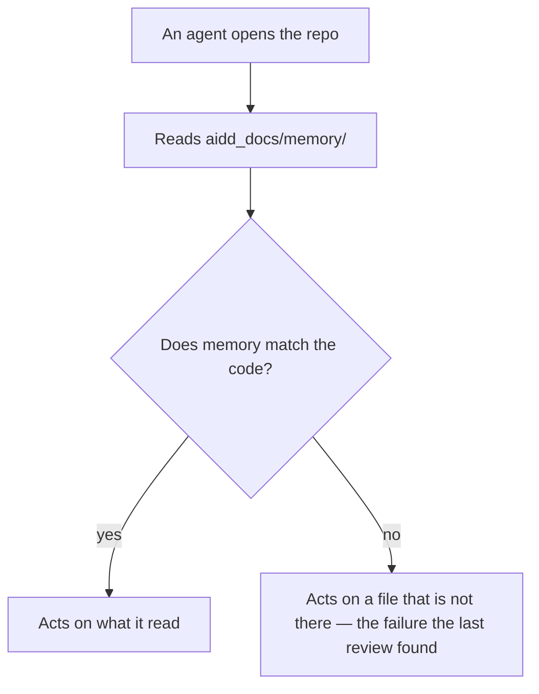
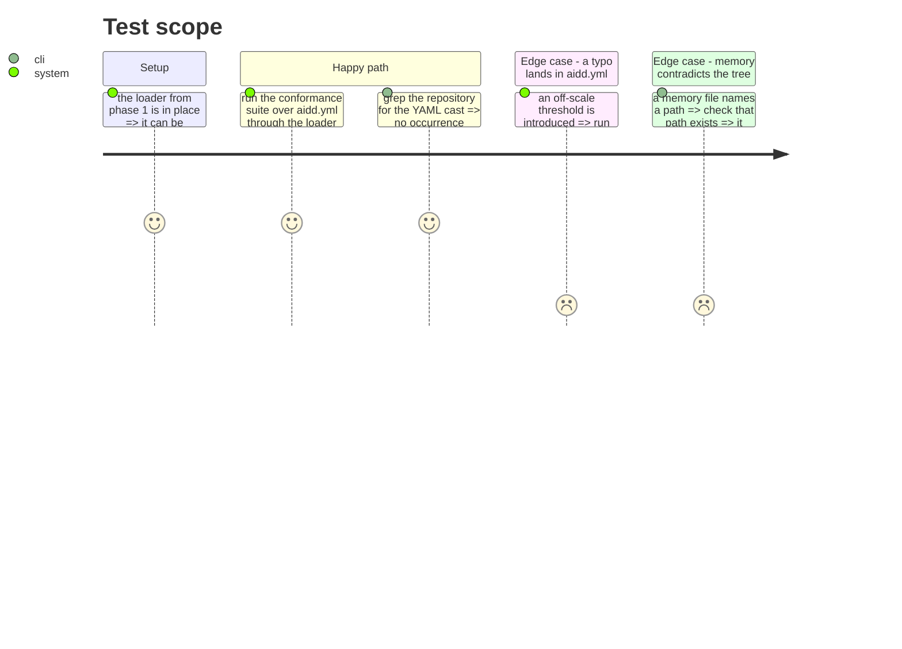

# Instruction: cut the cast and make the docs true

## Architecture projection

```txt
.
├── src/maturity/engine/
│   ├── scale-comparison.ts       ✏️ the comment promising the loader takes this function is now false
│   └── maturity-engine.ts        ✏️ name the loader that now owes what the engine assumes
├── tests/maturity/
│   └── aidd-model.test.ts        ✏️ read the model through the loader; assert the guards directly
└── aidd_docs/memory/
    ├── architecture.md           ✏️ the loader exists; the port is deferred, with the reason
    ├── codebase-map.md           ✏️ adapters/ is real; the guards are no longer "temporary"
    └── testing.md                ✏️ the debt this phase pays is paid
```

## User Journey



## Test Scope



## Tasks to do

### `1)` Route the conformance test through the loader

> `tests/maturity/aidd-model.test.ts` is the file that taught the cast. It stops teaching it.

1. Replace `YAML.parse(readFileSync('aidd.yml','utf8')) as MaturityModel` with `loadMaturityModel('aidd.yml')`.
   Drop the now-unused `node:fs` and `yaml` imports.
2. `testing.md` owes this file a direct assertion of the model guards: it currently proves them only
   sideways, through reference points that happen to throw. Now that the loader owns them, assert them
   here directly — the canonical model loads without throwing, and that is the claim.
3. Keep it a **conformance** test: it reads the real file on purpose, so a typo in `aidd.yml` fails at
   commit rather than at assessment. Decision tests stay free of disk and YAML.

### `2)` Rewrite the two comments the loader falsified

1. `src/maturity/engine/scale-comparison.ts` — `requireThresholdOnScale` says *"Temporary here: the
   `load AIDD model` feature moves this whole function to the loader"*. It did not. Say what is true:
   the loader is the gate on untyped input, this is the backstop for a hand-built model, and the two
   are scoped, not duplicated.
2. `src/maturity/engine/maturity-engine.ts` — *"Assumes a well-formed, cumulative model. The loader owes
   both."* Name the loader that now pays.

### `3)` Realign project memory with the tree

1. `architecture.md`:
   - **Runtime boundaries** — *"That loader does not exist yet"* is false. Describe what it checks.
   - **Levels are cumulative, and that is checked** — *"Not enforced yet ... the loader owes it"* is paid.
     Only the last sentence, that only `aidd.yml` is safe to trust, goes away.
   - **Shape** and **Contexts** — the mermaid names a *"maturity-model port (planned)"*. Replace it with the
     adapter, and record in one line why the port is deferred rather than forgotten: no consumer exists yet.
   - **Frozen before the split** — the guards in `engine/` are no longer on their way out.
2. `codebase-map.md` — `src/maturity/` now holds `adapters/`; the guards in `engine/` are not "temporary";
   the naming example may cite `yaml-maturity-model.adapter.ts`, which now exists.
3. `testing.md` — the *"Owed, not yet written"* note about the three vocabularies is a **different** debt
   and stays. Update only the paragraph ending *"Once the loader owns those guards, this file should
   assert them directly again."*
4. Change nothing else. A memory edit that outruns the code is the exact rot this phase exists to remove.

### `4)` Verify

1. `pnpm check`.
2. `grep -rn "as MaturityModel" src/ tests/` returns nothing.
3. For every path named in the three memory files, confirm it exists.

## Test acceptance criteria

| Task | Acceptance criteria |
| ---- | ------------------- |
| 1 | The conformance suite still grades `aidd.yml`'s reference points, and now obtains the model through the loader; introducing an off-scale threshold in `aidd.yml` makes it fail with a message naming the threshold. |
| 2 | No comment in `src/maturity/engine/` describes a move that did not happen. |
| 3 | No memory file names a file, folder or port that does not exist, and the deferred port is recorded with its reason. |
| 4 | `pnpm check` passes and `as MaturityModel` appears nowhere under `src/` or `tests/`. |
