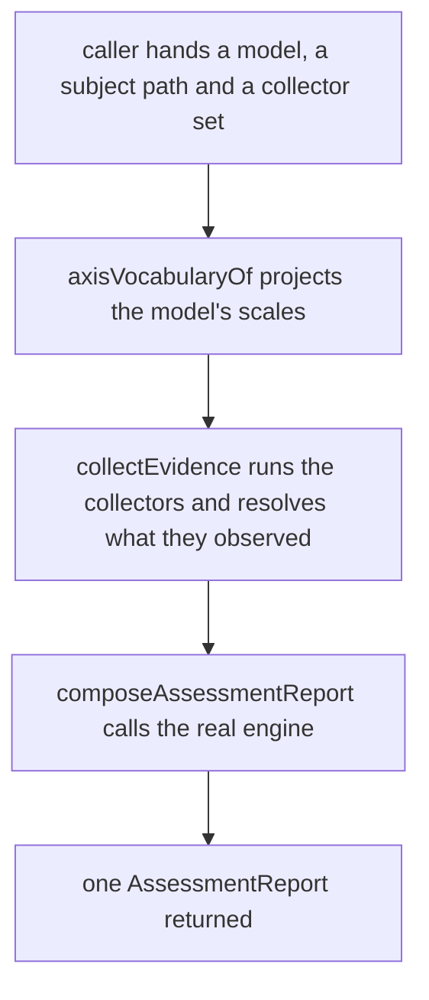
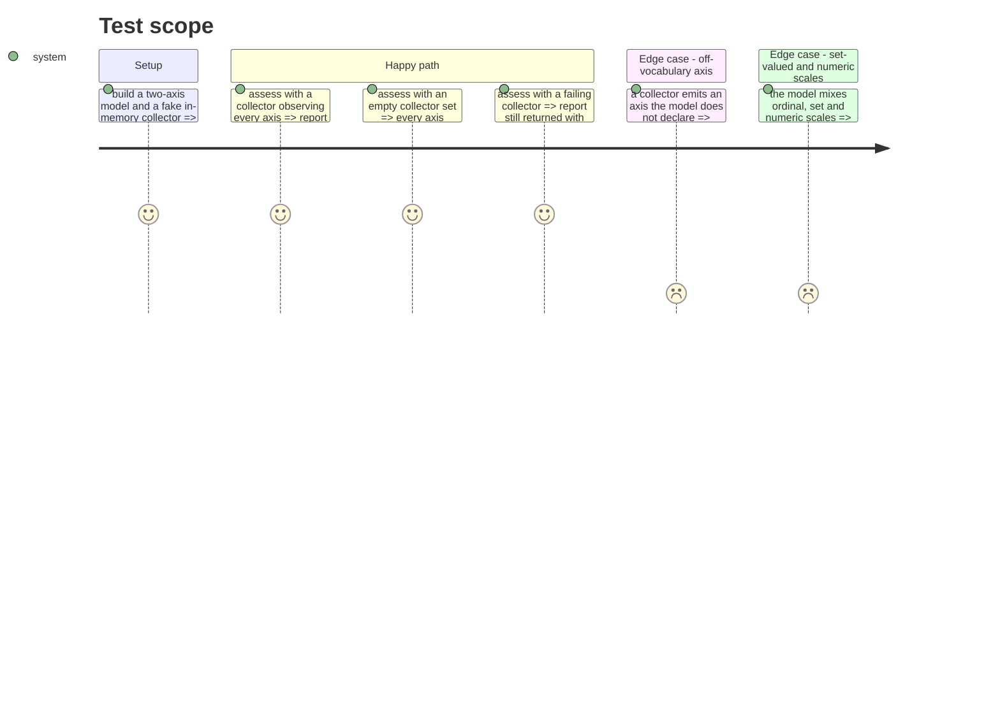

# Instruction: the assessment sequencer

## Architecture projection

> Tree of the final files. ✅ create · ✏️ modify · ❌ delete

```txt
.
├── src
│   └── assessment
│       ├── composition
│       │   └── axis-vocabulary.ts                    ✅ project the model's scales into the evidence vocabulary
│       └── usecases
│           ├── assess-maturity.usecase.ts            ✅ sequence collection then composition
│           └── assess-maturity.usecase.test.ts       ✅ prove the sequence at its own boundary
├── scripts
│   └── prove-boundary-rules.mjs                      ✏️ three domain-rule sentinels for src/assessment/usecases/
└── aidd_docs
    └── memory
        ├── architecture.md                           ✏️ record why the model-loading port did not appear
        └── codebase-map.md                           ✏️ the sequencer exists; name axis-vocabulary.ts
```

## User Journey



## Test Scope



## Tasks to do

### `1)` project the model's scales into the evidence vocabulary

> `assessment` is the only context that sees both declarations. Translate, decide nothing.

1. Create `src/assessment/composition/axis-vocabulary.ts` exporting `axisVocabularyOf(model: MaturityModel): readonly AxisVocabulary[]`.
2. For each `model.axes` entry, look its scale up in `model.scales` with `Object.hasOwn`, never a bare index — `model.scales` carries user-supplied keys and a plain lookup resolves `toString` as a declared scale. `requireVocabulary` already proves the key exists, so an absent scale is unreachable: throw naming the axis, and say so in a comment, as `labelOf` does in `compose-assessment-report.ts`.
3. Map `ordinal → { axis, kind: 'ordinal', values }`, `set → { axis, kind: 'set', members }`, `numeric → { axis, kind: 'numeric' }`. Exhaustive `switch`, no `default`.
4. Add no test file: the behaviour is proven through the use case, per `testing.md` ("do not create tests merely to mirror `src/`").

### `2)` sequence collection and composition

> The one file that loads nothing and decides nothing, and only orders the two steps.

1. Create `src/assessment/usecases/assess-maturity.usecase.ts`.
2. Request shape: `{ subjectPath: string; model: MaturityModel; collectors: readonly EvidenceCollector[]; signal: AbortSignal }`. The model arrives loaded — this file must not import `maturity/loading/`, and the gate proves that rule from this exact folder.
3. `assessMaturity(request): Promise<AssessmentReport>` calls `axisVocabularyOf`, then `collectEvidence({ path: subjectPath, vocabulary, collectors, signal })`, then `composeAssessmentReport({ subjectPath, model, evidence, provenance })`. Nothing else.
4. Import no `node:` module and no vendor package: the three domain rules reach this folder.

### `3)` prove the sequence at its own boundary

> Chicago style. Real `collectEvidence`, real `resolveEvidence`, real `composeAssessmentReport`, real `checkMaturity`.

1. Create `src/assessment/usecases/assess-maturity.usecase.test.ts`.
2. Reuse `src/evidence/adapters/fake-in-memory-evidence-collector.test-adapter.ts` and `failing-evidence-collector.test-adapter.ts`. Write no new double unless a case needs one that does not exist, and if so file it in `adapters/` as one class per concept.
3. Reuse or extend `src/maturity/engine/maturity-model.test-fixture.ts` rather than hand-building a model. Read it first — the engine and the loader both trust its shape.
4. Cover the five journeys above. The empty-collector case is the shipped CLI behaviour, so assert it precisely: one `UNKNOWN` evidence entry per declared axis, `proven` null, `coverage.axesObserved` 0, `provenance` empty.
5. Assert on the returned `AssessmentReport`, never on which collaborator was called.

### `4)` arm the boundary rules in the new folder

> A rule that matches nothing reports success, and `src/assessment/usecases/` is about to hold real code.

1. Read `aidd_docs/memory/coding-assertions.md` §"The rules are themselves under test" before touching the script.
2. `scripts/prove-boundary-rules.mjs` already covers `assessment-composes-never-adapts` (twice) and `assessment-never-depends-on-cli` from `src/assessment/usecases/`. It does **not** cover `domain-has-no-filesystem`, `domain-has-no-processes` or `domain-has-no-vendor-sdk` there, and all three match `^src/[^/]+/(models|usecases|contracts|engine|resolution|composition)/`.
3. Add one sentinel per missing rule, named `src/assessment/usecases/__boundary-sentinel__fs.ts`, `__boundary-sentinel__proc.ts`, `__boundary-sentinel__vendor.ts`, mirroring the `src/assessment/composition/` block directly above them.
4. Run `pnpm architecture` and read the printed count: it must rise by three violations, and the rule count must not change.
5. Note in one line to the orchestrator, and change nothing, that `src/evidence/usecases/` holds production code under the same three rules with no sentinel either. Pre-existing, out of this feature's scope.

### `5)` correct the memory the code just contradicted

> `architecture.md` predicted a sequencer that loads. The gate forbids it.

1. In `architecture.md`, rewrite the `assessment` section and the "Public boundary" note so they say the sequencer receives a loaded model, and why: `assessment-composes-never-adapts` reaches `loading/`, and the sentinel proves it from `usecases/`. Keep the existing reasoning about why no port appeared — extend it, do not delete it.
2. Do **not** add a status line to `architecture.md`: `b939dde` moved "what exists and what is still planned" into `codebase-map.md` alone, and that file now says so in its opening line.
3. In `codebase-map.md`, move `usecases/assess-maturity.usecase.ts` out of **(planned)**, drop the stale "will load the model" clause, and name `composition/axis-vocabulary.ts`.
4. Both files are project memory shared with other worktrees. Write why, not what.

## Test acceptance criteria

| Task | Acceptance criteria                                                                                                                          |
| ---- | -------------------------------------------------------------------------------------------------------------------------------------------- |
| 1    | An ordinal, a set and a numeric scale each reach a collector as the matching `AxisVocabulary` kind, carrying the model's own values.          |
| 2    | `assessMaturity` returns an `AssessmentReport` whose verdicts come from the real engine; the file imports nothing from `maturity/loading/`.   |
| 3    | An empty collector set yields one `UNKNOWN` entry per declared axis, `proven: null`, `coverage.axesObserved: 0`, and no thrown error.         |
| 3    | A failing collector still yields a report, with a `FAILED` provenance entry naming it.                                                       |
| 3    | A collector emitting an undeclared axis makes `assessMaturity` reject with `UndeclaredAxisError` naming that axis.                            |
| 4    | `pnpm architecture` reports three more deliberate violations than before, all green. Removing a sentinel proves nothing — it removes its own expectation. Prove the bite instead: narrow each of the three rules out of `usecases/` and confirm the script names that sentinel and exits 1. |
| 5    | `architecture.md` and `codebase-map.md` describe the code that now exists, and state why the model-loading port still does not.               |
