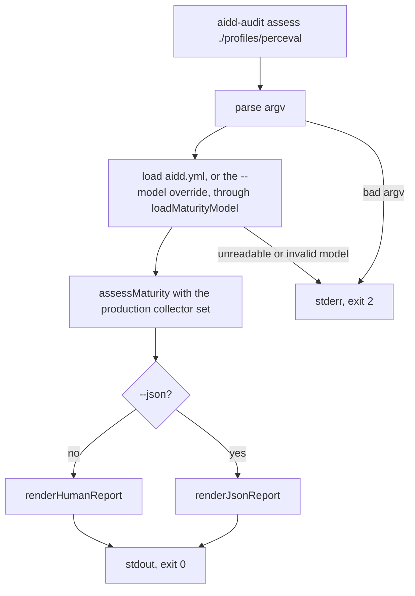
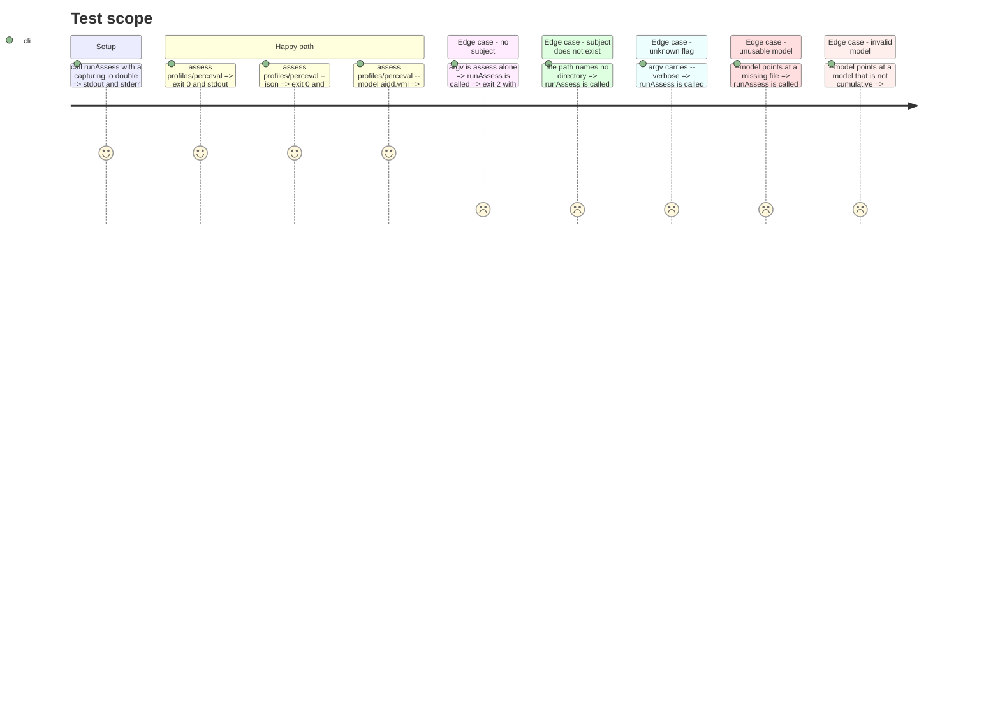

# Instruction: the executable command

## Architecture projection

> Tree of the final files. ✅ create · ✏️ modify · ❌ delete

```txt
.
├── src
│   └── cli
│       ├── assess-arguments.ts                       ✅ parse argv into a subject, a model override and a renderer choice
│       ├── canonical-model-path.ts                   ✅ locate the packaged aidd.yml without reading the cwd
│       ├── usage.error.ts                            ✅ the error class that means "you typed it wrong"
│       ├── assess.command.ts                         ✅ runAssess(argv, io) — the whole command, no side effect on import
│       ├── assess.command.test.ts                    ✅ stdout, stderr and exit code, in process
│       └── main.ts                                   ✅ the executable shell, and the only file that touches process
├── tsup.config.ts                                    ✏️ entry becomes src/cli/main.ts
└── aidd_docs
    └── memory
        ├── cli.md                                    ✏️ the command exists; exit codes; the absent timeout
        ├── codebase-map.md                           ✏️ entry point is main.ts, and why the command is split from it
        ├── coding-assertions.md                      ✏️ pnpm build is green again
        └── testing.md                                ✏️ where the CLI boundary suite sits and what it observes
```

## User Journey



## Test Scope



## Tasks to do

### `1)` parse the arguments, by hand

> `dependencies` holds `yaml` and nothing else. Keep it that way.

1. Create `src/cli/usage.error.ts` — `export class UsageError extends Error {}`, mirroring `unrenderable-report.error.ts`.
2. Create `src/cli/assess-arguments.ts` exporting `parseAssessArguments(argv: readonly string[]): AssessArguments` where `AssessArguments = { subjectPath: string; modelPath: string | null; json: boolean }`.
3. Accept exactly `assess <path>` plus `--json` and `--model <path>`, in any order. Reject with `UsageError`: a missing or unknown command word, no subject, a second subject, an unknown flag, `--model` with no value, a repeated flag.
4. Every `UsageError` message ends with the usage line `usage: aidd-audit assess <path> [--json] [--model <path>]`, so a mistyped invocation is self-correcting.
5. `noUncheckedIndexedAccess` is on: every `argv[i]` is `string | undefined`. Handle it, do not assert it away.

### `2)` locate the packaged model

> Criterion 3: relative to the installed package, never to `process.cwd()`.

1. Create `src/cli/canonical-model-path.ts` exporting `canonicalModelPath(): string`.
2. Start at `dirname(fileURLToPath(import.meta.url))` and walk up to the nearest ancestor directory containing `aidd.yml`. That resolves from `src/cli/` in the suite and from `dist/` in the bundle, which sit at different depths — a fixed `'..'` is right in one layout and wrong in the other.
3. Stop at the filesystem root and throw a plain `Error` naming what was searched for. This is a packaging fault, not a user error, so it must reach exit 1.
4. This file may import `node:fs`, `node:path` and `node:url`: no dependency-cruiser rule reaches `src/cli/`, because the CLI is the composition root.

### `3)` write the command

> Wiring only. Criterion 8: no maturity, evidence, coverage or blocker rule appears in this folder.

1. Create `src/cli/assess.command.ts` exporting `runAssess(argv: readonly string[], io: CommandIo): Promise<number>` with `CommandIo = { stdout(text: string): void; stderr(text: string): void }`. Importing this module must run nothing.
2. Sequence: parse argv, `statSync` the subject and throw `UsageError` if it is not a directory or file, `loadMaturityModel(modelPath ?? canonicalModelPath())`, `assessMaturity(...)`, render, write to `io.stdout`, return 0.
3. The subject check is argument validation, not interpretation: stat the path, read nothing inside it. Criterion 5 stands.
4. Declare `const collectors: readonly EvidenceCollector[] = []` with a comment naming what fills it — the fixture bundle and live-repository adapters — and why it is empty today. Do not write a collector.
5. Create an `AbortController`, pass `controller.signal`, abort it in `finally`. No timeout constant: the port makes the budget the collector's duty and there are no collectors. Say so in the comment.
6. Catch `UsageError` and `InvalidMaturityModelError` → write `error.message` to `io.stderr`, return 2. Catch everything else → write the message to `io.stderr`, return 1. Nothing reaches stdout on either path.
7. `proven: null` is not an error. It leaves through the success path, exit 0, like any other report.

### `4)` make it executable

> One file touches `process`, and the suite never imports it.

1. Create `src/cli/main.ts`: call `runAssess(process.argv.slice(2), { stdout: (t) => process.stdout.write(t), stderr: (t) => process.stderr.write(t) })` and assign the result to `process.exitCode`. Never `process.exit()` — it truncates a pending write.
2. Ensure the rendered report ends with exactly one trailing newline. The renderers return no trailing newline; add it here or at the write, once, not twice.
3. Point `tsup.config.ts` at `{ cli: 'src/cli/main.ts' }`. The `bin` field and the `#!/usr/bin/env node` banner already exist and stay.
4. Run `pnpm build` and confirm `dist/cli.js` appears. This is the gate that has been red since `tsup.config.ts` was written.

### `5)` observe the user boundary

> Criterion 16: stdout, stderr, exit code. Never which function was called.

1. Create `src/cli/assess.command.test.ts`, beside its subject as `testing.md` requires.
2. Drive `runAssess` with an in-memory `CommandIo` that appends to two string arrays. No spawn, no build, no `process` stubbing.
3. Cover every journey above. `profiles/perceval` is the subject of record; name it once, in the suite, never in `src/` outside the test — criterion 17 forbids profile knowledge in production code.
4. For `--json`, `JSON.parse` the stdout and assert on the parsed object, not on the string. Assert `schemaVersion`, `proven === null`, `coverage.axesRequested === 4`, and `provenance` empty.
5. For the invalid-model case, build the bad model as a temp file under the OS temp dir and remove it afterwards. Assert the error class's message fragment reaches stderr, not just that stderr is non-empty — `coding-assertions.md` and `testing.md` both say a rejection test that only checks "something threw" passes for the wrong throw.
6. Assert stdout is empty on every failing path, and that no case exits 0 with an empty stdout.

### `6)` verify, then record

> Evidence, not assertion.

1. `pnpm check` — typecheck, test, architecture, in that order.
2. `pnpm build`, then run the real binary offline: `node dist/cli.js assess ./profiles/arthur` and `node dist/cli.js assess ./profiles/arthur --json`. Paste the actual output into the handback.
3. `pnpm format` last, since it rewrites files.
4. Update `cli.md`: the command exists; the exit-code taxonomy; that no collection timeout is set and why; that `runAssess` is the command and `main.ts` the shell.
5. Update `codebase-map.md` (entry point is `main.ts`, and why the command is split from it), `coding-assertions.md` (its **Before push** section still ends "It stays red until `src/cli/assess.command.ts` lands" — that sentence is now false and names the wrong entry file), and `testing.md` (the CLI boundary suite, what it observes, and that the four profiles are not yet pinned to their expected levels).
6. State plainly in the handback that no reference profile reaches its expected level yet, because no collector exists. That is the accepted scope limit, not a defect.

## Test acceptance criteria

| Task | Acceptance criteria                                                                                                                     |
| ---- | ----------------------------------------------------------------------------------------------------------------------------------------- |
| 1    | Every rejected invocation carries the usage line, and a valid one in any flag order parses identically.                                  |
| 2    | The default model resolves to the repository's `aidd.yml` from the suite and from `dist/cli.js`, with the process started anywhere.      |
| 3    | `assess <a profile>` exits 0, writes a report to stdout and nothing to stderr, with `proven: null`.                                      |
| 3    | No file under `src/cli/` computes a maturity, evidence, coverage or blocker verdict; all of them arrive on the report.                   |
| 4    | `pnpm build` produces an executable `dist/cli.js`, and running it prints the same report as the in-process suite.                        |
| 5    | Each failing journey exits 2 with a message on stderr naming the offending input, and writes nothing to stdout.                          |
| 5    | The invalid-model case asserts the loader's own message fragment, so a `TypeError` in its place fails the test.                          |
| 6    | `pnpm check` and `pnpm build` both exit zero, with the real output quoted in the handback.                                               |
| 6    | The memory files describe the shipped command, including the ceiling that no profile reaches its expected level yet.                     |
