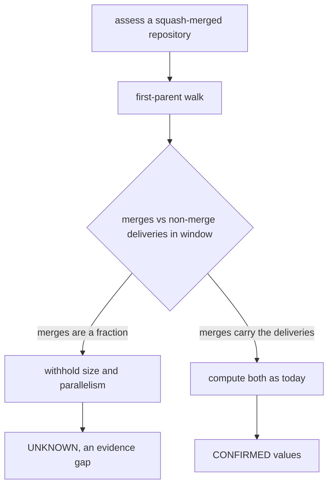
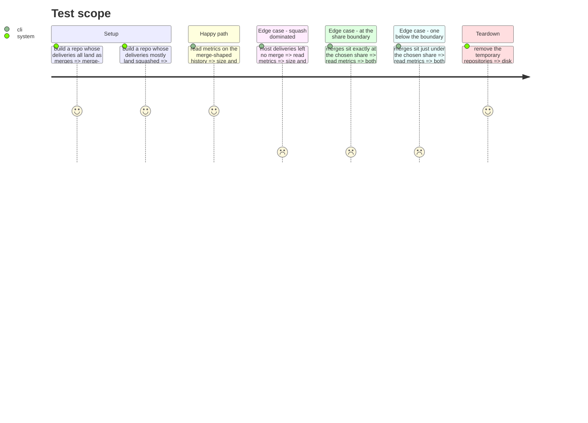

# Instruction: Silence the local artefact on size and parallelism

## Architecture projection

```txt
.
├── src/evidence/adapters/live-repository/
│   ├── git-history.ts              ✏️ withhold both axes when merges are a fraction of deliveries
│   └── git-history.test.ts         ✏️ the withholding, both sides of the chosen share
└── aidd_docs/memory/
    ├── cli.md                      ✏️ a third reason a live repository yields no level
    └── testing.md                  ✏️ what the live adapter now proves
```

## User Journey



## Test Scope



## Tasks to do

### `1)` Name the condition and its constant

> The merge graph is only the delivery record when merges account for the deliveries.

1. Add `MINIMUM_MERGE_SHARE` beside the existing floors in `git-history.ts`.
2. Compute it over the window: merges divided by merges plus non-merge first-parent commits.
3. Tag it `LIMITATION:`, state that the value is chosen and not measured, and that it must not be
   lowered so that a given repository classifies, on the same footing as the sample floors above it.
4. State what each direction costs: too high withholds a real practice, too low publishes a median
   and a branch count drawn from a fraction of what was delivered.

### `2)` Withhold both axes, never lower them

> A value the graph cannot support is an evidence gap, never a practice gap.

1. Return `sizeBucket: null` and `parallelism: null` together when the share is not met.
2. Leave `intervention` untouched, it reads authorship and not branch shape.
3. Keep the existing guards ahead of it, shallow clone and no merge at all, they answer first.

### `3)` Prove the guard on both sides

> A threshold is pinned only by rows on both sides of it.

1. Build a merge-shaped history that clears the share, assert both axes carry a value.
2. Build a squash-shaped history one delivery under the share, assert both are null.
3. Build one exactly at the share, assert both carry a value.
4. Neuter the guard, watch the squash case go green, restore.

### `4)` Record what changed in the memory bank

> A live repository now has three reasons to yield no level, not two.

1. In `cli.md`, add the squash-dominated history beside the sample floors and the missing forge.
2. In `testing.md`, extend the live adapter's row with the delivery-record share.

## Test acceptance criteria

| Task | Acceptance criteria              |
| ---- | -------------------------------- |
| 1 | The constant carries a `LIMITATION:` block naming the cost of each direction and forbidding its lowering to make a repository classify. |
| 2 | A history whose deliveries mostly left no merge reports both size and parallelism as absent, and reports intervention exactly as before. |
| 3 | The suite fails when the guard is removed, and pins the share at the last value below it and the first value at or above. |
| 4 | `cli.md` names three distinct reasons a live repository yields no level, and only one of them expires with age. |
