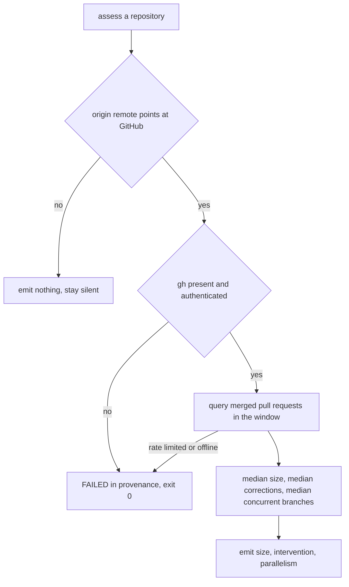
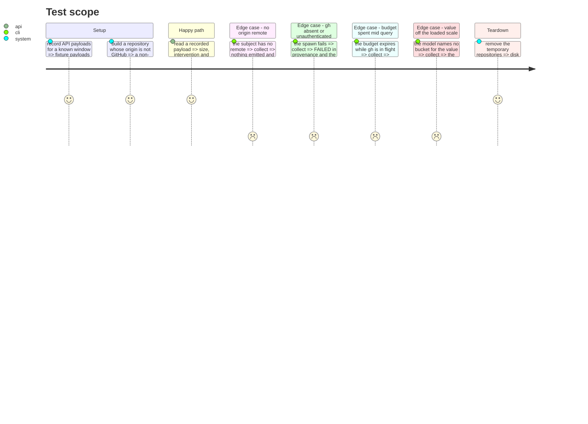

# Instruction: A GitHub forge collector, single reading

## Architecture projection

```txt
.
├── src/evidence/adapters/
│   ├── forge-repository.adapter.ts              ✅ the collector, behind the existing port
│   ├── forge-repository.adapter.test.ts         ✅ what it emits, and what it stays silent on
│   └── forge-repository/
│       ├── gh-process.ts                        ✅ the single gh spawn, honours the signal
│       ├── gh-process.test.ts                   ✅ cancellation and failure surfacing
│       ├── gh-command-failed.error.ts           ✅ one error class, beside its spawn
│       ├── repository-slug.ts                   ✅ owner and name from the origin remote
│       ├── repository-slug.test.ts              ✅ ssh, https, no remote, not GitHub
│       ├── pull-request-history.ts              ✅ the paginated query and the three medians
│       └── pull-request-history.test.ts         ✅ the medians, over recorded API payloads
├── src/evidence/adapters/
│   ├── delivery-sample.ts                       ✅ window length and sample floors, shared by all three
│   ├── intervention-scale.ts                    ✅ the corrections-to-scale reading, shared
│   ├── live-repository.adapter.ts               ✏️ accept the axes it is built to answer
│   └── fixture-bundle/recorded-activity.ts      ✏️ read the intervention scale from the shared module
├── src/cli/
│   ├── commands/assess.command.ts               ✏️ choose the collector set, set a real budget
│   └── commands/assess.command.test.ts          ✏️ the budget, and a failing forge exiting 0
└── tests/cli/process-contract.test.ts           ✏️ the set chosen per subject, and its provenance
```

## Replan of 2026-08-29

The first projection added the forge collector beside the live one. Executing it surfaced that
`resolveAxis` turns two `OBSERVED` values of one axis into `CONFLICTING`, and that the two
collectors necessarily disagree: the forge reads the pull request, the live collector reads the
graph the merge left behind, and their divergence is the whole point of adding the forge. Intervention
is near-certain to conflict, since the live rule answers `never-once-framed` from authorship while
the forge answers from commits after opening.

**The collector set is therefore chosen at the composition root**, which is where wiring belongs. No
collector learns about another, and `resolveEvidence` is untouched. When the subject is the root of a
work tree with a GitHub origin, the forge owns size, intervention and parallelism, and the live
collector is built for the harness alone. Otherwise the set is the one that ships today.

The cost is stated rather than hidden: on a GitHub repository where `gh` is absent or refuses, those
three axes are `UNKNOWN` where the graph would previously have offered a value. That is the
conservative direction, and the provenance names the forge as `FAILED` so a reader sees why.

## User Journey



## Test Scope



## Tasks to do

### `1)` Spawn gh the way the project spawns git

> One process module, one error class, the signal honoured.

1. Mirror `live-repository/git-process.ts`: a single `runGh`, an explicit environment, no bare
   `process.env`.
2. Kill the child on abort and reject, so the collector reports `TIMED_OUT` rather than hanging.
3. Surface a non-zero exit as `GhCommandFailedError` carrying the command and the first line of
   stderr.

### `2)` Recover the repository from its remote

> The subject is still a path. The forge is reached through what that path declares.

1. Read `git remote get-url origin` through the existing git spawn.
2. Accept the ssh and https GitHub forms, reject everything else by returning nothing.
3. No remote, or a remote on another host, means this collector stays silent, exactly as the live
   collector does outside a work tree. Silence is not a failure and records none.

### `3)` Query the window in one shape

> Three axes, one query, three pages.

1. One GraphQL query returning `createdAt`, `mergedAt`, `additions`, `deletions`, `changedFiles`
   and each commit's `authoredDate` and `committedDate`.
2. Thread the cursor from `pageInfo.endCursor`, and assert in the test that a second page is
   actually fetched. The probe run during planning looped on page one and must not be repeated.
3. Keep only pull requests merged inside the same 180-day window the live collector uses, so the
   two collectors describe the same period.

### `4)` Derive the three values from the shared tables

> Interchangeability is a promise of the port, and shared tables are how it is kept.

1. Size from `size-buckets.ts`, the lower of the lines and files buckets, over the window's medians.
2. Intervention from the same reading `recorded-activity.ts` applies, and from `autonomy.ts` for
   its zero-touch share. Extract that reading so the bundle and the forge cannot drift.
3. Parallelism as the median, over active days, of distinct pull requests receiving a commit that
   day.
4. Apply the same minimum sample the other collectors apply, and emit nothing below it.

### `5)` Choose the set at the composition root, and give collection a real budget

> Two sources for one axis is a conflict. Choosing which one owns it is wiring, not domain.

1. Resolve the slug once in `assess.command.ts`, and only when the subject is the root of a work
   tree. A bundle tracked inside a repository would otherwise be handed that repository's pull
   requests, which is the fault the live subject gate already exists to prevent.
2. With a slug, build the forge collector for size, intervention and parallelism, and the live
   collector for the harness alone. Without one, build the set that ships today.
3. Let the live collector accept the axes it is built to answer, and narrow the vocabulary it is
   handed so the existing early returns do the rest.
4. Set a timeout on the `AbortController` the command already owns, and record in `cli.md` that the
   reason not to have one no longer holds.
5. Extend `process-contract.test.ts` to assert the set chosen per subject kind, not a fixed count.

## Test acceptance criteria

| Task | Acceptance criteria              |
| ---- | -------------------------------- |
| 1 | A budget spent while gh is in flight surfaces as `TIMED_OUT`, and a gh failure names the command and its stderr. |
| 2 | A subject with no remote, or a remote on another host, produces no observation and no provenance failure. |
| 3 | The suite proves a second page is fetched, and that a pull request merged outside the window contributes nothing. |
| 4 | On the recorded payload the collector reports size M, intervention key-steps and parallelism 2, matching `measurements.md`. |
| 5 | On a GitHub work-tree root no axis carries two observations, the forge owning size, intervention and parallelism and the live collector the harness alone; with gh unavailable the process still exits 0, publishes a report, and records the forge as FAILED. |
