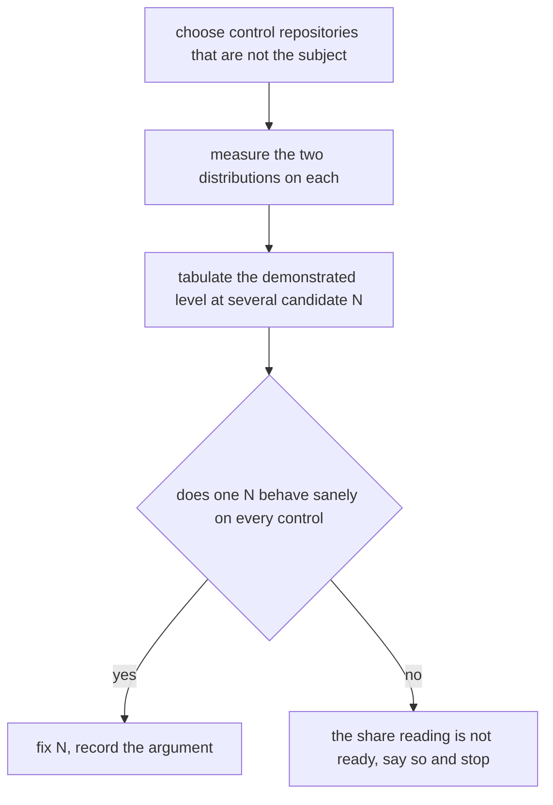
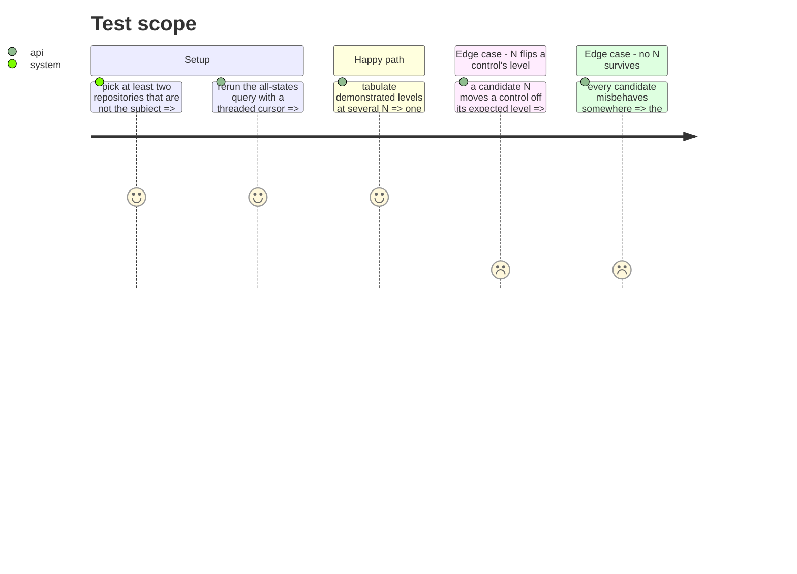

# Instruction: Settle the transcription of the Taille axis, before any code reads it

## Architecture projection

```txt
.
└── aidd_docs/tasks/2026_08/2026_08_29_dual-reading-and-forge-collector/
    └── size-transcription.md   ✅ the measurements, the chosen bucket rule and the chosen N
```

No production file changes in this phase. It settles the reading of one axis, and nothing else.

## Scope, widened on 2026-08-29

`levels/aidd.md` defines the axis qualitatively — `S` petite ou triviale, `M` complexité moyenne,
`L` multi-étapes, `XL` multi-modules — and says nothing about how an observation becomes a bucket.
Three decisions stand between the two, none of them argued anywhere and each changing the level of
every subject:

* **the bucket bounds**, `<100 / <400 / <1000` lines and `<5 / <10 / <25` files, in `size-buckets.ts`;
* **the aggregate**, a median, which `architecture.md` never records among its forced readings;
* **the share N**, if the aggregate becomes a share.

They are settled together because they are one reading of one axis, and because the subject's own
verdict has already moved between Blue and Green on the first of them alone: its median sits at 355
lines on one window and 449 on another, either side of a 400-line bound the model never states.

## User Journey



## Test Scope



## Tasks to do

### `1)` Close the verification the plan owes

> The parallelism figures are floors until this is done.

1. Rerun the all-states pull request query with the cursor correctly threaded, which the planning
   probe failed to do.
2. Recompute the parallelism distribution counting branches that were abandoned or merged after the
   window closed.
3. Record whether the subject's 2 and 3 move, and by how much.

### `2)` Choose the control repositories

> A rule validated only on the repository it was invented for is a rule nobody has checked.

1. Ask the human for at least two repositories that are not the subject, with a forge and enough
   history to clear the sample floors.
2. State the expected level of each before measuring, in writing.
3. Record the four reference profiles as a fifth control, noting that all four give the identical
   size bucket under the median and under the share reading, so they prove absence of harm and
   nothing more.

### `3)` Tabulate, then decide

> Fix the number on the argument, then read what it gives. Never the reverse.

1. For each control and for the subject, tabulate the demonstrated level at N in one quarter, one
   third, and two fifths.
2. Write the argument for the chosen N in the model's own terms, not in terms of what it yields for
   any repository.
3. Record explicitly that the subject's size share is 39.8% and its parallelism share 40.0%, so any
   N above two fifths reverses its size and any N at or below one third confirms both. The choice is
   under result pressure, and hiding that would be worse than the pressure itself.
4. If no N behaves defensibly across the controls, conclude against the share reading and stop the
   plan here. Phases 4 to 6 depend on this phase concluding in favour.

## Test acceptance criteria

| Task | Acceptance criteria              |
| ---- | -------------------------------- |
| 1 | The parallelism distribution is recomputed over every pull request, and the document states whether the subject's figures moved. |
| 2 | At least two control repositories are named, with their expected level written down before their measurement. |
| 3 | `size-transcription.md` holds one chosen N, an argument stated in the model's terms, the table it was checked against, and an explicit note that the subject's two shares sit just above one third. |
| 4 | A run where no candidate N survives ends the plan in writing rather than picking the most convenient value. |
