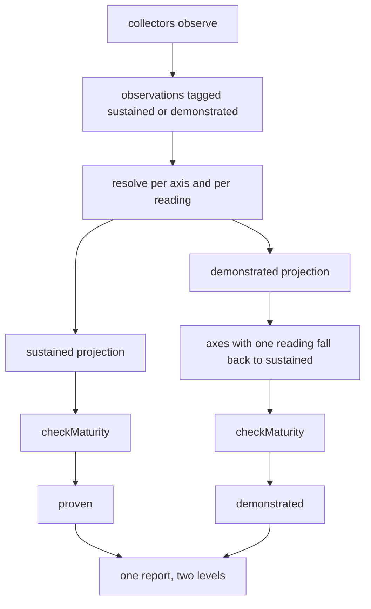
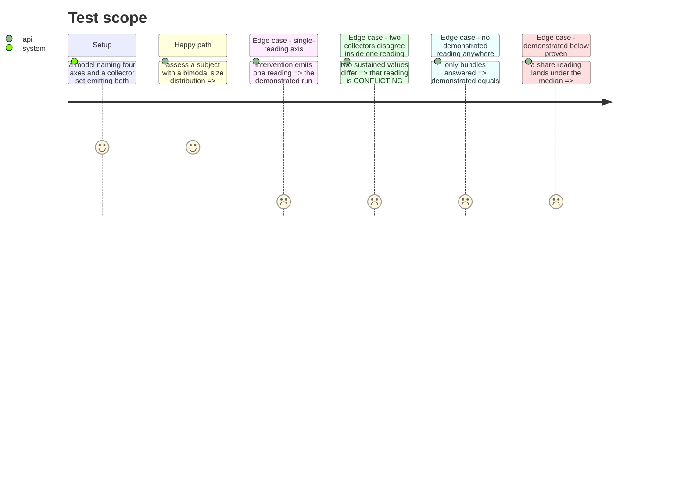

# Instruction: Two readings, from the observation to the contract

## Architecture projection

```txt
.
├── src/evidence/
│   ├── models/observation.model.ts                    ✏️ a reading tag on Observation and Evidence
│   ├── resolution/resolve-evidence.ts                 ✏️ resolve per axis and per reading
│   ├── resolution/resolve-evidence.test.ts            ✏️ a disagreement stays inside one reading
│   └── adapters/
│       ├── forge-repository.adapter.ts                ✏️ emit both readings on size and parallelism
│       ├── live-repository.adapter.ts                 ✏️ emit the sustained reading only
│       └── fixture-bundle.adapter.ts                  ✏️ emit the sustained reading only
├── src/assessment/
│   ├── contracts/assessment-report.contract.ts        ✏️ a demonstrated block beside proven
│   ├── composition/compose-assessment-report.ts       ✏️ project both readings, derive both levels
│   └── usecases/assess-maturity.usecase.ts            ✏️ call checkMaturity twice
└── tests/assessment/vocabulary-conformance.test.ts    ✏️ the reading vocabulary across declarations
```

`src/maturity/engine/` is deliberately absent. It already takes a model and an array and returns a
level, so a second reading is a second call.

## User Journey



## Test Scope



## Tasks to do

### `1)` Give an observation its reading

> Two values of one axis are a conflict. Two readings of one axis are two questions.

1. Add `reading: 'SUSTAINED' | 'DEMONSTRATED'` to `Observation`, and carry it onto `Evidence`.
2. Update the frozen-model note in `architecture.md`: the file is unfrozen deliberately, and why.
3. Extend `vocabulary-conformance.test.ts` so the reading names cannot drift between declarations.

### `2)` Resolve inside a reading, never across

> `CONFLICTING` must keep meaning "two collectors saw the same thing differently".

1. Map `resolveEvidence` over the requested axes crossed with the readings.
2. Assert that a sustained disagreement leaves the demonstrated reading intact, and the reverse.
3. Keep `UNKNOWN` for an axis and reading nobody answered.

### `3)` Emit the right readings from each collector

> A collector that cannot see a distribution must not pretend to have one.

1. Forge collector: both readings on size and parallelism, sustained only on intervention.
2. Live collector: sustained only, on every axis it answers.
3. Bundle collector: sustained only until phase 6 gives it a distribution.

### `4)` Compose two projections and run the engine twice

> The decision engine is not modified. It is asked twice.

1. Build the sustained projection from sustained evidence.
2. Build the demonstrated projection the same way, falling back to the sustained value on any axis
   carrying no demonstrated reading.
3. Clamp the demonstrated level at or above the proven one. A share reading below the median means
   the distribution is skewed downward and the higher figure is already the honest one.
4. Call `checkMaturity` once per projection.

### `5)` Extend the contract additively

> A versioned public shape grows, it does not turn.

1. Add a `demonstrated` block beside `proven`, carrying the level and the share that earned it.
2. Leave `proven`, `next`, `levels`, `blocking` and `coverage` untouched in meaning and in name.
3. Keep the schema version, the change is additive, and record that in the contract's own comment.

## Test acceptance criteria

| Task | Acceptance criteria              |
| ---- | -------------------------------- |
| 1 | An observation without a reading no longer compiles, and the three vocabulary declarations agree on the reading names. |
| 2 | Two collectors disagreeing on a sustained value leave the demonstrated value CONFIRMED, and the axis reports both statuses independently. |
| 3 | A bundle-only assessment reports a demonstrated level equal to its proven level. |
| 4 | On the recorded forge payload the report carries proven Blue and demonstrated Copper, matching `measurements.md`. |
| 5 | A consumer reading only `proven` sees byte-identical output to the previous schema version for a subject with no demonstrated reading. |
