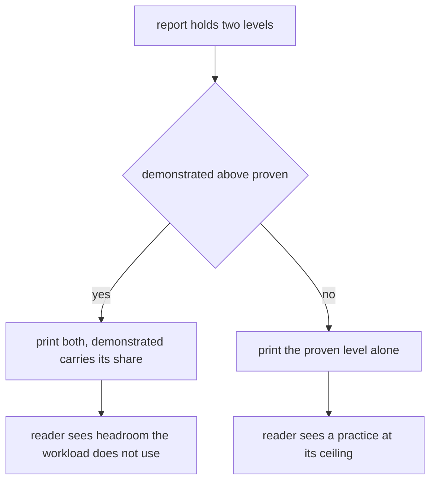
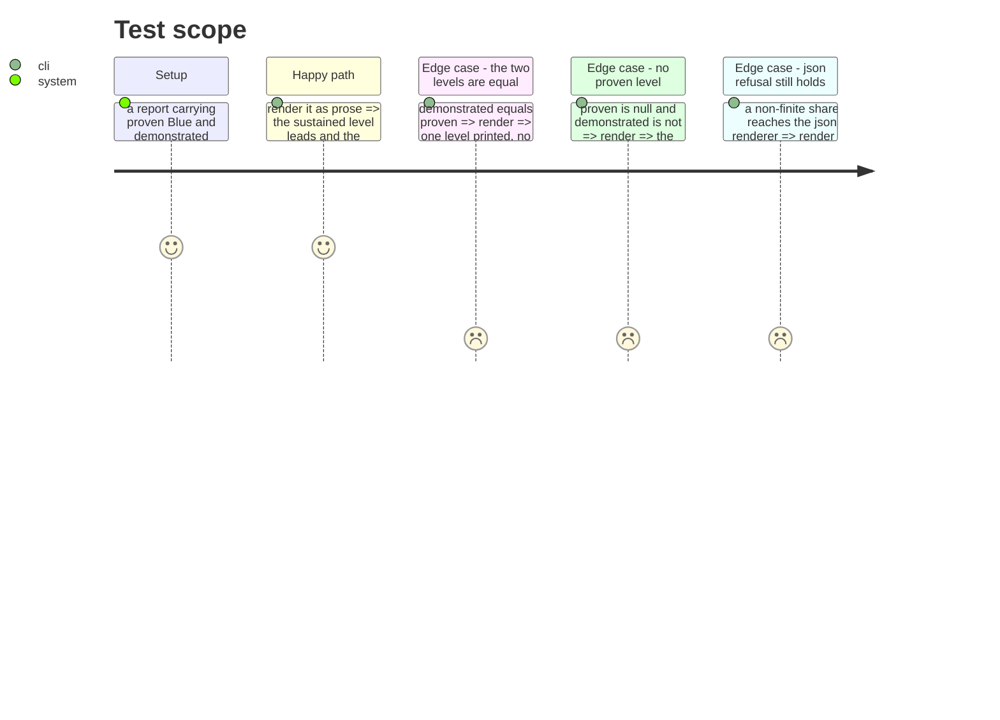

# Instruction: Render two levels without inviting the higher one to be quoted alone

## Architecture projection

```txt
.
├── src/cli/renderers/
│   ├── human.renderer.ts           ✏️ the sustained level leads, the demonstrated one follows with its share
│   ├── human.renderer.test.ts      ✏️ one assertion per load-bearing reading
│   ├── json.renderer.ts            ✏️ project the demonstrated block, allowlist style
│   └── json.renderer.test.ts       ✏️ the new field, and the non-finite refusal still holding
└── aidd_docs/memory/cli.md         ✏️ what the two outputs promise and what they do not
```

## User Journey



## Test Scope



## Tasks to do

### `1)` Put the sustained level first, always

> Two headline numbers invite quoting the higher one.

1. The existing "Proven level" line keeps its position and its wording.
2. The demonstrated level is a second line beneath it, never above, never in its place.
3. When `proven` is null the existing sentence about being unclassifiable leads, and the demonstrated
   level does not soften it.

### `2)` Never print a demonstrated level without its frequency

> The figure is meaningless without the share of occasions that earned it.

1. Render it as one sentence carrying both, in the shape
   `Demonstrated: Copper, reached on 40% of active days and 40% of deliveries`.
2. Per axis, print the share beside the demonstrated value the same way.
3. Assert in the suite that no rendering path emits the level without a share. This is the clause
   most likely to be dropped in a later edit, so it gets its own test rather than a shared one.

### `3)` Say nothing when there is nothing to say

> Equal levels are the ordinary case and must not print twice.

1. Omit the demonstrated sentence entirely when it equals the proven level.
2. Keep the axis detail lines unchanged in that case, so a bundle assessment reads exactly as before.

### `4)` Project the new block in json, allowlist style

> A field the contract does not declare never reaches the output.

1. Add the demonstrated block field by field, as the renderer already does for every other block.
2. Extend the non-finite guard to the share, since a share is a number and `null` in this contract
   means absence.
3. Do not stringify the report, and do not read meaning into key order.

### `5)` Write down what the two outputs promise

> And what they do not.

1. In `cli.md`, state that the sustained level is the conservative figure and the demonstrated one
   is a capability claim carrying its frequency.
2. State that a demonstrated level is not a level the subject holds, and must not be quoted alone.
3. State that the harness axis has one reading by nature, and intervention by decision.

## Test acceptance criteria

| Task | Acceptance criteria              |
| ---- | -------------------------------- |
| 1 | Prose naming a demonstrated level always names the proven level above it, on every path including `proven: null`. |
| 2 | No rendering path emits a demonstrated level without its share, proven by a test that fails when the share is removed. |
| 3 | A subject whose two levels are equal renders exactly as it does before this phase. |
| 4 | `--json` publishes the demonstrated block and still refuses a report holding a non-finite number, naming the field's path. |
| 5 | `cli.md` states that a demonstrated level is not held, and that it never appears alone. |
