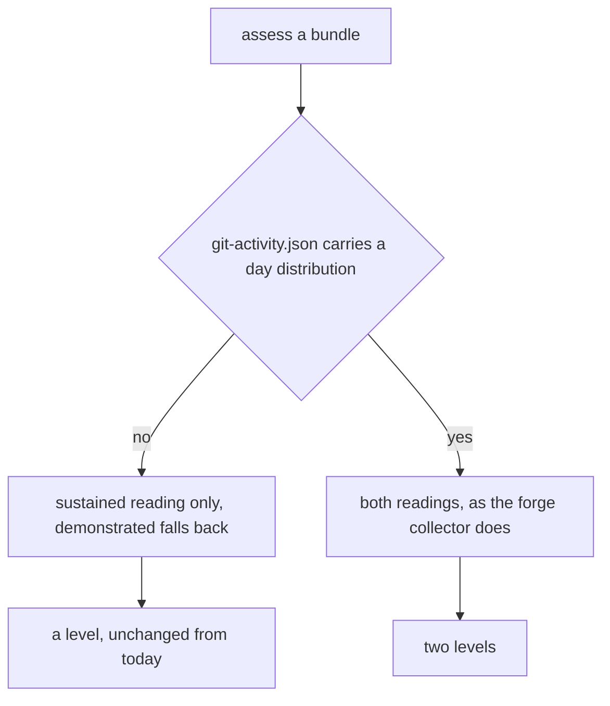
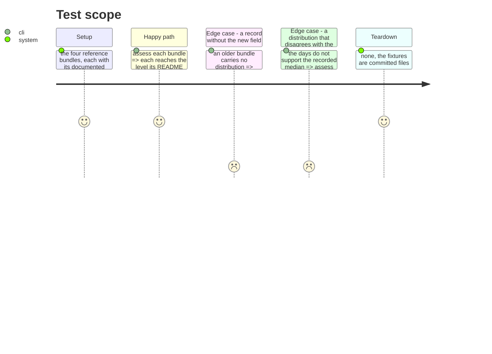

# Instruction: Teach the bundle format to carry a distribution

## Architecture projection

```txt
.
├── src/evidence/adapters/fixture-bundle/
│   ├── recorded-activity.ts              ✏️ read the daily distribution, emit the demonstrated reading
│   └── recorded-activity.test.ts         ✏️ a record without the new field still yields one reading
├── profiles/
│   ├── perceval/git-activity.json        ✏️ add the parallelism day distribution
│   ├── bohort/git-activity.json          ✏️ idem
│   ├── leodagan/git-activity.json        ✏️ idem
│   ├── arthur/git-activity.json          ✏️ idem
│   └── README.md                         ✏️ the level each profile reaches, in both readings
├── tests/cli/reference-profiles.test.ts  ✏️ pin both levels per profile
└── aidd_docs/memory/testing.md           ✏️ the profile table gains a demonstrated column
```

## User Journey



## Test Scope



## Tasks to do

### `1)` Extend the record, additively

> An older bundle must keep working, and must not gain a reading it never recorded.

1. Add `parallelism.days_at_concurrency`, a map from a branch count to a number of active days.
2. Absent field means the sustained reading only, and the demonstrated one falls back, exactly as
   phase 4 specified for every single-reading axis.
3. Keep `median_concurrent_branches` as the sustained source. The new field never overrides it.

### `2)` Read it through the shared threshold

> The bundle and the forge must not compute the demonstrated reading differently.

1. Derive the demonstrated value from the same share rule the forge collector applies, extracted
   into the module `autonomy.ts` already establishes as the place for shared thresholds.
2. Refuse a record whose distribution cannot support its own recorded median, rather than reconciling
   the two. A bundle is a recording, and an inconsistent recording is not evidence.

### `3)` Regenerate the four fixtures

> Their expected levels are the acceptance assertion, and they may not move by accident.

1. Add a distribution to each of the four, consistent with its recorded median and max.
2. Verify each profile still reaches its documented sustained level, unchanged.
3. Write down each profile's demonstrated level, and state in `profiles/README.md` that a profile is
   now specified by both.
4. Where a demonstrated level exceeds the sustained one, say in the README what that fixture is now
   demonstrating, so a future reader does not treat it as a typo.

### `4)` Pin both levels in the acceptance suite

> The table in the memory bank is an assertion, and it now has two columns.

1. Extend `reference-profiles.test.ts` to pin the demonstrated level per profile alongside the
   sustained one.
2. Keep `coverage.axesConfirmed === 4` on the sustained reading. A level named on partial evidence
   would still be an accident.
3. Update the profile table in `testing.md` to carry both columns and both deliberate holes.

## Test acceptance criteria

| Task | Acceptance criteria              |
| ---- | -------------------------------- |
| 1 | A bundle with no day distribution assesses exactly as it does today, with one reading and no fabricated second. |
| 2 | A bundle whose distribution contradicts its recorded median is refused, naming the inconsistency. |
| 3 | The four profiles each reach their documented sustained level, and their demonstrated level is written in `profiles/README.md`. |
| 4 | `reference-profiles.test.ts` fails if any profile's sustained or demonstrated level moves. |
