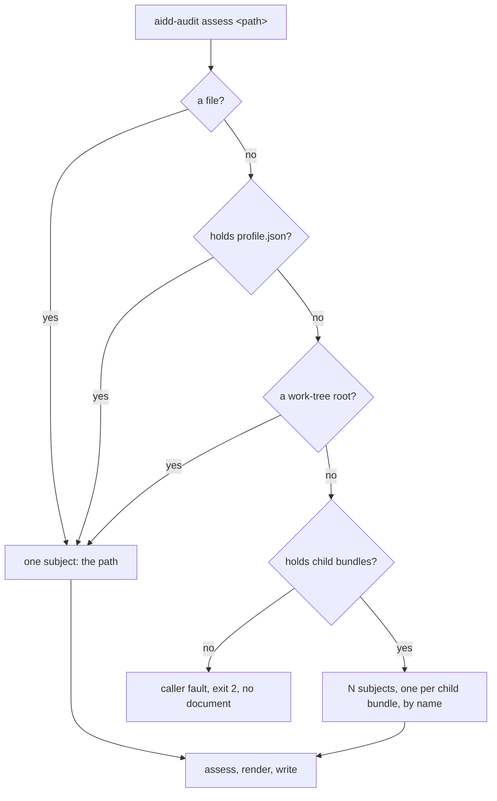
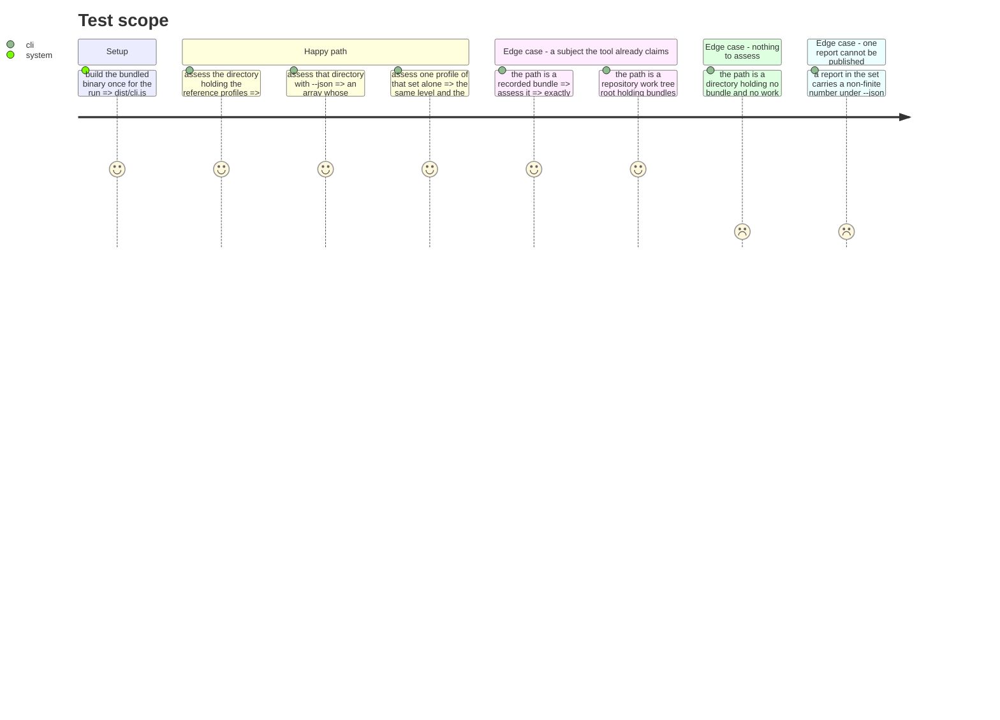

# Instruction: The subject becomes a list

## Architecture projection

```txt
.
└── src/
    ├── cli/
    │   ├── commands/
    │   │   ├── assess.command.ts            ✏️  assess and render every resolved subject, not one
    │   │   └── assess.command.test.ts       ✏️  a set, a refusal, and the single subject unchanged
    │   ├── renderers/
    │   │   ├── human.renderer.ts            ✏️  a many-report entry point, reports separated
    │   │   ├── human.renderer.test.ts       ✏️  separation and attribution of N reports
    │   │   ├── json.renderer.ts             ✏️  a many-report entry point, an array of documents
    │   │   └── json.renderer.test.ts        ✏️  the array's elements are the per-subject document
    │   └── subjects/
    │       ├── resolve-subjects.ts          ✅  one operand → the ordered subjects, or a caller fault
    │       └── resolve-subjects.test.ts     ✅  the rule order, the set, the refusal
    └── evidence/
        └── adapters/
            ├── fixture-bundle.adapter.ts    ✏️  read the marker from its new home, behaviour unchanged
            └── fixture-bundle/
                └── bundle-manifest.ts       ✅  what makes a directory a bundle, in one place
```

## User Journey



## Test Scope



## Tasks to do

### `1)` Give the bundle marker one home

> The rule that makes a directory a bundle is read from two places now; it may only be written once.

1. Move the `profile.json` marker constant and its `isBundle` predicate into `bundle-manifest.ts`, exported.
2. Have `fixture-bundle.adapter.ts` import it. No behaviour changes; its suite must stay green untouched.

### `2)` Resolve one operand into the subjects to assess

> The rule order is the whole design: file, bundle, work-tree root, set, refusal.

1. Write `resolveSubjects(path, signal)` returning a non-empty ordered list of subject paths.
2. Apply the rules in order and stop at the first that matches; a file, a bundle, and a work-tree root each resolve to the path itself.
3. For the set, read the directory's immediate entries, keep the directories holding the bundle marker, sort by name, and return them joined onto the operand.
4. When nothing matches, throw the caller-fault error the CLI already uses, naming the path and saying it is neither a repository, a recorded bundle, nor a directory holding any.
5. Honour the abort signal, as the rest of the command's pre-flight does.
6. Return the work-tree-root answer alongside the subjects, so a **lone** subject does not spawn `git` twice for the same question. A set's members are each asked separately: one of them may be its own work-tree root even though the directory holding them is not.

### `3)` Render many reports without touching the frozen document

> N reports, each identical to what its subject publishes alone.

1. Add a many-report entry point to `json.renderer.ts` that projects each report through the existing per-report projection and serialises the resulting array, keeping the non-finite refusal per report.
2. Add a many-report entry point to `human.renderer.ts` that renders each report through the existing one and joins them with a separator a reader cannot mistake for a section break.
3. Leave both single-report entry points and their output exactly as they are.

### `4)` Assess every resolved subject

> One invocation, N assessments, one stream.

1. In `runAssess`, resolve the subjects after the subject-exists check and before the model is loaded, so the documented failure order — argv, subject, model — still holds.
2. Assess each subject in turn, choosing its collector set per subject as the command already does, reusing the work-tree answer resolution returned.
3. Render every report, then write once: a single subject writes exactly what it writes today, a set writes the many-report rendering.
4. Leave the exit taxonomy untouched: a set that publishes exits `0`, an unassessable path exits `2`, a report that cannot be published truthfully exits `1` with nothing on stdout.

## Test acceptance criteria

| Task | Acceptance criteria |
| ---- | ------------------- |
| 1 | The fixture-bundle adapter's own suite passes unchanged, and only one file in the tree names the bundle manifest. |
| 2 | A file, a bundle, and a work-tree root each resolve to one subject, the path itself; a directory holding child bundles resolves to those children in name order; a directory holding neither is refused as a caller fault naming the path. A work-tree root that holds bundles resolves to itself, never to its bundles. |
| 3 | The many-report JSON output parses as an array whose every element is deep-equal to that subject's own single-report document; the many-report prose contains each report's rendering with its own subject line, in the same order. The single-report outputs are unchanged. |
| 4 | Assessing the reference-profile directory publishes one report per profile, each stating the level that profile states when named alone, and exits `0`. Assessing a directory that is neither a subject nor a set publishes nothing and exits `2`. Assessing a bundle, and assessing a repository root, each publish exactly one report unchanged from today. |
