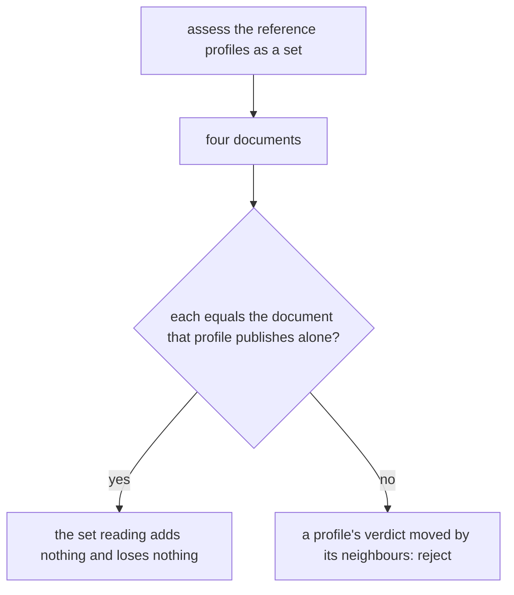
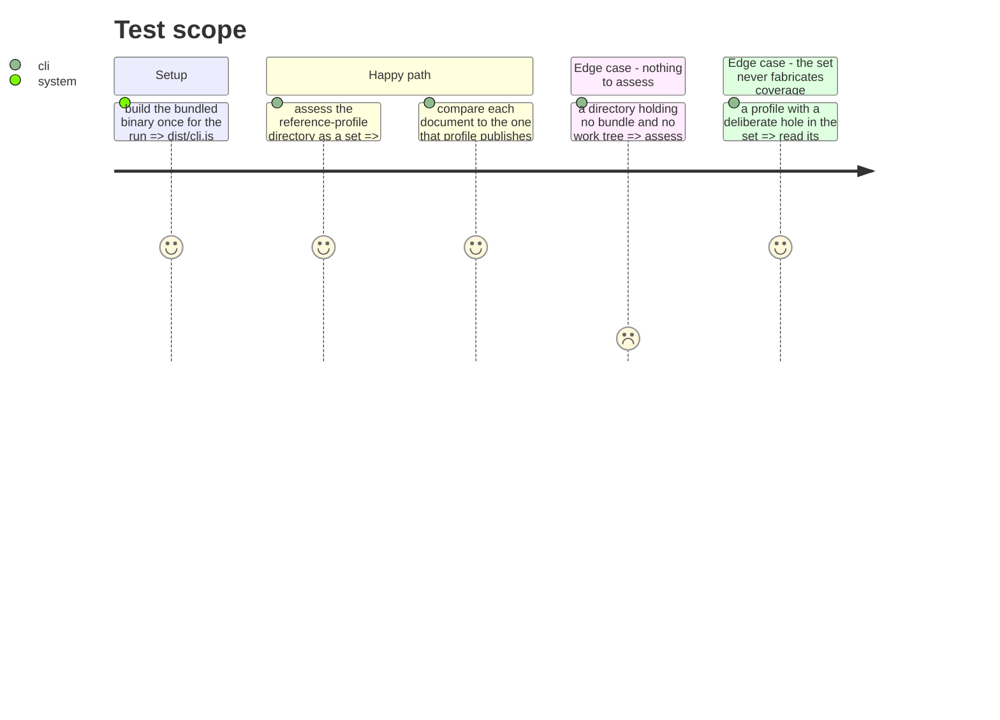

# Instruction: Acceptance and memory

## Architecture projection

```txt
.
├── aidd_docs/
│   └── memory/
│       ├── cli.md                          ✏️  the set subject, its published shapes, its exit codes
│       └── codebase-map.md                 ✏️  the new cli folder and what it decides
└── tests/
    └── cli/
        ├── process-contract.test.ts        ✏️  the unassessable directory exits 2 through the binary
        └── reference-profiles.test.ts      ✏️  the four profiles assessed as one set
```

## User Journey



## Test Scope



## Tasks to do

### `1)` Pin the set against the profiles already pinned

> The set is only correct if it changes no profile's verdict.

1. In `reference-profiles.test.ts`, assess the reference-profile directory as one set and assert one document per profile, in name order.
2. Assert each of those documents is deep-equal to the document that profile publishes when named alone — the level, the coverage, the provenance and the evidence together.
3. Leave the existing per-profile expectations in place; they are the reason this assertion means anything.

### `2)` Pin the refusal through the process

> The new failure route is a caller fault and belongs with the others a caller sees.

1. In `process-contract.test.ts`, assess a directory that is neither a repository, a bundle, nor a set, through the built binary.
2. Assert exit `2`, an empty stdout, and that stderr names the path the caller passed.
3. Assert the exit code with an integer literal, never by importing the taxonomy.

### `3)` Record what changed in the memory bank

> A capability nobody wrote down is one the next session re-derives or breaks.

1. In `cli.md`, record the set subject: the rule order that decides it, that a set publishes an array of the unchanged per-subject documents under `--json`, how prose separates them, and that an unassessable directory is now exit `2` while a file is still accepted.
2. In `cli.md`, record what the set deliberately does not do: no comparison, no aggregate, no recursion, no second operand.
3. In `codebase-map.md`, add the new `cli/` folder and the one question it answers, and the bundle marker's new home.
4. Keep both entries to what is not derivable from the code.

## Test acceptance criteria

| Task | Acceptance criteria |
| ---- | ------------------- |
| 1 | The suite fails if any profile's document differs between the set reading and the single reading, and fails if the set yields a number of documents other than the number of bundles. |
| 2 | The suite fails if an unassessable directory publishes a document, or exits anything but `2`, through the built binary. |
| 3 | A reader of `cli.md` alone can say which directories are one subject, which are a set, what each publishes, and which exit code an unassessable path gets, without opening the source. |
