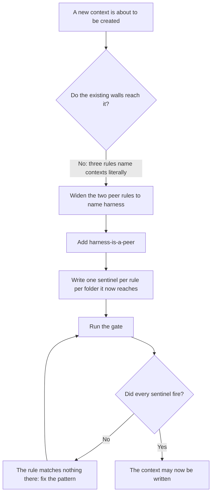
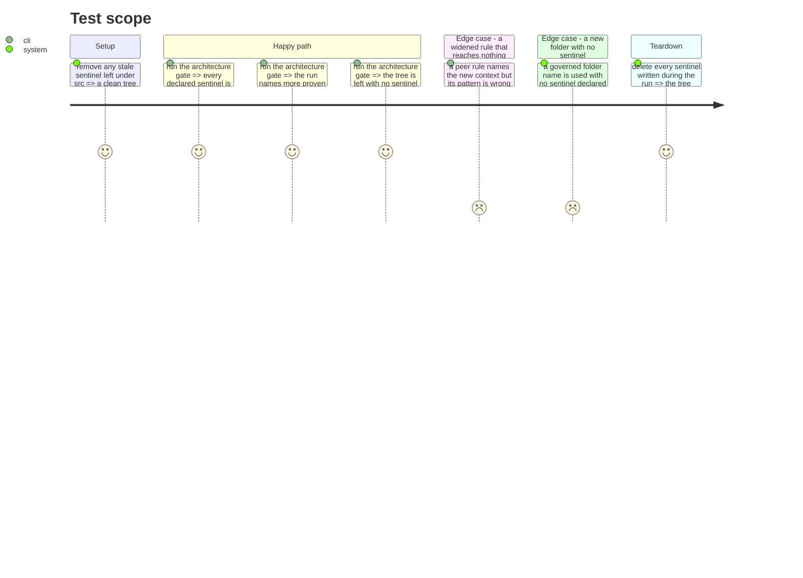

# Instruction: walls before code

## Architecture projection

> Tree of the final files. ✅ create · ✏️ modify · ❌ delete

```txt
.
├── .dependency-cruiser.cjs          ✏️ widen two peer rules, add one for the new context
└── scripts/
    └── prove-boundary-rules.mjs     ✏️ add the sentinels that prove each rule bites in each new folder
```

## User Journey



## Test Scope



## Tasks to do

### `1)` Widen the two peer rules so they see the new context

> A peer rule that lists contexts by name is blind to one that did not exist when it was written.

1. In `.dependency-cruiser.cjs`, extend `maturity-is-a-peer`'s `to.path` so it names the new context alongside `evidence`, `assessment` and `cli`.
2. Extend `evidence-is-a-peer`'s `to.path` the same way.
3. Leave `assessment-composes-never-adapts` alone: its `to` already matches `adapters` and `loading` in any context, so it reaches the new one already.
4. Update each rule's `comment` so it states the context list it now covers.

### `2)` Add the rule that keeps the new context a peer

> Nothing today stops a new context importing the driving adapter or either domain.

1. Add `harness-is-a-peer`: `from` the new context, `to` the three other contexts.
2. Write its `comment` to say what it protects and why the context is a peer rather than a layer.
3. Decide, and record in the comment, whether the new context may be imported by `assessment`. It must not be: the audit feeds no assessment.
4. Add the matching prohibition so `assessment` cannot import it.

### `3)` Prove each rule bites in each folder it now reaches

> A dependency-cruiser rule that matches nothing reports success. A widened rule is unproven in its new folder until a sentinel sits there.

1. For every folder the new context will hold whose name is in the governed set, declare one sentinel per `domain-has-no-*` rule: the filesystem one, the process one, and the vendor one.
2. Declare a sentinel for `harness-is-a-peer`, and one for each widened peer rule, each placed in the folder the widening newly reaches.
3. Follow the existing entries exactly: a `rule` name, a `from` path that is the exact path dependency-cruiser will report, and a `files` map holding the breaching file and anything it imports.
4. Use the `__boundary-sentinel__` prefix on every file, and the `.js` extension inside every import specifier.
5. Run the gate and confirm the count of proven rules rose.

### `4)` Neuter each new wall and watch its sentinel go red

> This repository has shipped a guard three times with a green suite that asserted something weaker. A sentinel that has never failed has not been checked.

1. Break one new rule's pattern deliberately, run the gate, and confirm it fails naming that rule and that folder.
2. Restore it and confirm the gate goes green.
3. Repeat for each rule added or widened in this phase.

## Test acceptance criteria

| Task | Acceptance criteria |
| ---- | ------------------- |
| 1 | Each widened peer rule names the new context, and its comment states the full list it covers |
| 2 | The new context cannot import the three other contexts, and `assessment` cannot import it; both directions are stated in a rule, not in prose |
| 3 | The architecture gate reports a higher count of proven rules than before the phase, and leaves no sentinel file behind |
| 4 | Breaking any rule added or widened here makes the gate fail and name that rule together with the folder whose sentinel stayed silent |
