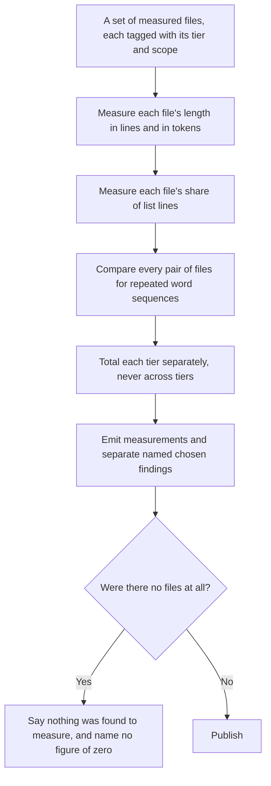
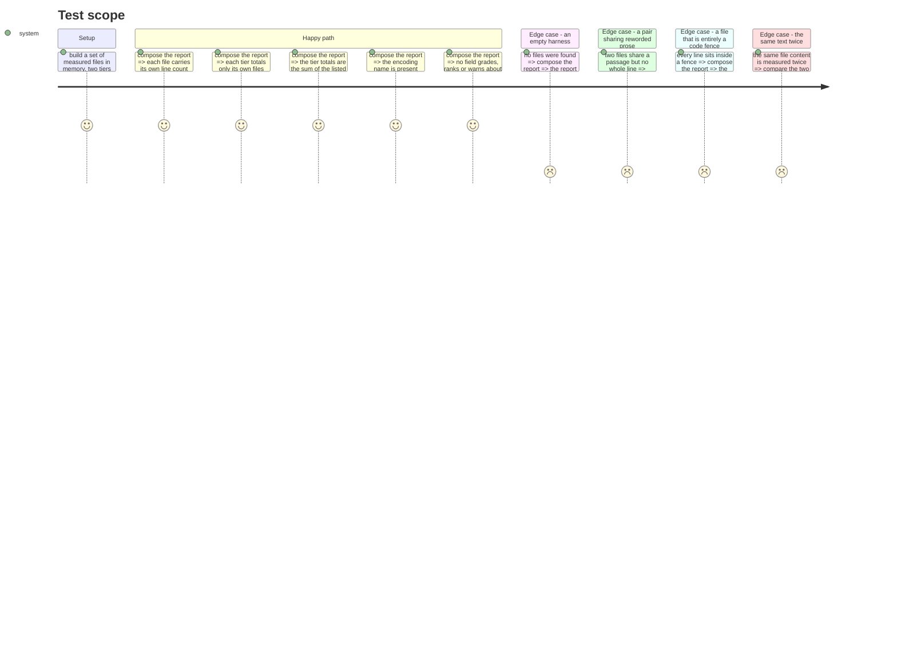

# Instruction: the measurement domain

## Architecture projection

> Tree of the final files. ✅ create · ✏️ modify · ❌ delete

```txt
.
├── package.json                                    ✏️ one runtime dependency: the token encoder
└── src/
    └── harness/
        ├── contracts/
        │   └── harness-audit-report.contract.ts    ✅ the versioned public shape, self-contained
        ├── models/
        │   ├── loaded-file.model.ts                ✅ one measured file and the tier it belongs to
        │   ├── loading-tier.model.ts               ✅ always-loaded against conditionally-loaded
        │   └── reading-scope.model.ts              ✅ carried by the subject against carried by the machine
        ├── ports/
        │   ├── harness-source.port.ts              ✅ what a tool's loading convention must answer
        │   └── token-encoder.port.ts               ✅ text in, an estimate and its encoding name out
        └── measurement/
            ├── file-length.ts                      ✅ lines and tokens for one file
            ├── shared-passages.ts                  ✅ repeated word sequences across a pair of files
            ├── prose-share.ts                      ✅ list lines against prose lines
            └── compose-harness-audit.ts            ✅ files in, the public report out
```

## User Journey



## Test Scope



## Tasks to do

### `1)` Add the encoder, behind a port

> The domain must not learn which library counts tokens, and the estimate must never be mistaken for the model's own count.

1. Add the token encoder as a runtime dependency, pinned.
2. Declare a port taking text and returning an estimate together with the name of the encoding that produced it.
3. Place the concrete encoder in `adapters/`, so the domain rules keep it out mechanically.
4. Import the encoding explicitly by name rather than through the package's default, so a new major cannot move the encoding under the published figure.
5. Record in one tagged comment why the estimate is not the model's own count.

### `2)` Model a measured file

> A figure without its tier and its scope is not reproducible, and cannot be totalled honestly.

1. Model a measured file as its path, its byte size, its line count, its token estimate, its tier and its scope.
2. Model the tier as exactly two values: loaded at every session opening, and loaded only when something triggers it.
3. Model the scope as exactly two values: carried by the subject, and carried by the machine.
4. Make a file that belongs to no tier unrepresentable rather than defaulting it.

### `3)` Measure length, and measure it twice over

> Lines and tokens disagree: on this repository one memory file is shorter in lines than another and larger in bytes. Publishing one alone hides that.

1. Count lines and count tokens for one file, and return both.
2. Decide and record what a line is at the end of a file with no trailing newline.
3. Prove the two figures are independent with a file that is long in lines and small in tokens, and one that is the reverse.

### `4)` Measure repeated passages across a pair

> Whole-line matching finds one shared line in five hundred and eighty-two here. The pairs a reader would name share their wording, not their lines.

1. Normalise a file to a sequence of words, dropping fenced blocks.
2. Build the set of fixed-length word sequences.
3. For each pair of files, report how many sequences they share and which.
4. Report the count and the passages. Never a ratio, never a percentage, never a threshold above which a pair is called duplicated.
5. Record the sequence length as a chosen value, with what a shorter and a longer one each cost, and state that it is not to be tuned so that a given repository reports a given number.

### `5)` Measure the share of list lines

> The reading has to be stated, or the figure means nothing.

1. Ignore blank lines and everything inside a fenced block.
2. Classify a line as a list line by its leading marker, tables included.
3. Return the count of each kind rather than only the ratio, so a reader can recompute it.
4. Answer a file with no countable line without dividing by zero, and without reporting a share of zero as though it were measured.

### `6)` Compose the public report

> The report is a projection, not the internal shape, and this is where the absence of a verdict is enforced.

1. Declare the contract self-contained, every field readonly, with an explicit schema version, following the house style of the existing contract.
2. Total each tier over its own files only, and never emit a figure that adds the two.
3. Carry the encoding name on the report.
4. Carry the sequence length used for repeated passages, for the same reproducibility reason.
5. Emit no field that grades, ranks, scores, warns, or recommends. Record that prohibition in a tagged comment on the contract.
6. Distinguish "no file was found" from "a file was found and measured zero".

## Test acceptance criteria

| Task | Acceptance criteria |
| ---- | ------------------- |
| 1 | Counting the same text twice returns the same estimate, and the encoding name travels with it |
| 2 | A measured file cannot be constructed without a tier and a scope |
| 3 | A file long in lines and small in tokens, and its reverse, both report both figures correctly |
| 4 | Two files sharing a reworded passage but no whole line are reported as a pair, with the passage shown |
| 5 | A file whose every line sits in a fence reports no countable line, rather than a share of zero |
| 6 | The report totals each tier separately, names its encoding and its sequence length, separates named chosen findings from measurements, and tells an empty harness from a measured zero |
