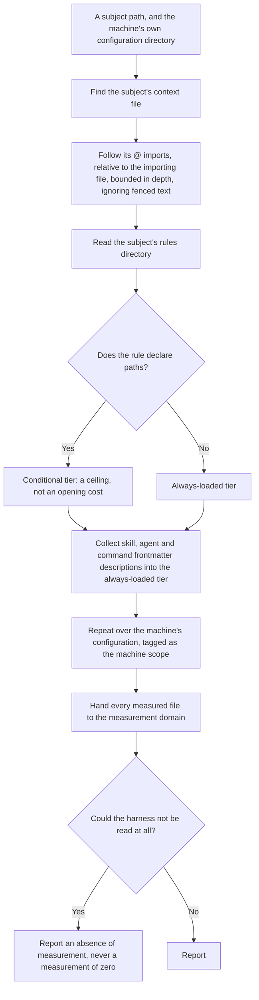
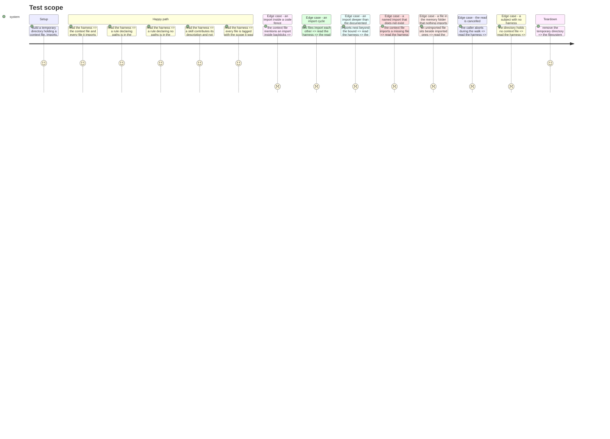

# Instruction: the Claude loading convention

## Architecture projection

> Tree of the final files. ✅ create · ✏️ modify · ❌ delete

```txt
.
└── src/
    └── harness/
        └── adapters/
            ├── token-encoder.adapter.ts            ✅ the concrete encoder behind the port
            ├── claude-harness.adapter.ts           ✅ what Claude loads, in two tiers and two scopes
            └── claude/
                ├── harness-tree.ts                 ✅ the seam: list a tree, read a file
                ├── directory-tree.ts               ✅ the seam over a real directory
                ├── context-imports.ts              ✅ follow @ imports, bounded, fences ignored
                ├── rule-tier.ts                    ✅ a rule with paths: is conditional, without it is not
                └── declaration-front-matter.ts     ✅ the description a skill, agent or command contributes
```

## User Journey



## Test Scope



## Tasks to do

### `1)` Declare the tree seam, and one implementation over a real directory

> The context must not learn the filesystem, and the audit reads a directory rather than a tracked tree: an unstaged context file still costs a session its tokens.

1. Declare the seam: list the entries, read one file.
2. Implement it over a real directory, skipping what the tool would never load.
3. Keep it beside its adapter. It crosses no context boundary and abstracts nothing the domain knows about, so it is not a port and must not be named one.
4. Honour the caller's cancellation on every walk, not only before it starts.

### `2)` Follow the context file's imports

> This is where a wrong reading silently changes the headline figure.

1. Find the subject's context file at each location the tool accepts.
2. Recognise an import by its marker, and resolve it relative to the importing file rather than to the working directory.
3. Ignore an import appearing inside backticks or inside a fenced block.
4. Bound the recursion at the documented depth, and record that bound as coming from the tool's documentation rather than chosen here.
5. Count each file once however many times it is reached, and terminate on a cycle.
6. Report a named but missing import as unread, distinct from a file that was read and found empty.
7. Do not follow the walk up the parent directories under the subject scope. Record why in a tagged comment: it would make the figure depend on where the repository sits on disk.

### `3)` Split the rules by the tier they actually load in

> A rule declaring a path glob costs nothing at session opening. On this repository every rule declares one, and treating them as always-loaded would overstate the opening cost by a fifth.

1. Read each rule's frontmatter.
2. Place a rule declaring a path glob in the conditional tier, and one declaring none in the always-loaded tier.
3. Treat an unreadable or unparseable frontmatter as undecided, and report it as unread rather than assigning it a tier.

### `4)` Count a declaration by what it actually contributes

> A skill costs its description at session opening and its body only when invoked. Counting the body as opening cost would be the largest single error available here.

1. For a skill, an agent and a command, read the frontmatter and measure the description alone into the always-loaded tier.
2. Measure the body into the conditional tier.
3. Record in a tagged comment that the split follows the tool's documented behaviour.

### `5)` Read the machine scope, separately

> Most of a real session's opening weight sits outside the subject, and mixing it into a reproducible figure would make that figure false.

1. Read the machine's own configuration directory with the same reader.
2. Tag every file it yields with the machine scope.
3. Include the ancestor walk here, where the dependence on the machine is already stated.
4. Never merge a machine figure into a total the report calls reproducible.
5. Report an absent or unreadable machine configuration as unread, and continue: the subject reading does not depend on it.

## Test acceptance criteria

| Task | Acceptance criteria |
| ---- | ------------------- |
| 1 | Aborting during the walk stops the read rather than letting it run to completion |
| 2 | An import inside backticks is not counted; a cycle terminates with each file counted once; a missing import is reported unread rather than empty; an unimported neighbour is absent from the always-loaded tier |
| 3 | A rule with a path glob lands in the conditional tier and one without it in the always-loaded tier |
| 4 | A skill contributes its description to the always-loaded tier and its body to the conditional tier |
| 5 | Every file carries the scope it was read from, and no total mixes the two scopes |
