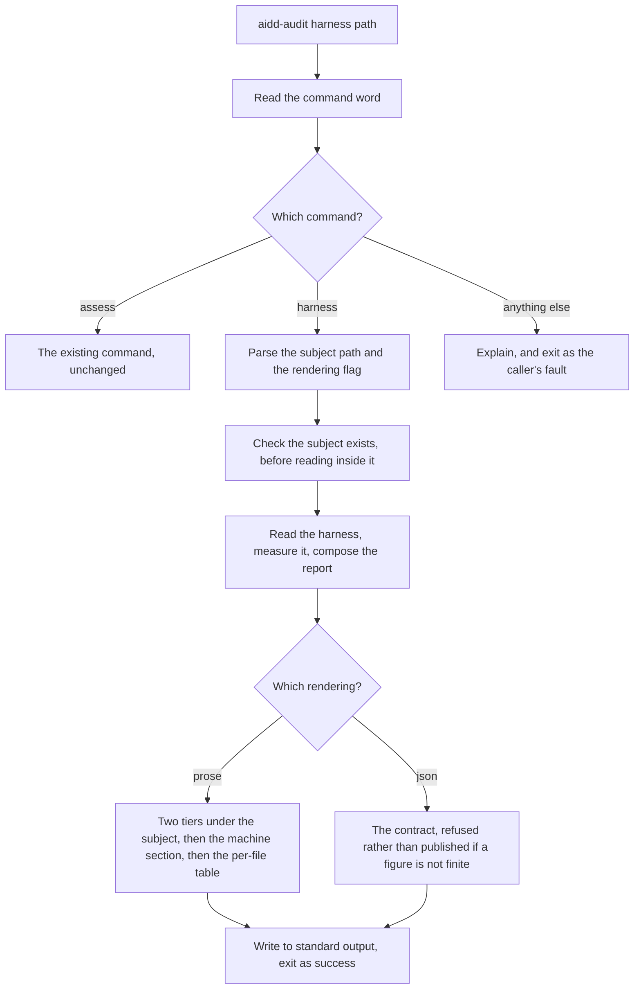
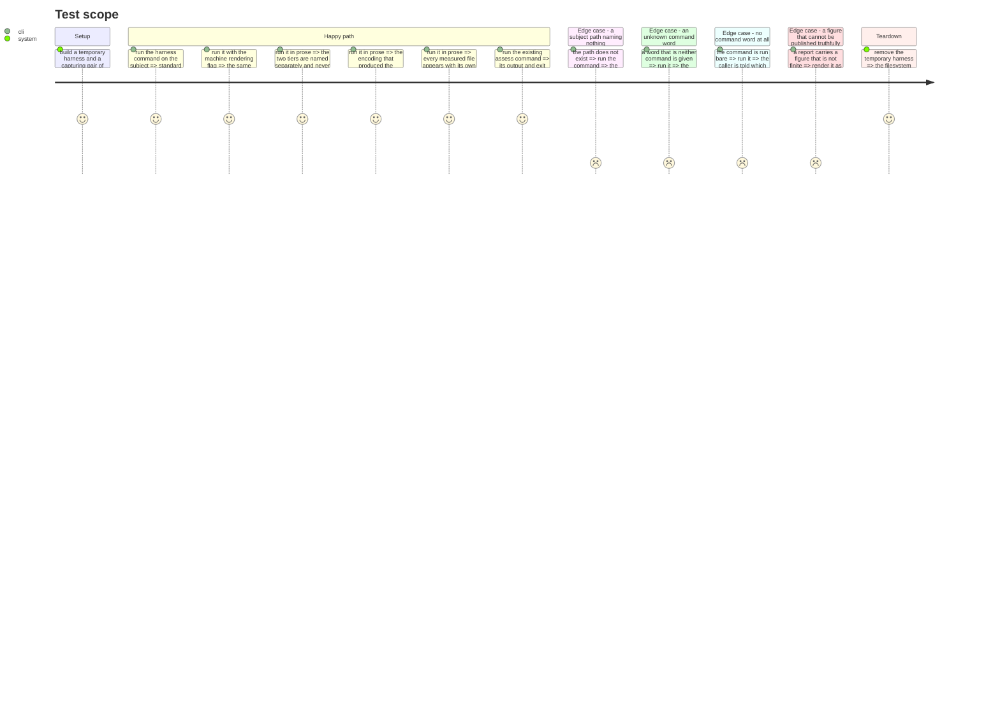

# Instruction: the command and its two renderings

## Architecture projection

> Tree of the final files. ✅ create · ✏️ modify · ❌ delete

```txt
.
└── src/
    ├── cli/
    │   ├── main.ts                                  ✏️ dispatch on the command word, nothing more
    │   ├── parsing/
    │   │   ├── command-name.ts                      ✅ read the command word before either parser
    │   │   ├── assess-arguments.ts                  ✏️ stop owning the rejection of an unknown command
    │   │   └── harness-arguments.ts                 ✅ subject path and --json
    │   ├── commands/
    │   │   └── harness.command.ts                   ✅ parse, read, measure, render, write
    │   └── renderers/
    │       ├── harness-json.renderer.ts             ✅ the contract, projected field by field
    │       └── harness-human.renderer.ts            ✅ the explanation, two tiers, two scopes
    └── harness/
        └── usecases/
            └── audit-harness.usecase.ts             ✅ sequence the reading and the measurement
```

## User Journey



## Test Scope



## Tasks to do

### `1)` Give the binary a command word, without moving the existing one

> Today one parser owns both the command word and the arguments, and rejects anything that is not the existing command. A second command cannot exist until those two jobs are separated.

1. Read the command word in one place, before either argument parser runs.
2. Leave the existing parser owning its own arguments and nothing else.
3. Keep an unknown or absent command word the caller's fault, with the same exit code it has today, and name both commands in the explanation.
4. Change no message the existing command emits, and no code it returns.

### `2)` Sequence the audit

> The sequencer takes what it is given and calls three things in order. It loads nothing and decides nothing.

1. Take a subject path, a harness source, an encoder and a cancellation signal.
2. Call the reader, then the measurement, then the composition.
3. Load no configuration and choose no adapter: that belongs to the composition root.
4. Keep it small enough to read as a business flow rather than an algorithm.

### `3)` Wire the command

> The composition root is the only place that may know which adapter is which.

1. Parse the arguments, then check the subject exists before reading inside it.
2. Build the concrete reader and the concrete encoder here.
3. Hold a cancellation budget and abort it whichever way the command returns.
4. Render, then write once, with the same trailing-newline behaviour the existing command has.
5. Map failures onto the existing responsibility split: the caller's fault for a bad invocation or a bad path, ours for anything else.

### `4)` Render the contract

> The published document must carry only what the contract declares.

1. Project the contract field by field rather than stringifying the internal report.
2. Refuse a report holding a figure that cannot be published truthfully, naming the field's path, exactly as the existing renderer does.
3. Express any share as a fraction, never a percentage, matching the existing contract's convention.

### `5)` Render the prose

> Prose is where the absence of a verdict is easiest to lose.

1. Print the subject section first, then the machine section, each labelled with what it can be reproduced against.
2. Print the two tiers separately under each scope, and never print a figure that adds them.
3. Print the conditional tier as a ceiling, in words, not as an opening cost.
4. Name the encoding beside the figures, and say the figures are estimates.
5. Print every measured file with its own length, so a reader can add up what they are shown and reach the tier total.
6. Print the shared passages with the pair that shares them, and no similarity score.
7. Print the share of list lines together with the reading that produced it.
8. Print no word that grades, ranks, warns or recommends. Assert that absence in the suite rather than trusting it.
9. Say plainly when nothing was found to measure, and never render that as a figure of zero.

## Test acceptance criteria

| Task | Acceptance criteria |
| ---- | ------------------- |
| 1 | The existing command's output and exit codes are unchanged; an unknown or absent command word names both commands and stays the caller's fault |
| 2 | The sequencer loads nothing and builds no adapter |
| 3 | A subject path naming nothing leaves standard output empty and exits as the caller's fault |
| 4 | A report holding a figure that cannot be published truthfully is refused rather than published, and exits as ours |
| 5 | Prose names both tiers separately, never sums them, names the encoding, lists every measured file, and confines chosen-guideline advice to Findings |
