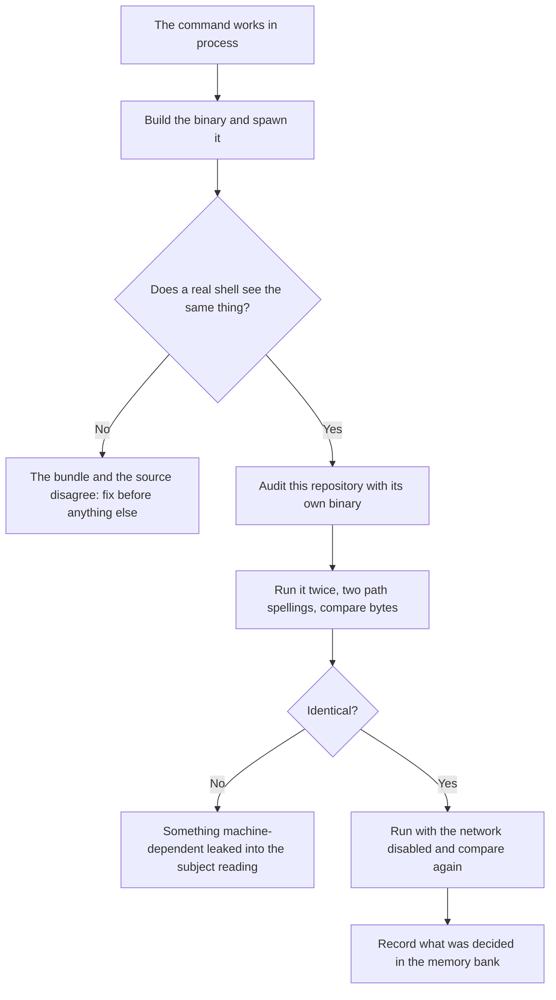
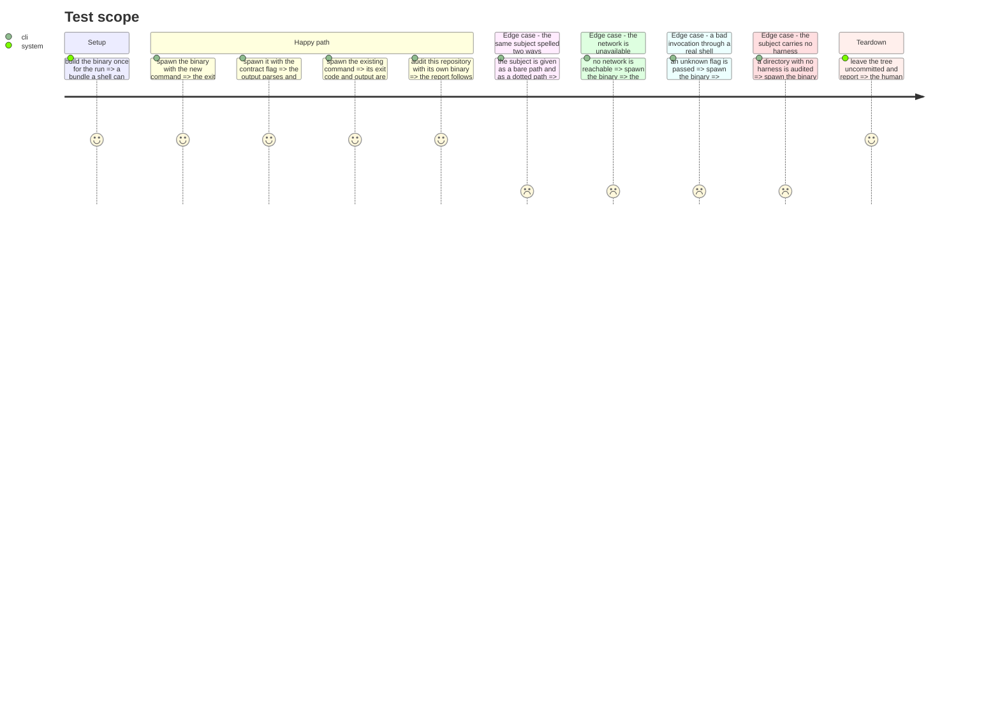

# Instruction: the published behaviour

## Architecture projection

> Tree of the final files. ✅ create · ✏️ modify · ❌ delete

```txt
.
├── tests/
│   ├── cli/
│   │   ├── process-contract.test.ts        ✏️ the second command through the built binary
│   │   ├── harness-determinism.test.ts     ✅ same subject, same bytes, from two path spellings
│   │   └── self-harness-audit.test.ts      ✅ this repository audited by its own shipped binary
│   └── harness/
│       └── vocabulary-conformance.test.ts  ✅ tiers and scopes agree across their declarations
└── aidd_docs/memory/
    ├── cli.md                              ✏️ the second command, its two tiers, its two scopes
    ├── architecture.md                     ✏️ the new context, its walls, and the seam that is not a port
    ├── codebase-map.md                     ✏️ where the new context sits
    ├── testing.md                          ✏️ what the new suites prove and what they fake
    └── coding-assertions.md                ✏️ the sentinels the gate now proves
```

## User Journey



## Test Scope



## Tasks to do

### `1)` Prove the second command through the built binary

> The in-process suite proves what the command returns. Only a spawned process proves the executable turns that into what a caller sees.

1. Extend the process-contract suite with the new command, reusing the existing spawn helper so the two cannot drift on how the process is invoked.
2. Assert the exit codes as integer literals, never by importing the mapping.
3. Prove success, the caller's fault, and an empty standard output on failure.
4. Keep the wording of any message in the in-process suite, so rewording an error turns one file red rather than two.

### `2)` Prove the subject reading is reproducible

> The report claims byte-identical output across machines. A claim nothing tests is a claim nobody has checked.

1. Audit the same subject under two spellings of its path and compare the subject section byte for byte.
2. Assert the echoed path is the operand as given, not resolved.
3. Assert no timestamp, no duration and no hostname reaches the output.
4. Assert the machine section is labelled with what it can be reproduced against, and never folded into a figure the report calls machine-independent.

### `3)` Audit this repository with its own binary

> The tool should survive being pointed at itself, and this is the cheapest end-to-end proof there is.

1. Audit this repository through the shipped binary, in both renderings.
2. Assert the capability and its invariants, never the state of this checkout: no line count, no token figure, no file list is pinned.
3. Assert prose and the contract carry the same figures.
4. Assert the report names no maturity level and confines chosen-guideline advice to Findings.
5. Assert the existing assessment of this repository is unchanged by this work.

### `4)` Prove the vocabularies cannot drift

> The tiers and the scopes are declared in more than one place, and a member added to one and not the other compiles.

1. Assert each declaration against the others, in the one place allowed to import both.
2. Split the assertion the way the existing conformance suite does: what only the type checker can see, and what a test can.

### `5)` Record what was decided

> This bank is the reason a later session does not re-derive any of it. Every reading forced here is invisible in the code.

1. Record the second command, its two tiers, its two scopes, and what each can be reproduced against.
2. Record the new context, the walls widened for it, and the seam that is deliberately not a port.
3. Record the encoding, why it rather than the cheaper one, and that a figure without its encoding is not reproducible.
4. Record the sequence length behind repeated passages as chosen, with the measurement that rejected whole-line matching.
5. Record the bundle cost, plainly, as the price of the estimate.
6. Record what the audit cannot see: reworded duplication, anything a tool loads that is not on disk, and the body of a declaration that is never invoked.

### `6)` Run the gate and stop

> The pipeline reviews its own work, so the last word belongs to someone outside it.

1. Run the full gate and the build.
2. Leave the tree uncommitted.
3. Report what was built, what was measured, and what was left out.

## Test acceptance criteria

| Task | Acceptance criteria |
| ---- | ------------------- |
| 1 | A real shell spawning the binary sees the new command succeed, and sees a bad invocation as the caller's fault with an empty standard output |
| 2 | The same subject spelled two ways produces byte-identical subject sections, and the machine section is labelled rather than merged |
| 3 | This repository audits itself through its shipped binary, naming no maturity level, with prose and contract agreeing on measurements and findings |
| 4 | A member added to one vocabulary declaration and not the others fails the gate |
| 5 | The memory bank states the encoding, the chosen sequence length, the bundle cost, and what the audit cannot see |
| 6 | The gate and the build are green and the tree is uncommitted |
