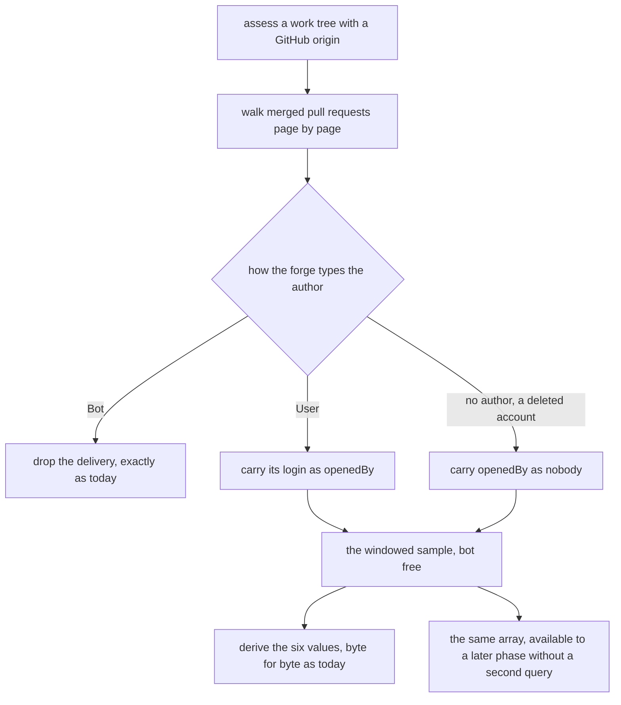
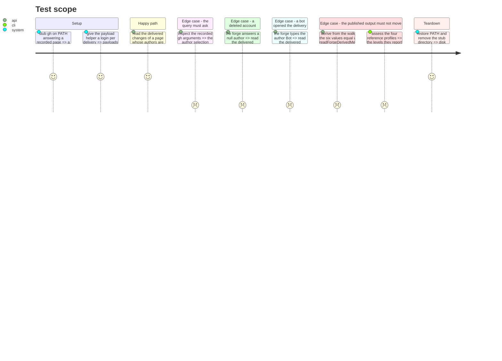

# Instruction: The delivery walk learns who

## Architecture projection

```txt
.
└── src/evidence/adapters/forge-repository/
    ├── pull-request-history.ts        ✏️ the walk carries each delivery's opener, and splits from the derivation
    └── pull-request-history.test.ts   ✏️ the opener on a named account, on nobody, on a bot, and that nothing moved
```

Nothing else is touched. The memory bank is phase 9's, and this phase deliberately leaves it alone:
what it changes is not yet visible from outside the module, so a memory entry written here would
describe a seam no output has met.

## User Journey



## Test Scope



## Tasks to do

### `1)` Ask the forge who opened each delivery

> The walk already reads the author to drop the bots; the account it is looking at costs one field,
> and a second query for it would read a second window.

1. Add `login` beside `__typename` inside the `author` selection of `QUERY`. Nothing else in the
   query moves, and no variable is added.
2. Add `readonly openedBy: string | null` to `MergedPullRequest`, beside the existing
   `openedByABot`. The two answer different questions and both are kept: one decides whether the
   delivery counts at all, the other names whose sample it belongs to.
3. Read it in `readPullRequest` with the module's own accessors, from the same node the bot check
   reads: `stringAt(objectAt(node, 'author'), 'login')`. A null author, an absent login and an empty
   login all become `null`, which is the one value that states "nobody GitHub can name".
4. Change no filtering. The bot drop stays keyed on `__typename === 'Bot'` and never on the login's
   suffix, and the reason is already written in this file's `COMPAT:` block: `renovate` and
   `dependabot` carry no `[bot]` suffix on a pull request's author. Extend that existing block with
   the one sentence saying so rather than opening a second comment beside it, per
   `.claude/rules/01-standards/1-comments.md`, which bans a parallel rule as much as `pnpm comments`
   bans an untagged block.
5. If the note that `openedBy` is `null` for a deleted account needs two lines, it opens with
   `LIMITATION:`. One line takes no tag. No docblock, in either case.

### `2)` Split the walk from the derivation, and export both halves

> The seam chosen is the existing function cut in two at the line where the windowed sample already
> exists: an exported `readDeliveredChanges` and an exported `deriveForgeMetrics`, with
> `readForgeDerivedMetrics` kept as their composition. It was chosen over adding a field to
> `ForgeDerivedMetrics`, which would disturb a return the suite pins twice with `toEqual`, and over a
> second exported entry point that walks again, which is the double query this phase exists to avoid.
> It also makes "the same walk" a fact of the call graph rather than a promise in prose.

1. Extract everything from the walk up to and including `inWindow` into
   `export async function readDeliveredChanges(slug, subjectActivityEnd, signal): Promise<readonly MergedPullRequest[] | null>`.
   The signature is `readForgeDerivedMetrics`'s, unchanged.
2. It answers `null` in exactly the two places the current function answers `UNRECOVERABLE` before
   filtering: a walk that could not be completed, and a window end that is not finite. It answers
   `[]` for a walk that completed over a window holding nothing. That distinction is the one
   `readMergedPullRequests`'s own `INVARIANT:` block already draws and the `merged.length === 0`
   early return currently blurs; a later phase needs it, because a failed walk is an evidence gap
   and an empty window is not.
3. Extract everything after it into
   `export function deriveForgeMetrics(deliveries: readonly MergedPullRequest[] | null): ForgeDerivedMetrics`,
   answering `UNRECOVERABLE` on `null`.
4. Delete the `merged.length === 0` early return. It dissolves rather than disappears: an empty
   sample fails `MINIMUM_DELIVERED_CHANGES`, fails `MINIMUM_ACTIVE_DAYS` and fails
   `MINIMUM_DEMONSTRATED_SAMPLE`, so `deriveForgeMetrics([])` is the six nulls `UNRECOVERABLE`
   already holds. Do not take that on reading; the payload the forge cannot answer already pins the
   six with `toEqual` and must stay green untouched.
5. Export `MergedPullRequest`. It now leaves the module as the shape a later phase filters, so its
   `INVARIANT:` block stays where it is and keeps naming what one record is.
6. Leave `readForgeDerivedMetrics` exported with the same name, the same three parameters and the
   same return type. It becomes the composition of the two halves, and stays the only thing
   `forge-repository.adapter.ts` imports. The adapter is not edited in this phase.
7. No file moves and no folder is created, so no dependency-cruiser rule widens and no sentinel is
   owed in `scripts/prove-boundary-rules.mjs`. `pnpm architecture` must still be run, to prove that.

### `3)` Fix the payloads so the query is what is under test

> A fixture that carries a login proves nothing about a query that never asked for one.

1. Add `readonly authorLogin?: string` to `RecordedPullRequest` in the suite and let `page` emit it,
   keeping `'someone'` as the default the existing payloads already receive. A payload can then name
   two accounts, which every later phase needs and this one only has to make possible.
2. Assert on the recorded argument list that the query sent to `gh` selects `login`, on the same
   footing as the existing assertion that the second page is fetched with `after=CURSOR`. Without
   it, a hand-built payload carrying a login would go green over a query that asks for none.
3. Drive `readDeliveredChanges` directly for the three author shapes: a named account carries its
   login, a null author carries `null`, and a bot-opened delivery is absent from the sample whatever
   its login. The suite already has a payload for each of the last two; extend those rather than
   adding a third and a fourth beside them.
4. Pin the composition: on one payload, `deriveForgeMetrics(await readDeliveredChanges(…))` equals
   `readForgeDerivedMetrics(…)`. That is what stops the seam drifting from the function the adapter
   calls, and it is the only new assertion about the derivation this phase is entitled to make.

### `4)` Prove the published output did not move

> The phase's own test is that nothing it touched is visible from outside the module.

1. No existing assertion in `pull-request-history.test.ts` may be edited to make the phase pass. One
   going red means the split changed behaviour, and the split is what is wrong, not the assertion.
2. `pnpm check` — `typecheck`, `test`, `architecture`, `comments`. `tests/cli/reference-profiles.test.ts`
   pins the four levels and `coverage.axesConfirmed === 4`; those profiles have no forge and must be
   unmoved by construction, which is the cheapest available statement that the contract did not move.
3. The repository-level assessment of a subject with a GitHub origin answers exactly as before. It
   is not asserted against a live forge here — that reading is reproducible only against a fixed
   forge state, as `phase-2.md` of the 2026-08-29 plan records — so what is proven is the module's
   own recorded payloads plus the composition pinned above.
4. Do not commit, do not push, and open no pull request.

## Test acceptance criteria

| Task | Acceptance criteria              |
| ---- | -------------------------------- |
| 1 | The query sent to `gh` selects `login` inside `author`, and a delivery read from a page carries the opener the payload named. Which deliveries are dropped is unchanged, and the bot rule is still stated once. |
| 2 | `readForgeDerivedMetrics` keeps its signature and its return. `readDeliveredChanges` answers `null` for an unreadable walk and `[]` for a completed walk over an empty window, and `deriveForgeMetrics` answers the six nulls for both. `pnpm architecture` is green with no sentinel added. |
| 3 | The suite fails when `login` is removed from the query, when `openedBy` is hard-coded to `null`, and when a bot-opened delivery is allowed into the sample. |
| 4 | Every assertion that existed before the phase is green, unedited. `pnpm check` passes, and the four reference profiles report the levels `testing.md` gives them. |
