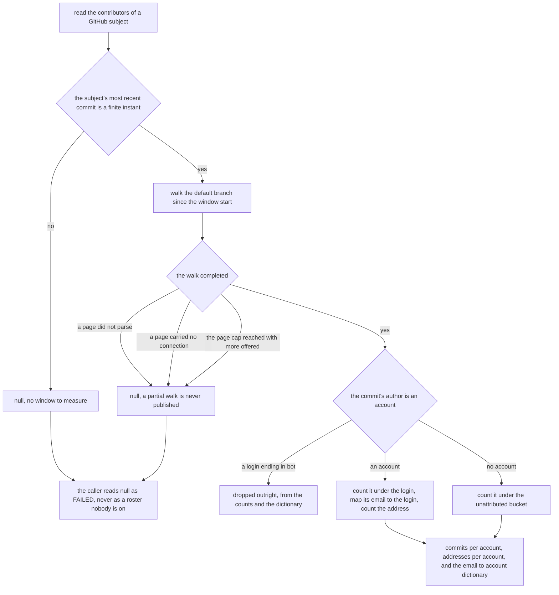
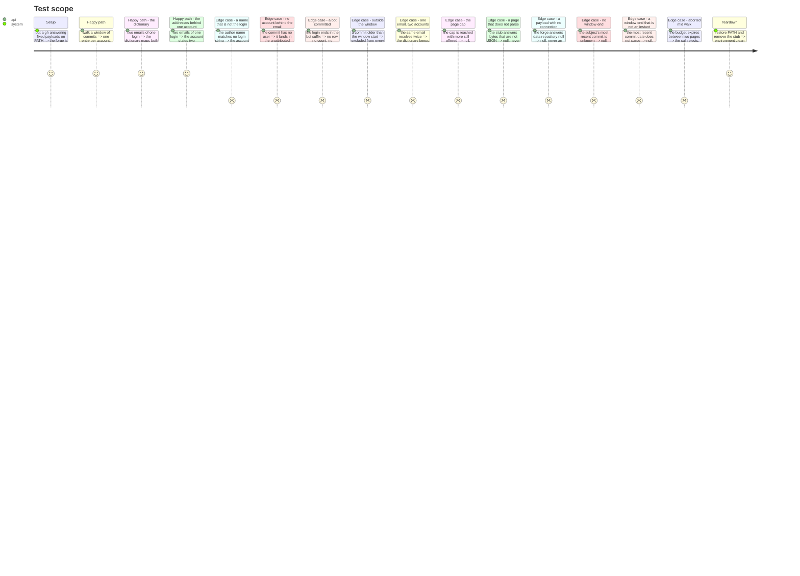

# Instruction: The contributor walk, and the identity dictionary

## Architecture projection

```txt
.
└── src/evidence/adapters/forge-repository/
    ├── commit-history.ts            🆕 who committed in the window, under how many addresses, how often
    └── commit-history.test.ts       🆕 the collapse, the unattributed bucket, the bots, the refusals
```

This phase wires nothing. No collector is built from it, no report carries it, and the composition
root is untouched. It delivers one module and its suite, and stops there. The port that reads it is
phase 6's, the harness join that needs the dictionary is phase 5's, and the memory bank is phase 9's.

## User Journey



## Test Scope



## Tasks to do

### `1)` Walk the default branch over the window everything else measures

> A roster on a different span would put two periods in one document.

1. Create `src/evidence/adapters/forge-repository/commit-history.ts`. It spawns nothing itself: every
   call goes through `runGh` from `gh-process.js`, which already kills the child on abort and turns a
   refusal into `GhCommandFailedError`.
2. Use the verified query shape, unchanged. It is settled, and is not to be re-derived:

   ```graphql
   query($owner: String!, $name: String!, $size: Int!, $since: GitTimestamp!, $after: String) {
     repository(owner: $owner, name: $name) {
       defaultBranchRef { target { ... on Commit {
         history(first: $size, since: $since, after: $after) {
           pageInfo { hasNextPage endCursor }
           nodes { authoredDate author { name email user { login } } }
         } } } }
     }
   }
   ```

3. Export one function, `readCommitHistory(slug, subjectActivityEnd, signal)`, mirroring
   `readForgeDerivedMetrics`'s signature so the two walks of one forge take their period the same
   way. `subjectActivityEnd` is the instant `mostRecentCommitDate` reports from local Git, and the
   window is `windowStartFrom(subjectActivityEnd)` — `WINDOW_DAYS` is imported from
   `delivery-sample.ts` and never restated here.
4. Filter every commit against the window locally, on `authoredDate`, bounded at both ends, even
   though `since` already bounds the query. The server-side bound is what keeps the walk short; the
   local one is what makes the answer the module's own rather than the forge's. Tag the pair
   `SAFETY:` and say that the upper bound matters because a default branch may carry commits the
   local checkout has not fetched, which are outside the period being measured rather than the newest
   thing in it.
5. `authoredDate` is the field to compare, because `mostRecentCommitDate` reads `%aI`. Two walks
   anchored on two different clocks would measure two windows that differ by the length of a review.

### `2)` Name a constant for the page cap, and state what a capped walk costs

> A cap that nobody can argue with is a cap nobody can move for the right reason.

1. `PAGE_SIZE` is 100, the size the walk was verified at: 783 commits of the measured subject came
   back in eight pages.
2. Add `MAXIMUM_PAGES` beside it, and tag it `LIMITATION:`. **State that the value is chosen, not
   measured**, that no distribution of commit counts per window was consulted, and that it is **not
   to be lowered so that a given repository classifies**.
3. State the cost of each direction. Too low, and a repository whose window genuinely holds more
   commits than the cap admits publishes no roster at all, an evidence gap where the work was there
   to be counted. Too high, and a subject with a runaway generated history spends round trips on
   pages whose only effect is to confirm the same accounts.
4. Say what bounds it in practice: `since` already restricts the walk to the window, so the cap bites
   only on a repository committing more than `PAGE_SIZE * MAXIMUM_PAGES` times in 180 days.

### `3)` Key everything on the account, and never on the git identity

> The identity is what the commit carries; the account is what the person is.

1. The answer is one value with three fields, each answering a different question:

   ```ts
   export interface CommitHistory {
     readonly commitsByAccount: ReadonlyMap<string | null, number>
     readonly accountByEmail: ReadonlyMap<string, string>
     readonly emailAddressesByAccount: ReadonlyMap<string, number>
   }
   ```

2. **Who exists is the key set of `commitsByAccount`, and is never published as a second list.** Two
   fields answering one question drift, and the drift would only show as a row with no count or a
   count with no row. `emailAddressesByAccount` is not that second list: it answers how many
   addresses one account collapsed, never which accounts exist, and it holds no key
   `commitsByAccount` does not. The unattributed bucket has no entry there — `null` is not an
   account, and counting the addresses nothing could attribute would state something about a person
   who was never named.
3. Tag `commitsByAccount` `INVARIANT:` and record the measurement that forced it: four git identities — two name
   strings under two emails — all resolve to the login `BlandineRdl`, and neither name string matches
   that login. Keying on the identity publishes one person as four rows and joins to nothing; no
   local heuristic recovers the mapping, because it is GitHub's.
4. `accountByEmail` is keyed on the **lowercased** email, and `emailAddressesByAccount` counts
   distinct addresses under that same lowercasing, so one address written two ways is one address.
   Say nothing here about what a later phase must do to its side of the join: the lookup is built
   once, by the composition root, and it lowercases its own argument. `resolutions.md` R8 is where
   that is settled and why — a second normalisation in a second module is what drifts, and a
   dictionary and a lookup disagreeing on case is a join that silently finds nobody.
5. An email that resolves to more than one account is **dropped from the dictionary**, and both
   accounts keep their commit counts and both keep that address in their address count. A key
   meaning two people joins local work to whichever page came back first, which is neither correct
   nor deterministic; dropping it sends that work to the unattributed bucket instead, which is the
   conservative direction and the honest one.
6. Tag `emailAddressesByAccount` `INVARIANT:` and say what it counts and where it is counted. It
   counts the distinct addresses GitHub collapsed into one account — the field it feeds is
   `ContributorRecord.emailAddresses`, named for the addresses it counts and not for identities,
   because a field named after identities and counting addresses is what published 2 and 4 for one
   measured subject. **It is derived here and never by counting `accountByEmail` entries in an
   adapter**: the previous point drops an address that resolves to two accounts from the dictionary
   by design, so a count taken there under-reports, and under-reports silently — the number is
   plausible either way and nothing marks the difference. The name string is carried in the query
   and used for nothing: it joins to nothing, it proves nothing, and publishing an unverified
   display name in a document keyed on accounts would invite a reader to key on it.

### `4)` Give the unattributed commits a bucket of their own

> Merging them into a named account is a guess; dropping them shrinks a count the roster publishes.

1. A commit whose `author.user` is null — and a commit whose `author` is null at all — is counted
   under the key `null`, and under no account.
2. It is never merged into a named account, and its email never enters the dictionary: there is no
   account for that email to map to, and inventing one is the guess this bucket exists to refuse.
3. Tag the rule `INVARIANT:`. The bucket is a statement about what is observable — commits nothing
   observable can attribute — and not about a person.

### `5)` Drop bots by the one discriminator this query has

> The pull-request walk has a type; the commit walk has a string, and the string is written down as one.

1. Exclude an account whose login ends in `[bot]`, before it reaches the counts and before its email
   reaches the dictionary. The exclusion is total: a dropped bot appears in none of the three fields.
2. Tag it `LIMITATION:` and state why the pull-request walk's route is unavailable: `GitActor.user`
   is typed `User`, so `author { __typename }` — which `pull-request-history.ts` uses to drop
   bot-opened deliveries — has no counterpart on a commit. `renovate[bot]`,
   `github-actions[bot]` and `dependabot[bot]` were all observed on the measured subject as ordinary
   logins carrying the suffix.
3. State both costs in the same block. A human account whose login ends in `[bot]` is wrongly
   dropped, and an app account not using the suffix is wrongly kept. GitHub reserves the suffix for
   app accounts, so the rule is sound in practice and unsound in principle, which is exactly why it
   is recorded rather than assumed.
4. State the consequence the next phases inherit: local work whose email belongs to a dropped bot
   finds no dictionary entry and lands in the unattributed bucket. That is a bot's work counted as
   nobody's, which is the right side to be wrong on — it is never counted as a person's.

### `6)` Refuse a walk that could not be completed

> A partial window is not a smaller repository. It is a window nobody read.

1. Return `null` — the whole `CommitHistory`, never a half-filled one — in each of these five:
   * a page whose JSON does not parse;
   * a payload that parses but carries no connection, `{"data":{"repository":null},"errors":[…]}`,
     which `gh` returns with exit 0. Tag this one `SAFETY:` and say that it once became an empty page
     whose `hasNextPage: false` ended a walk, and the truncated result was published as whole. That
     failure has already bitten this codebase and the guard exists because of it;
   * the page cap reached with `hasNextPage` still true;
   * `subjectActivityEnd` being `null`. Tag it `LIMITATION:`: without the subject's most recent
     commit there is no window end, and a roster anchored on the forge's own newest commit would
     measure a period no other number in the report measures. The cost is a subject whose local
     history cannot be read publishing no roster while the repository line still publishes its
     metrics, and that asymmetry is preferred to two periods in one document;
   * a `subjectActivityEnd` that is not a finite instant. A date that does not parse gives a window
     start of `NaN`, every comparison against it is false, and the walk would answer an empty
     window rather than an unread one — the same refusal `readDeliveredChanges` already makes on a
     window end that is not finite, made here for the same reason.
2. **`null` is the caller's `FAILED`, and this module says so where it returns it.** All five are a
   read that did not happen, and a `null` a caller treats as an ordinary value assembles zero
   records and publishes `{ status: 'COMPLETED', records: [] }` — a sentence stating that no
   account was active in the window, derived from a walk nobody read. That is the product's central
   failure mode reached by omission, and `resolutions.md` R2 settles it: `null` from this walk is
   `FAILED` with a reason naming this walk, only an abort is `TIMED_OUT`, and `COMPLETED` with no
   records is entitled to say the window held nobody precisely because the walk succeeded.
3. Do not catch what `runGh` rejects with. A refusal from `gh` and an abort both propagate, exactly
   as they do in `pull-request-history.ts`; the adapter that calls this is what turns the first into a
   `FAILED` status and the second into `TIMED_OUT`.
4. Call `signal.throwIfAborted()` before the first page, and let `runGh` carry the signal into every
   subsequent one, so an abort between two pages rejects rather than resolving a dictionary built
   from the pages that happened to arrive.

### `7)` Prove it on fixed payloads, at the module's own boundary

> Every finding this project's tests have produced came from driving a unit that could answer for
> itself.

1. Create `commit-history.test.ts` beside the module. Mirror `pull-request-history.test.ts`: a
   `#!/bin/sh` stub named `gh` on `PATH`, answering the nth invocation with the nth payload, the
   invocations tallied by bytes and never by lines. Restore `PATH` and remove the workspace in
   `afterEach`.
2. Build the payloads by hand, shaped like the GraphQL answer and copied from no real repository.
   The identity collapse is reproduced as its shape — two emails, two names, one login — and not as
   the subject's own addresses.
3. Assert the collapse, the address count it feeds, the unattributed bucket, the bot exclusion, the
   window exclusion, the one-email-two-accounts drop, the cap, the unreadable payload, the payload
   with no connection, the missing window end, a window end that does not parse, and the abort. One
   decision per test.
4. For the cap, hand the stub more pages than `MAXIMUM_PAGES` with `hasNextPage` true throughout, and
   assert `null`. For the window exclusion, have the stub return a commit older than the window start
   regardless of `since`, so the assertion drives the module's own filter rather than the forge's.
5. Neuter each guard in turn and watch its test go green, then restore. A guard nothing holds is what
   this repository's model loader shipped three times.
6. Honour `.claude/rules/01-standards/1-comments.md` throughout both files: no `/** */`, and any run
   of two or more `//` lines opens with `INVARIANT:`, `SAFETY:`, `COMPAT:` or `LIMITATION:`. A single
   line needs no tag, and no file header describes what the module is for.

## Test acceptance criteria

| Task | Acceptance criteria              |
| ---- | -------------------------------- |
| 1 | The walk pages through `pageInfo.endCursor`, and the suite proves a second page is fetched. A commit outside the window contributes to no count, with the stub returning it regardless of `since`. |
| 2 | `MAXIMUM_PAGES` carries a `LIMITATION:` block naming the cost of each direction, stating the value is chosen and not measured, and forbidding its lowering so that a repository classifies. |
| 3 | Two emails and two names resolving to one login produce one entry in `commitsByAccount`, whose count is the sum, two entries in `accountByEmail` both naming that login, and an `emailAddressesByAccount` of 2 for it — never 4, and never the count of the names. No second list of accounts exists, and the unattributed bucket has no address count. An email seen under two logins leaves the dictionary while both accounts keep their commit counts and their address counts. |
| 4 | A commit with a null `user` is counted under the key `null` and is added to no named account, and its email appears in no dictionary entry. |
| 5 | A login ending in `[bot]` appears in neither `commitsByAccount` nor `accountByEmail`, and the comment naming the rule states that `GitActor.user` is typed `User` and what the string rule costs in both directions. |
| 6 | Each of the five refusals returns `null` rather than a partial `CommitHistory`, and the module states that `null` is the caller's `FAILED` and never an empty roster; a `gh` refusal rejects, and a signal aborted between two pages rejects rather than resolving. |
| 7 | Every test drives `readCommitHistory` through the stub, no test reaches the network, and removing any one guard turns exactly one test red. |
