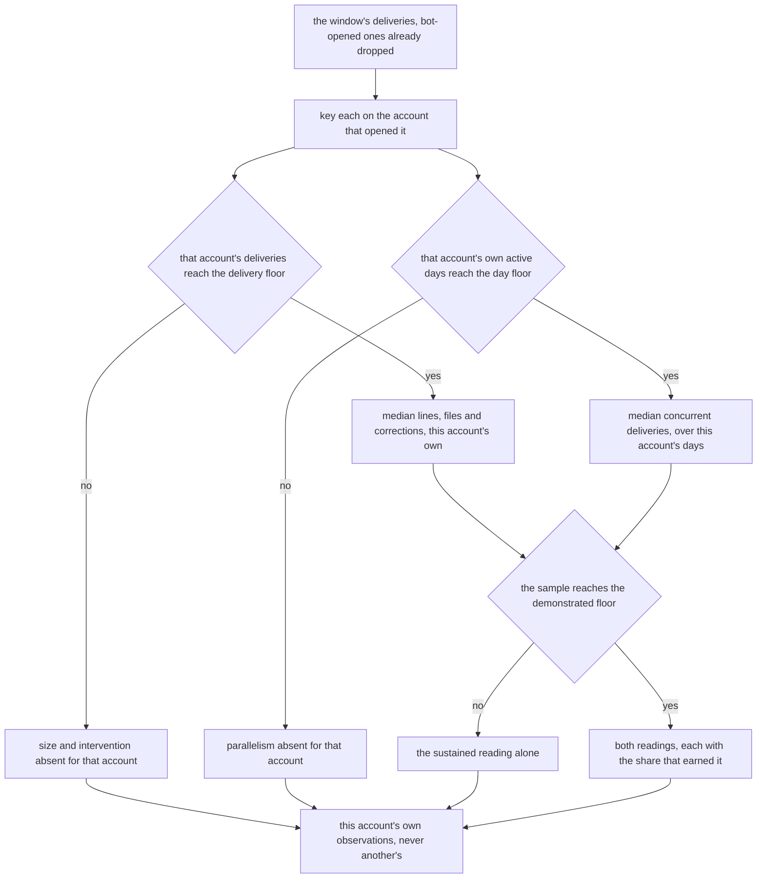
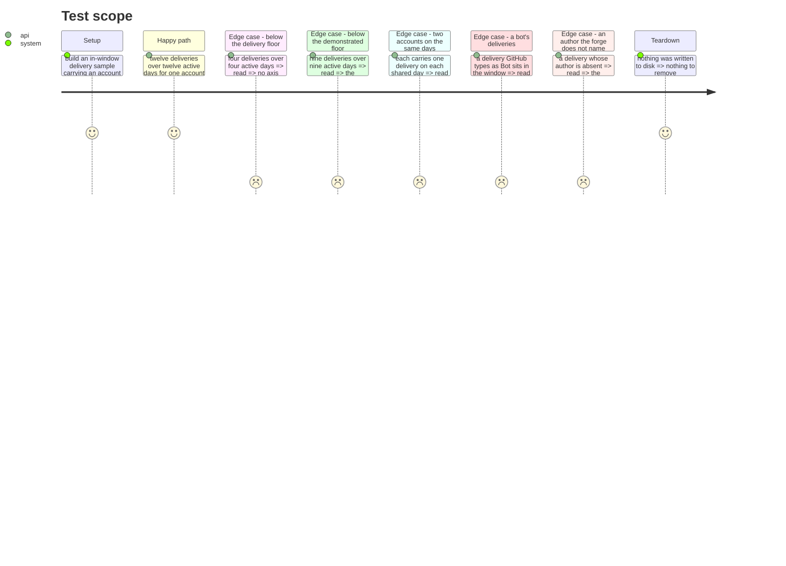

# Instruction: One person's deliveries, both readings

## Architecture projection

```txt
.
├── src/evidence/adapters/forge-repository/
│   ├── derived-observations.ts          🆕 metrics onto the loaded vocabulary, one projection, two callers
│   ├── contributor-deliveries.ts        🆕 one account's sample, three axes, both readings
│   └── contributor-deliveries.test.ts   🆕 the floors per person, the active days, the bot
└── src/evidence/adapters/
    └── forge-repository.adapter.ts      ✏️ project through the shared function
```

`pull-request-history.ts` is absent from that list on purpose: phase 1 already split it, and this
phase imports what it exported. `stryker.config.json` owes the two new files an entry, and phase 9
is what writes it.

## User Journey



## Test Scope



## Tasks to do

### `1)` Take phase 1's split instead of cutting the same seam twice

> One sample in, three axes in both readings out. The repository line and a row beneath it must read a sample by the same rule, or they state two different things under one word.

1. The cut already exists, and it is phase 1's. Read `phase-1.md` task 2 before writing a line here: `pull-request-history.ts` exports `readDeliveredChanges(slug, subjectActivityEnd, signal)` — the pages, the window end and the filter, answering `null` for a walk nobody read and `[]` for a window holding nothing — and `deriveForgeMetrics(deliveries)` — the per-delivery buckets, the two medians through `size-buckets.ts`, `interventionFor`, `countRequestsPerActiveDay` and the two demonstrated readings. `readForgeDerivedMetrics` stays their composition, with its signature and its return unmoved, and `MergedPullRequest` is exported beside them as the shape of one in-window delivery.
2. This phase imports those names and specifies no extraction of its own. A seam described twice lands in two places; `resolutions.md` R5 settles which description stands, and this one consumes it.
3. `pull-request-history.ts` is therefore not edited here and `pull-request-history.test.ts` passes untouched, which is the cheapest available statement that the repository-level answer did not move by a single bucket. The four reference profiles and `mc-tracker` report exactly what they report today, which is question three of the brief.
4. Every per-account reading in this phase is `deriveForgeMetrics` over that account's slice of the same `readonly MergedPullRequest[]`. One function derives the repository line and every row beneath it, so the two cannot come to mean different things under one word. What narrows per account is the sample handed in, and nothing else.

### `2)` Key the sample on the account that opened the delivery

> A delivery belongs to the account the forge names on it, and to nobody by inference.

1. Export `readContributorDeliveries(deliveries, vocabulary)` from `contributor-deliveries.ts`: the window's `readonly MergedPullRequest[]` and the loaded vocabulary in, one entry per account out, each holding that account's own metrics, its active-day count and the observations task 5 projects. Phase 6's adapter calls it by that name and takes nothing else from this file, so the seam is named once here rather than described twice and consumed unnamed.
2. Group there, over the sample that has already left the window filter: bot-opened deliveries and merges outside the window are gone before any account is keyed, exactly as today.
3. A pull request GitHub types as `Bot` is excluded there and is not excluded a second time here. The commit walk excludes on the `[bot]` login suffix because a commit's author carries no type; the two sources are excluded by different rules because they offer different facts, and collapsing both onto the string rule would drop a human account for its name.
4. A delivery whose author the forge does not name joins the unattributed bucket under `account: null`, on the same terms as a commit whose email maps to no account. Dropping it would silently shrink a count the roster publishes; merging it into a named row would be a guess.
5. Nothing here consults the identity dictionary. An account that opened deliveries and made no commit in the window still has its sample read, and an account in the dictionary that opened no delivery gets an empty one and three absent axes. Neither is an error, and the join is phase 6's.
6. `src/evidence/adapters/forge-repository/` is a folder every relevant dependency-cruiser rule already reaches, so no rule widens and no sentinel is owed. `coding-assertions.md` requires one only where a rule reaches a folder it did not.

### `3)` Apply the floors per person, and do not lower them

> Splitting a sample by person shrinks every sample. The floors then answer the same question about a smaller one, which is what they are for.

1. Import `MINIMUM_DELIVERED_CHANGES` (5), `MINIMUM_ACTIVE_DAYS` (5) and `MINIMUM_DEMONSTRATED_SAMPLE` (10) from `delivery-sample.ts` and apply them to one account's occasions. This phase introduces no constant and copies none.
2. Each floor counts its own occasions: deliveries for size and intervention, that account's active days for parallelism. An account may clear one and not the other, and carry parallelism where it carries no size. That is the floors working on two different samples, not an inconsistency to smooth over.
3. Below a floor the axis is absent, which reaches the report as `UNKNOWN`: an evidence gap the report names as one. It is never a lower level and never a practice gap, and `project-brief.md` forbids recommending a practice change from a failure to prove one.
4. Record the consequence where the grouping happens, in a `LIMITATION:` block. A team of four sharing thirty deliveries will have members below both floors, and their rows carry an evidence gap where the repository line carried a level; that is the conservative rule working, not a regression. The whole argument for the values is in `delivery-sample.ts` and none of it changes because the sample is now one person's. **The floors are not to be lowered so that a given contributor classifies**, on the same footing as the sentence in `delivery-sample.ts` that forbids lowering them so that a given repository classifies.

### `4)` Count a person's own active days

> Two people each carrying one branch a day is not one person carrying two.

1. An active day is a day on which one of that account's own deliveries received a commit. A day on which only somebody else was active is not that account's day at all, and does not enter its sample as a zero.
2. The count on such a day is that account's own distinct deliveries receiving a commit, never the repository's. The repository's answer stays the repository's, on the line above the roster.
3. Narrow the sample, not the rule: the per-account count is `countRequestsPerActiveDay` over one account's deliveries. A second implementation would be a second answer to one question, and `size-buckets.ts` and `intervention-scale.ts` exist because that failure has already been paid for once.
4. Both readings follow from the same list: the median over that account's active days, and the concurrency at least a third of them carried, with the share that earned it.
5. **The count itself travels, and does not stop here.** It leaves on that account's entry from `readContributorDeliveries` and reaches phase 6's record as `ContributorRecord.activeDays`, which phase 7 publishes on every row. Today it is computed and dropped; a record that lost it would leave prose with nothing to print beside the delivery count on a member whose sample supported a reading, and would leave `--json` a count short on every row.

### `5)` Give each account its own observations, and never a shared list

> N accounts emitting one axis resolves to `CONFLICTING` and destroys that axis for everyone. The rows are kept apart by construction, not by care.

1. Extract the projection now in `forge-repository.adapter.ts` — the three scale lookups and the six guarded pushes — into `derived-observations.ts`, and have the collector call it. The repository-level output must be identical: the same six sentences, the same guards, the same order.
2. **The collector id is a parameter, not a constant**: the signature is `(metrics, vocabulary, collectorId, basis)`. The projection has two callers from the moment it exists — the forge collector, passing `'forge-repository'`, and the roster adapter of phase 6, passing its own id — and a baked-in `'forge-repository'` would make every roster observation claim it came from the collector. `resolutions.md` R5 settles it, and phase 6 is entitled to rely on it: **the roster adapter constructs no observations of its own**, it calls this.
3. Call it once per account, with that account's own metrics and a basis naming the account, and hang the result on that account's row. No observation list is ever concatenated across accounts, and no account's list ever reaches `resolveEvidence` beside another's.
4. The vocabulary guards travel with the projection: a value the loaded model's scale does not carry is dropped for the account it belongs to, exactly as it is dropped for the repository. Same rule, narrower sample.
5. The invariants written on the projection travel with it, tags included, and any that names a position rather than a rule is corrected as it moves: `coding-assertions.md` records three that survived two refactors of `harness-scan.ts` and were caught by a reviewer rather than by a check. No docblock is introduced, and a run of two or more `//` lines opens with `INVARIANT:`, `SAFETY:`, `COMPAT:` or `LIMITATION:`.
6. `derived-observations.ts` gets no suite of its own. `forge-repository.adapter.test.ts` and `contributor-deliveries.test.ts` both drive it, and `testing.md` grants a file its own suite only when something other than taste says the boundary above it is too coarse.

**This phase does not order the rows, and must not start.** `composeContributorRoster` sorts, in phase 7, once the rows are built and at the last point before the contract — deliveries descending, then account ascending, the unattributed bucket last. Three phases each specified that order in a different place and `resolutions.md` R6 settled it there; establishing it here as well would be one order derived twice, with two places to disagree.

### `6)` Prove it on a sample, not through a spawn

> A rule reached only by walking a whole payload is pinned by nothing in particular.

1. `contributor-deliveries.test.ts` drives the grouping on a hand-built in-window sample: no `gh`, no child process, no fixture on disk, nothing to tear down.
2. Pin an account clearing every floor: three axes, both readings, and a share on each demonstrated one.
3. Pin four deliveries over four active days: no axis carries, and the row still states four deliveries. Keep the fixture below the day floor as well as the delivery floor, or the case proves half of what it names.
4. Pin nine deliveries over nine active days: the sustained reading on all three axes, and no demonstrated reading anywhere.
5. Pin two accounts committing on the same days: each parallelism is that account's own, and neither is the sum of the two.
6. Pin a bot's deliveries inside the window: no row carries them, and no other account's median moves because they were there.
7. Pin a delivery whose author the forge does not name: it lands in the unattributed row under the key `null`, counted and never dropped. Where that row sits among the others is not this suite's to assert — nothing here sorts.
8. Delete the per-account narrowing so every account reads the whole window's sample, confirm the two-account case fails, and restore.
9. `stryker.config.json` must name `contributor-deliveries.ts` and `derived-observations.ts`: `forge-repository/` is swept file by file, so without the entries the per-person floors and the per-account active-day count are mutated by nothing, and a guard nothing holds is exactly what this project's known weak spot was. **Phase 9 owns that edit** — this phase writes no configuration — and `resolutions.md` R9 is where it is recorded.

## Test acceptance criteria

| Task | Acceptance criteria              |
| ---- | -------------------------------- |
| 1 | No new split is made: `pull-request-history.ts` is unedited, its suite passes untouched, and every per-account reading goes through the `readDeliveredChanges`, `deriveForgeMetrics` and `MergedPullRequest` phase 1 exported. The repository-level metrics are unchanged, and the derivation is reachable without a `gh` spawn. |
| 2 | `readContributorDeliveries(deliveries, vocabulary)` is the name phase 6 calls and the only export this file offers. A bot-opened delivery produces no row and shifts no median; a delivery with no named author is counted in the unattributed row rather than dropped; an account with deliveries and no commits is read, and one with commits and no deliveries yields an empty sample. |
| 3 | Four deliveries over four active days carry no axis at all, and the block naming the floors states the cost of splitting a sample and forbids lowering them so that a given contributor classifies. |
| 4 | Two accounts each carrying one delivery on the same five days each report a parallelism of one, and the suite fails if either reads the other's days. Each account's active-day count is returned beside its metrics, under the name phase 6 copies onto `ContributorRecord.activeDays`, rather than consumed and discarded. |
| 5 | The projection takes its collector id as a parameter, so neither caller carries a baked-in one and the repository-level six sentences are byte for byte what the adapter emitted before the move. Every observation on a row names that row's account in its basis, and no row's list holds an observation derived from another account's deliveries. |
| 6 | Removing the per-account narrowing turns the two-account case red. No assertion in this suite depends on the order of the rows. |
