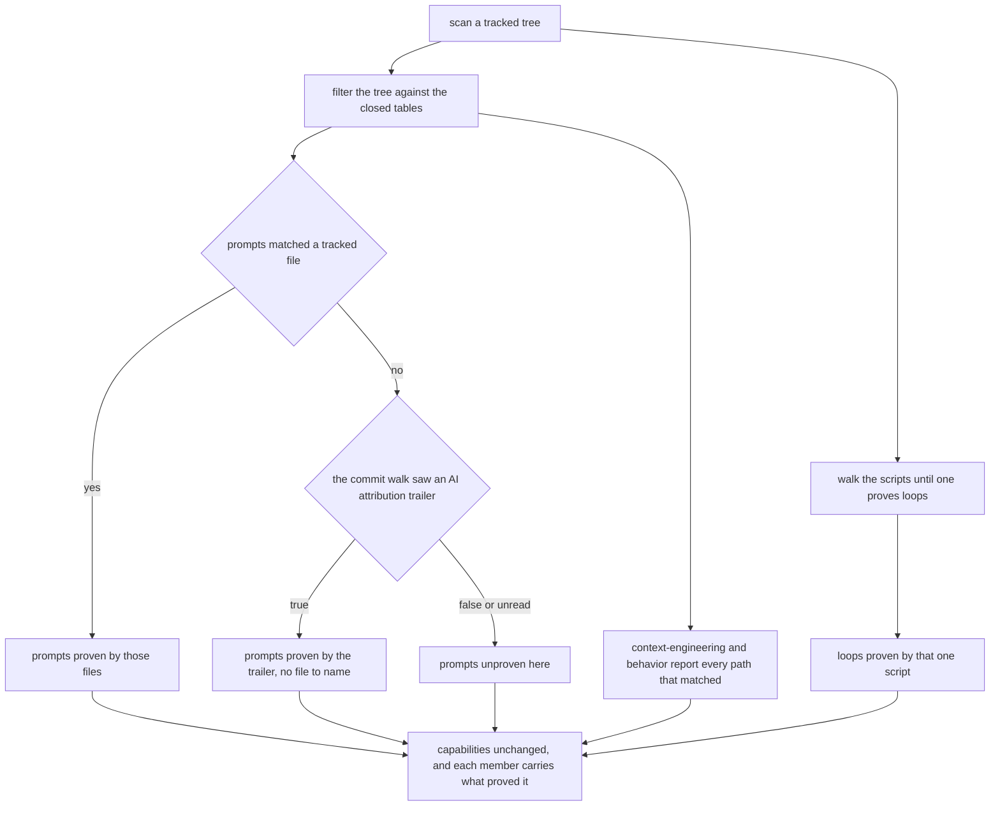
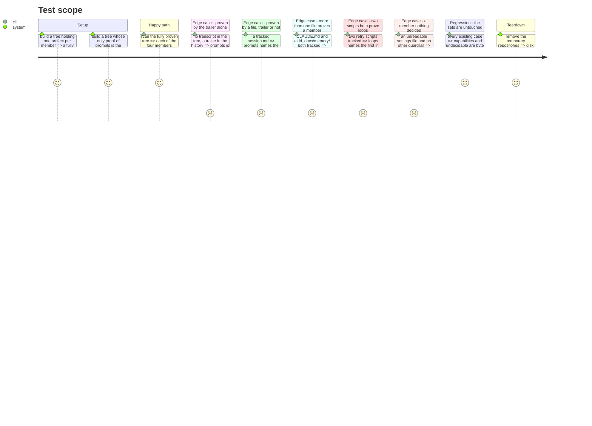

# Instruction: The harness scan reports what proved it

`scanHarness` answers two questions today: which capabilities the tree proves, and which it could not
decide. Phase 5 asks a third — **which files earned each one** — because authorship is read from the
paths, and no other module knows them. The addition is a **third field** on `HarnessScan`, beside
`capabilities` and `undecidable`. The plan calls it "a second field" counting from `capabilities`
alone; there are two fields today and there will be three.

Nothing that reads `capabilities` or `undecidable` changes. `decided-capabilities.ts`,
`live-repository.adapter.ts` and `fixture-bundle.adapter.ts` are untouched, and so is every axis they
publish. The new field is not an axis input and is deliberately not filtered by the loaded scale: a
member the model cannot rank is still a file somebody wrote, and the scale filter stays where it is,
in `decided-capabilities.ts`.

The scan gains a second caller with the field. Phase 6's roster adapter runs `scanHarness` itself,
over a `HarnessTree` the composition root hands it, so a subject with a forge origin has its tree
scanned twice per assessment — once by the live collector, once by the roster. Nothing here answers
that: the scan is a pure function of the tree it is given, and the one alternative, a single scan
handed to both, moves `LiveRepositoryEvidenceCollector`'s constructor, which no phase of this plan
touches. The cost is named and accepted, and revisited when a measurement says the second walk costs
something.

This phase introduces no constant, no threshold and no sample floor. `SHEBANG_PROBE_BYTES` is the
only number in the layer and it does not move.

## Architecture projection

```txt
.
└── src/evidence/adapters/harness/
    ├── harness-scan.ts             ✏️ a third field, and the member vocabulary exported with it
    ├── harness-scan.test.ts        ✏️ the third field, every existing case projected onto the two it already asserts
    ├── capability-signals.ts       ✏️ the pure tables return the paths they matched, not a boolean
    ├── member-scan.ts              ✏️ `ProvenPaths`: what proved a member, beside the three answers
    └── harness-tree.ts             ✏️ one line: `entries()` is ordered, and the order is the report's
```

`shell-loop.ts`, `shell-tokens.ts`, `agent-invocation.ts` and `script-candidate.ts` are **not** in the
projection, and that is a decision. `readShellLoops` reads a source string and knows no path — the
path belongs to the tree entry `scanScripts` was reading when it called it, so the answer is assembled
one level up and the tokeniser keeps its signature. `testing.md` records that those two files earned
their own suites from a mutation measurement; leaving them alone is how that measurement stays
comparable.

## User Journey



## Test Scope



## Tasks to do

### `1)` Give the scan a third field, and export the vocabulary it is keyed on

> A member is in `capabilities` exactly when something proved it, and the report says what.

1. In `harness-scan.ts`, export `HarnessMember`; it is a private alias today and phase 5 keys on it.
2. Declare the proof as a closed union, so that "no file" and "no proof" cannot be written the same
   way:

   ```ts
   export type HarnessProof =
     | { readonly kind: 'files'; readonly paths: readonly string[] }
     | { readonly kind: 'commit-trailer' }
     | { readonly kind: 'nothing' }
   ```

3. Add `readonly provenBy: Readonly<Record<HarnessMember, HarnessProof>>` to `HarnessScan`, keyed in
   `HARNESS_MEMBERS` order.
4. Tag the field's block `INVARIANT:` and state the two rules it carries: `kind: 'files'` never holds
   an empty list, and a member carries a proof other than `'nothing'` exactly when it appears in
   `capabilities`. An empty `paths` array would read as "the collector looked and found no file",
   which is the reading `'nothing'` and `'commit-trailer'` exist to keep apart.
5. `'nothing'` is the third variant's name because `unproven` is the maturity outcome vocabulary and
   `none` is a `size` scale member in `aidd.yml`; reusing either would put two unrelated concepts
   under one word. `cli.md` already refuses `none` in prose for the same reason.

### `2)` Return what matched from the closed tables, not whether anything did

> A boolean answers the axis. Authorship needs the file, and the tables already know it.

1. In `capability-signals.ts`, replace `provesPrompts` and `provesContextEngineering` with functions
   returning `readonly string[]`: the tracked paths matching that member's file table or its
   root-directory table. Keep both tables closed and matched exactly as they are; this task changes
   what is returned, never what matches.
2. Filter the tracked list **once, in place**, rather than concatenating one table's matches after
   the other's. One pass keeps the result in tree order, needs no deduplication, and is provably the
   same predicate: `some(p)` and `filter(p).length > 0` agree for every input.
3. `provesBehavior` returns `ProvenPaths` (task 3). Its two pure tables are read together in that one
   pass, so a tree holding both `.claude/rules/` and a `.cursorrules` names both. The settings route
   still runs only when neither table matched, so no settings file is opened that is not opened
   today, and the first settings file declaring a permission list is the path it names.
4. Prove the boolean is unchanged before trusting it: the four members' `capabilities` and
   `undecidable` values in every existing case are the assertion, and task 5 keeps all of them.

### `3)` Carry the path beside the three answers, without widening `MemberScan`

> `MemberScan` is the answer a source gives about itself. A path is what the caller was reading.

1. In `member-scan.ts`, add:

   ```ts
   export interface ProvenPaths {
     readonly paths: readonly string[]
     readonly undecidable: boolean
   }
   ```

   with a single-line comment stating that `paths` is empty exactly when the member is unproven, so
   `MemberScan.proven` is `paths.length > 0` and is not repeated as a field. A single `//` line needs
   no tag.
2. Leave `MemberScan` and `DECIDED_PRESENT` exactly as they are. `readShellLoops` keeps returning
   `MemberScan`: it is handed a source string, it has no path to give, and changing it would reach
   the two files `testing.md` protects.
3. Change `scanScripts` in `harness-scan.ts` to return `ProvenPaths`, holding the path of the entry
   whose script proved `loops`, or no path.
4. Keep the early `break` once `loops` is proven, and keep its `INVARIANT:` block. The cost is now
   visible and is accepted rather than hidden: a tree with two retry scripts names the first in tree
   order, so phase 5 attributes `loops` to that script's authors alone. The alternative is to open
   every remaining file in the tree to find the others, which is the read the existing invariant
   refuses. Record it as a `LIMITATION:` block on `scanScripts`, naming what each direction costs.

### `4)` Decide the prompts shape where the trailer short-circuits the tree

> The trailer proves the member and names no file. Which of the two answered must be observable.

1. `hasAiAttributionTrailer === true || provesPrompts(paths)` never scans the tree when the trailer
   answered, so today a trailer-proven repository holding a `session.md` knows nothing about that
   file. Evaluate the tree **first** and fall back to the trailer.
2. The decision is provably unchanged: both operands are pure over an in-memory array, `||` is
   commutative over their values, and the only cost of reordering is one array scan with no I/O.
3. When files match, report `{ kind: 'files', paths }` even if the trailer also proved the member.
   Files are what authorship can attribute; the trailer is not, and `capabilities` is identical
   either way. The report does not say the trailer also answered, and nothing consumes that.
4. When no file matches and the trailer is `true`, report `{ kind: 'commit-trailer' }`.
5. When the history could not be read at all — `hasAiAttributionTrailer === null` — and no file
   matches, `prompts` stays undecidable and its proof is `'nothing'`. Undecidable is an evidence gap;
   `'nothing'` here says no source proved the member, never that the practice is absent.
6. Keep the existing `INVARIANT:` block on `scanHarness`'s three-answer trailer parameter, and extend
   it with the rule this task settles rather than adding a second block beside it.

### `5)` Project every existing case onto the two fields it already asserts

> Seventy-seven assertions match an exact object. A third field turns every one of them red for nothing.

1. Add one suite-local helper to `harness-scan.test.ts` returning `{ capabilities, undecidable }`
   from a `HarnessScan`, and wrap in it each of the seventy-seven `scanHarness(...)` calls asserted
   with `resolves.toEqual`. Every expectation literal stays exactly as written, which is what makes
   "the sets are unchanged" a property of the diff rather than a claim.
2. The three remaining calls assert cancellation and are left alone: `countChecks` and the two
   rejection cases read no field at all.
3. Do **not** reach for `toMatchObject`. It permits extra properties, so a wrong `provenBy` — or a
   fourth field nobody meant to add — would pass silently in all seventy-seven.
4. **Add no checkpoint.** `EXPECTED_CHECKS` pins the number of `signal.throwIfAborted()` calls the
   scan makes as `4 + 2 + files`, and one case per checkpoint asserts the rejection. Nothing in this
   phase reads a file that is not read today: the tables are filtered in memory and the settings
   route is unchanged, so the arithmetic must come out the same. A budget case turning red means an
   unintended read, not a stale expectation.
5. `harness-scan.test.ts` is the boundary that covers `capability-signals.ts`, and it stays so.
   Nothing here says the boundary above those tables is too coarse; `testing.md` requires a
   measurement, not taste, before a file earns its own suite.

### `6)` Pin the third field

> A field nothing asserts is a field the next refactor deletes.

1. One tree proving all four members: assert `provenBy` in full, each member naming the path that
   proved it.
2. `prompts` proven by a trailer with no transcript in the tree: `{ kind: 'commit-trailer' }`.
   Beside it, `prompts` proven by a tracked `session.md`: `{ kind: 'files', paths: ['session.md'] }`.
   These two are the case the field exists for, and neither is readable from the other.
3. `prompts` with both a trailer and a tracked transcript: the files win, and the path is named.
4. `context-engineering` proven by a tracked `CLAUDE.md` **and** a file under `aidd_docs/memory/`:
   both paths, in tree order. Assert the order, not the set.
5. Two tracked retry scripts, both proving `loops`: exactly one path, the first in tree order.
6. A member nothing decided — an unreadable `.claude/settings.json` and no other guardrail — carries
   `{ kind: 'nothing' }` while `undecidable` still names it.
7. The cross-field invariant, on the fully proven tree and on an empty one: a member is in
   `capabilities` if and only if its proof is not `'nothing'`.
8. Add the one line `harness-tree.ts` now owes: `entries()` returns a deterministically ordered
   listing, because the report's path order is that order. `tracked-tree.ts` gets it from `git
   ls-files` and `bundle-tree.ts` from a codepoint-sorted walk, so both hold it today. No sort is
   added here: sorting in the scan would hide a tree that stopped being deterministic, and `cli.md`
   promises the same bytes on any machine.
9. Every multi-line `//` block added by this phase opens with `INVARIANT:`, `SAFETY:`, `COMPAT:` or
   `LIMITATION:`, and no `/** */` is written. `pnpm comments` is the verdict.
10. `evidence/adapters/harness/` is in the mutation sweep. The sweep is not part of `pnpm check` and
    is not a gate here, but the new filters must be pinned on both sides — a matching path reported
    and a non-matching path absent — so that a mutant flipping a table predicate dies in
    `harness-scan.test.ts` rather than surviving into phase 5.

### `7)` Leave the memory bank alone, and check no wall moved

> A phase that edits `aidd_docs/memory/` because it happened to learn something leaves nine phases
> rewriting one page.

1. Record nothing in `aidd_docs/memory/`. Phase 9 owns the bank and names the third field on
   `HarnessScan` there, in `codebase-map.md`, once — including the sentence this phase makes false,
   the `harness-scan.ts` entry that still says it "holds nothing else".
2. No dependency-cruiser rule widens and no file crosses a folder, so no sentinel is added. State
   nothing about the boundary rules that this phase does not change.

## Test acceptance criteria

| Task | Acceptance criteria              |
| ---- | -------------------------------- |
| 1 | `HarnessScan` carries three fields, and the type makes an empty `paths` list unwritable under `kind: 'files'`. |
| 2 | Every existing case reports the same `capabilities` and the same `undecidable` as before the change, and a tree holding a behavior directory and a `.cursorrules` names both files. |
| 3 | `readShellLoops` still returns `MemberScan` and neither `shell-loop.ts` nor `shell-tokens.ts` appears in the diff. Two retry scripts yield one path, and the `LIMITATION:` block says why. |
| 4 | A trailer-proven repository holding a `session.md` names the file; one holding none reports `commit-trailer`; an unread history with no transcript reports `nothing` and keeps `prompts` undecidable. |
| 5 | The suite fails when `provenBy` is wrong, no expectation literal in the seventy-seven existing assertions was edited, and `EXPECTED_CHECKS` is untouched and still passes. |
| 6 | Deleting the third field from `harness-scan.ts` turns the suite red on more than one case, and `pnpm comments` passes. |
| 7 | No file under `aidd_docs/memory/` appears in the diff, and `scripts/prove-boundary-rules.mjs` is unchanged. |
