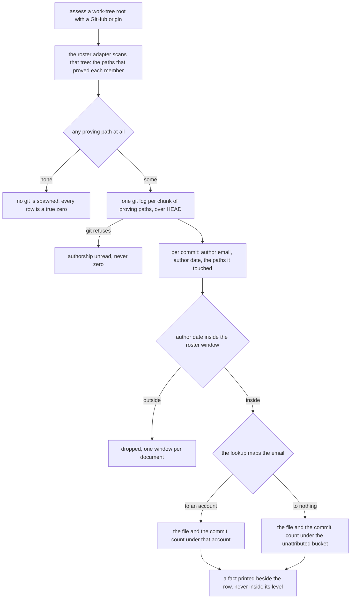
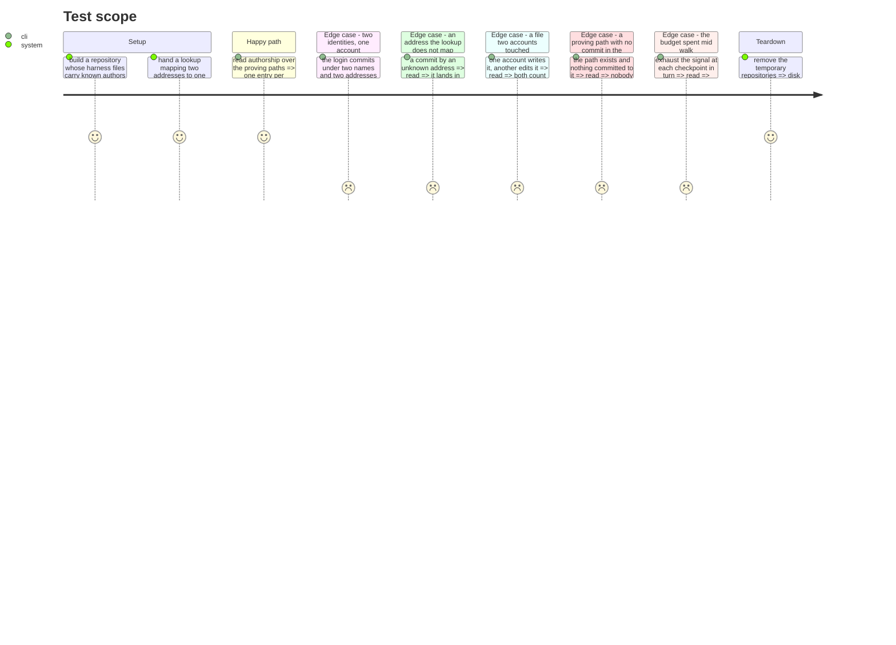

# Instruction: Count who authored the harness, never rank them

## Architecture projection

```txt
.
├── src/evidence/models/
│   └── harness-authorship.model.ts   🆕 two counts, named once for the port and this module both
└── src/evidence/adapters/harness/
    ├── harness-authorship.ts         🆕 who authored the proving paths, per account the lookup resolves
    └── harness-authorship.test.ts    🆕 the identity collapse, the unattributed bucket, the budget
```

Nothing else is touched. `harness-scan.ts` is phase 4's, the dictionary is phase 2's, the port and the
adapter that call this are phase 6's, and the memory bank is phase 9's — a phase that edits
`aidd_docs/memory/` because it happened to learn something leaves nine phases each rewriting the same
page. The model file is written here rather than there because the shape is this module's return and
phase 6's record field at once, and a shape two boundaries share is a model.

## What this module is not

`harnessAuthorship` is a fact published beside a level and never inside one. It produces no
`Observation`, it names no axis, no scale and no threshold, it reaches `resolveEvidence` through
nothing, and no recommendation is derived from it. "Has never touched the harness" proves nothing
about a person's practice, and `project-brief.md` forbids recommending a practice change from a
failure to prove one. Authorship is also not use: the plan rejected attributing the harness axis by
authorship precisely because the files are available to everyone who works in the tree, and a
developer who joins tomorrow and relies on them daily authored none of them.

`harness/` gains its first module that only a Git work tree can answer, and that is a real cost.
`harness-scan.ts` reads through the `HarnessTree` seam so a bundle and a repository answer the four
capabilities identically; this module reads local Git directly and a bundle can never call it. It
therefore sits **beside** the scan and not above or below it: `harness-authorship.ts` imports nothing
from `harness-scan.ts`, `harness-scan.ts` imports nothing from `harness-authorship.ts`, and their
only coupling is a list of paths the caller passes from one to the other. Cross that and the scan
stops answering for a bundle.

## User Journey



## Test Scope



## Tasks to do

### `1)` Read the proving paths in one walk per chunk

> Authorship is a fact about files, and one `git log` answers it for as many of them as argv holds.

1. Export `readHarnessAuthorship(path, provingPaths, accountForEmail, windowStart, signal)`, returning
   `Promise<ReadonlyMap<string | null, HarnessAuthorship> | null>`. The `null` key is the
   unattributed bucket, on the same footing as `ContributorRecord.account`; a sentinel string would
   be a login-shaped value in a map of logins.
2. `HarnessAuthorship` is `{ readonly files: number; readonly commits: number }` and lives in
   `src/evidence/models/harness-authorship.model.ts`, written by this phase and imported here. The
   consumer exists: phase 6's port carries the shape on every record, a port may not import an
   adapter, and a shape a port and an adapter both name sits in `models/` on the footing
   `collector-provenance.model.ts` already sits there. Export `NO_HARNESS_AUTHORSHIP`, the two zeros,
   from that same file, so phase 6 cannot spell "authored nothing" a second way. Export **no**
   constant for a walk that did not run: the record's field is `HarnessAuthorship | null` and `null`
   is that walk, which a named pair of zeros could only blur.
3. `provingPaths` is the flattened union of what phase 4 reports on `HarnessScan.provenBy`, and the
   caller that flattens it is phase 6's roster adapter — it runs `scanHarness` over the `HarnessTree`
   the composition root hands it and passes the union down. This module never learns which member a
   path proved, so a change to how phase 4 groups them cannot reach it. **There is no per-member
   breakdown, here or anywhere downstream**: the answer is keyed on the account and holds two counts,
   no `members` field is returned, and none is derived from this module later.
4. Spawn through `live-repository/git-process.ts`'s `runGit`. It is the one place `git` is spawned,
   and its hardened configuration and stripped environment come with it. Add no second spawn.
5. Arguments: `log`, `--full-history`, `--no-merges`, `--name-only`, `-z`, `--no-ext-diff`,
   `--no-textconv`, `--format=<RECORD>%H<FIELD>%aI<FIELD>%ae`, `HEAD`, `--`, then one
   `:(top,literal)<path>` per proving path in the chunk.
6. Reuse the `\x1e` and `\x1f` separators `git-history.ts` already names, for the reason it names
   them: neither occurs in a hash, a date, an address or a path.
7. Parse a record by splitting on NUL: the first element is the header, split on `\x1f`; every
   remaining non-empty element is a path that commit touched. `-z` is what makes this hold — without
   it a path outside ASCII is quoted, and one containing a newline breaks the record.
8. Document the two pathspec magics as one `SAFETY:` block. `literal` because a proving path
   containing `*`, `?` or `[` is a filename and not a glob; `top` because it anchors at the
   repository root whatever working directory `git` is given, which is the frame `git ls-files`
   reported the path in.
9. Document `--no-ext-diff` and `--no-textconv` in that same block: `--name-only` produces a diff,
   `git-process.ts` can disarm `core.fsmonitor` and `core.hooksPath` through config but the diff
   family has no config counterpart, and assessing a repository received as a directory must never
   run what its author chose.
10. Add `PROVING_PATHS_PER_LOG_INVOCATION`, mirroring `MERGES_PER_DIFF_INVOCATION`, and tag it
   `LIMITATION:`. The bound is argv and not `git`: a repository whose harness proves itself through
   hundreds of files would otherwise build a command line the kernel refuses, and a refusal here
   loses the whole fact. **The value is chosen and not measured**, and no repository was consulted
   for it. Too high is a kernel refusal; too low is more spawns, each paying `git`'s startup cost.
   Unlike the sample floors it is not a threshold and neither direction changes a published number —
   say so, and say that it is still not to be moved so that a given repository produces a tidier
   count.
11. Accumulate across chunks into one map, so the counts are identical whatever the chunk size: a
    set of commit hashes and a set of paths per account, sized at the end. A commit touching proving
    paths in two chunks is one commit.
12. Promise no iteration order. Rows are ordered by the plan's rule — deliveries descending, then
    login, the unattributed bucket last — and `composeContributorRoster` applies it in phase 7, after
    the rows are built and before the contract.

### `2)` Take the window and the identity from outside, and compute neither

> Two computations of one window drift, and the roster publishes both numbers on the same line.

1. `windowStart` is a parameter. Do not call `mostRecentCommitDate` or `windowStartFrom` here: the
   commit walk already ended the window at the subject's most recent commit, and a second reading
   would put two periods in one document. Tag it `INVARIANT:`.
2. Filter in process on the author date `%aI`, `>= windowStart` and no upper bound, exactly as
   `git-history.ts`'s `inWindow` does. Do **not** use `--since`: it filters on the committer date,
   which a rebase rewrites, and every other window in this codebase is on the author date.
3. Read the author, never the committer: authorship is the question, and a cherry-pick or a rebase
   rewrites the committer while leaving the author intact.
4. Read `%ae` and never `%aE`. `%aE` applies the subject's own `.mailmap`, which would let a file the
   assessed repository's author wrote decide which two people are one. The forge's dictionary is the
   only identity authority in this feature. Tag it `SAFETY:`.
5. `accountForEmail` is a parameter — a lookup, not a table — and this module hands it the address it
   read and normalises nothing. The roster adapter of phase 6 builds that lookup over phase 2's
   dictionary the moment the commit walk returns, and lowercases its argument there, once. It cannot
   be built earlier: the dictionary it closes over does not exist until that walk has run. A second normalisation in a second module is free to drift,
   and its drift is silent: the miss does not fail, it lands in the unattributed bucket and looks
   like an ordinary answer.
6. Apply no bot rule and no exclusion of any kind. Which accounts deserve a row is the roster's
   decision; an account this module counts and phase 6 gives no row to is simply dropped there. A
   second `[bot]` string rule here would be a copy of phase 2's, free to drift, and its drift would
   move a bot's commits into the unattributed bucket rather than out of the report.

### `3)` Count files and commits, and keep a zero distinct from an unread

> An account that touched nothing and a walk that could not run are different answers.

1. `files` is the number of distinct proving paths the account committed to inside the window, and
   `commits` the number of distinct commits it made to them. A commit touching three proving paths
   is one commit and three files.
2. Tag `INVARIANT:` on the rule that the counts **do not partition** the proving set: a file written
   by one account and later edited by another counts once for each, and the sum of `files` across
   rows may exceed the number of proving paths. Anyone reading the column as a share of the harness
   is reading it wrong, and the phrasing of the output is phase 8's problem, not a reason to change
   the count.
3. An empty `provingPaths` returns an empty map and spawns no `git`. There is nothing to author.
4. A proving path with no commit in the window contributes to nobody, and that is a complete answer
   rather than a gap: the file is there, and the walk looked. A pathspec matching nothing does not
   fail the invocation and does not suppress the others in its chunk.
5. Return `null` — the whole read — when `git` refuses, on the pattern `git-history.ts`'s `readGit`
   already holds: rethrow on an abort, `null` on anything else. Tag it `SAFETY:` and say what it
   buys: a walk that did not run is not a walk that found nothing, and publishing `NO_HARNESS_AUTHORSHIP`
   from a `git` that failed would state that a person wrote none of the harness on the strength of a
   read nobody completed. Phase 6 carries that distinction into the record as `HarnessAuthorship |
   null`, and turns the `null` into a `FAILED` roster rather than a row of zeros.
6. Apply no sample floor. `MINIMUM_DELIVERED_CHANGES` and `MINIMUM_DEMONSTRATED_SAMPLE` exist because
   a median and a share over a thin sample describe an accident; a count of commits is exact at any
   size and estimates nothing. State that in the same block, so the floor is not copied here by
   analogy.

### `4)` Write down what the cheap reading costs

> A rename is invisible to a pathspec, and the reader is owed the sentence that says so.

1. Read authorship on the path as it stands today. `git log --follow` takes one path at a time, so
   following would mean one spawn per proving path where one answers for the chunk, and `--follow`
   is a similarity heuristic — the count would then depend on a rename-detection threshold nobody in
   this project chose.
2. Tag it `LIMITATION:` and name the cost exactly: a harness file renamed inside the window loses
   every author it had under its old name, so the developer who wrote `CLAUDE.md` scores nothing and
   the developer who renamed it to `AGENTS.md` yesterday scores the file. What lifts this is the
   forge's own `history(path:)`, one query per path, which the plan already weighed and rejected for
   the same reason the walk is local.
3. Name the second bound in the same block: only what is reachable from `HEAD` is counted, so harness
   work on an unmerged branch is invisible. `--full-history` is what keeps a commit that landed
   through a branch from being simplified away, and its own cost is that a change later reverted
   still counts — which is what the column claims, a commit that touched the file.

### `5)` Honour the budget at every checkpoint, and prove each one

> `testing.md` records that a cancellation test can be satisfied by a shallower checkpoint than the
> one it aimed at.

1. `signal.throwIfAborted()` on entry, and once more before each chunk's invocation. `runGit` kills
   the child on abort and rejects with the signal's reason, so a spawn already in flight is covered;
   what the loop's own check adds is the gap between two chunks.
2. Prove them with `harness-scan.test.ts`'s `signalExhaustedAt` idiom: a real signal that aborts on
   its nth check, one case per checkpoint index, plus a test pinning how many checkpoints there are.
   That is what makes a deep check unable to hide behind a shallow one — remove any guard and the
   count test fails alongside the case that addressed it.
3. Derive the expected number of checkpoints from the fixture rather than hardcoding an integer, as
   that suite does: `runGit` performs one of its own per invocation, so the total grows by two per
   chunk.
4. A rejection is never a partial count. The map is returned or the promise rejects.

### `6)` Keep it mechanically a fact

> Prose has no sentinel, and this constraint is the one the whole phase rests on.

1. Assert in the suite that `harness-authorship.ts` imports nothing from `harness-scan.ts`, and that
   its only import from `evidence/models/` is `harness-authorship.model.js` — an `Observation`
   reaching this module is exactly what the second half catches. One `it`, reading the module's own
   source, on the precedent of `reference-profiles.test.ts` grepping `src/` for a profile name. It is
   a test and not a wall: a dependency-cruiser rule would need its own sentinel in this folder per
   `coding-assertions.md`, and buys nothing a grep does not here.
2. Say what the assertion is for in one line: nothing else stops a later hand from emitting an
   `Observation` out of this module and turning a count into an axis, which is trap two of the brief
   reached from the other side.
3. Drive the suite against real temporary Git repositories and the real filesystem, as every
   Git-facing suite in this project does. Do not mock `git` to test a `git` reader.
4. Record nothing in `aidd_docs/memory/`. Phase 9 owns the bank.

## Test acceptance criteria

| Task | Acceptance criteria              |
| ---- | -------------------------------- |
| 1 | One walk per chunk answers for every proving path in it, and a commit touching paths in two chunks is counted once — the totals are identical whatever `PROVING_PATHS_PER_LOG_INVOCATION` is set to. The constant carries a `LIMITATION:` block naming the cost of each direction and stating it is chosen, not measured. |
| 2 | Two git identities under two addresses, resolving through the lookup to one login, produce one entry whose files are counted once and whose commits are the sum. An address the lookup maps to nothing lands under the `null` key and on no login. A commit dated before `windowStart` contributes nothing, and the module calls neither `mostRecentCommitDate` nor `windowStartFrom`. |
| 3 | A proving path written by one account and later edited by another is counted by both. A proving path with no commit in the window leaves every count at zero and the result non-null. An empty proving set returns an empty map without spawning `git`. A failing `git` returns `null` — never `NO_HARNESS_AUTHORSHIP` — and no row is ever handed a fabricated zero. |
| 4 | The `LIMITATION:` block names the renamed file that loses its earlier authors, and the unmerged branch that is invisible, in terms a reader of the output can act on. |
| 5 | Every checkpoint index rejects with the abort reason, the checkpoint count is pinned by a test of its own, and removing any single guard turns both red. |
| 6 | The suite fails if `harness-authorship.ts` gains an import from `harness-scan.ts`, or any import from `evidence/models/` other than `harness-authorship.model.js`. `pnpm comments` passes: no `/** */` anywhere, and every multi-line `//` block opens with `INVARIANT:`, `SAFETY:`, `COMPAT:` or `LIMITATION:`. |
