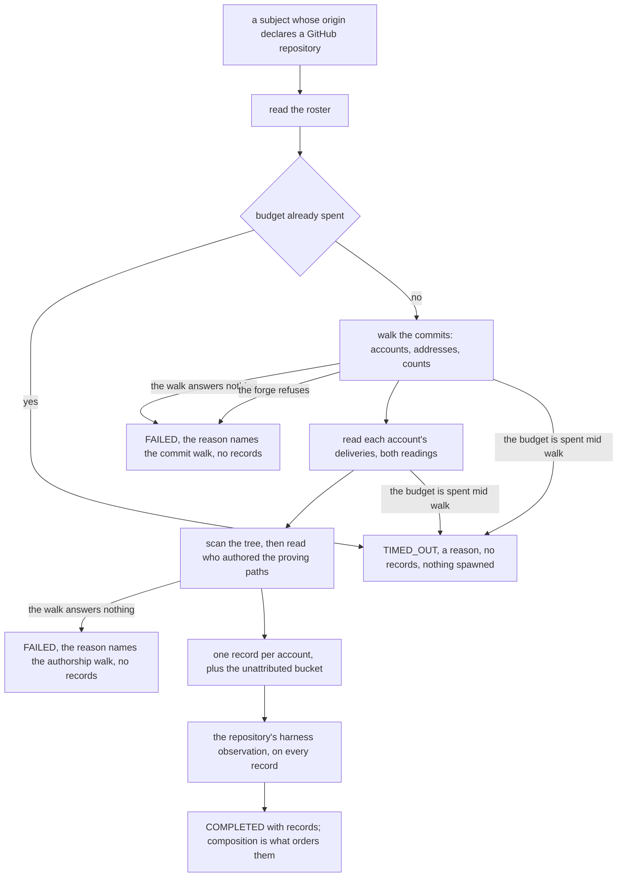
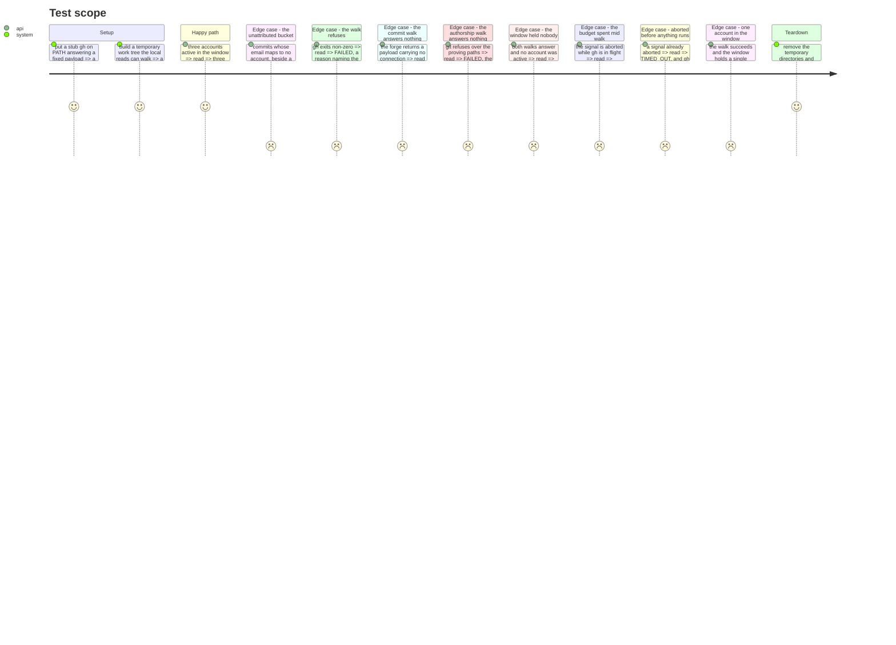

# Instruction: The roster port and its adapter

The roster is a **second port**, never a second collector, and this is the decision a later change is
most likely to undo. `EvidenceCollector` is frozen in `architecture.md`: it emits observations that
`resolveEvidence` compares by axis, one axis at a time. N contributors emitting `size` would be N
values of one axis, and resolution answers that with `CONFLICTING` — the axis is destroyed for the
repository and for every person at once. A roster answers a different question, so it gets its own
port, and nothing it returns ever reaches `resolveEvidence`.

This phase writes the boundary and its one implementation, and specifies what the constructor takes.
**The composition root is not edited here.** `cli/` already builds both collectors, and it is what
builds the roster's four arguments too — the `RepositorySlug`, the subject path, one delivery reader
memoised on its walk, and a `HarnessTree`. That wiring lands in phase 8 with the rendering it
serves, together with the choice of when a roster is built at all. What this phase owes phase 8 is
the shape it wires. The email lookup is not among them and could not be: the dictionary it closes
over does not exist until the commit walk returns, so the adapter builds it — task 3 says where.

## Architecture projection

```txt
.
├── src/evidence/ports/
│   └── contributor-roster.port.ts                            🆕 the second port: people, never axes
├── src/evidence/adapters/
│   ├── forge-contributor-roster.adapter.ts                    🆕 the one implementation
│   ├── forge-contributor-roster.adapter.test.ts               🆕 assembly, the counts, and the three statuses
│   └── fake-in-memory-contributor-roster.test-adapter.ts      🆕 one alternative implementation, for later phases
└── aidd_docs/memory/                                          — untouched here; phase 9 owns it
```

## User Journey



## Test Scope



## Tasks to do

### `1)` Declare the port beside the collector port

> A second question needs a second boundary, not a second value on the first one.

1. Write `src/evidence/ports/contributor-roster.port.ts` with the shapes named in the plan:
   `ContributorRosterContext { path, vocabulary, signal }`,
   `ContributorRecord { account, emailAddresses, commits, deliveries, activeDays, harnessAuthorship, observations }`,
   `ContributorRoster { readonly id: string; read(context): Promise<ContributorRosterRun> }`.
   `emailAddresses` is how many addresses GitHub collapsed into that account, and
   `harnessAuthorship` is `HarnessAuthorship | null`, where `null` is a walk that did not run. This
   adapter never publishes that `null` on a `COMPLETED` run: a walk that did not run fails the whole
   run, per task 4. The field is nullable because the port is not this implementation.
2. `readonly activeDays: number` is on the record too: the days on which one of that account's own
   deliveries received a commit, and never a day on which only somebody else was active. Phase 3
   already counts it per account and it had nowhere to travel; the contract publishes it on every
   row, and a record that dropped it would leave prose with nothing to print beside a member's
   delivery count and `--json` a count short. It is copied from the per-account delivery metrics and
   is not recomputed here.
3. Import `AxisVocabulary`, `ObservedValue`, `Observation` and `HarnessAuthorship` from
   `../models/`, exactly as `evidence-collector.port.ts` imports what it needs. Import nothing else.
   **`ports/` is domain**: the three `domain-has-no-*` dependency-cruiser rules reach it, and
   `coding-assertions.md` records that they once omitted it and left a frozen port free to import
   `node:fs` with the gate green. No
   filesystem, no child process, no vendor package, and no import from `adapters/` — a port naming
   an adapter's type inverts the dependency the port exists to create.
4. `HarnessAuthorship` is **not** declared here. It is phase 5's
   `src/evidence/models/harness-authorship.model.ts`, and both this port and
   `harness/harness-authorship.ts` import it from there: a port declaring it would own a shape its
   own adapters define, and a port importing an adapter for it inverts the dependency the port
   exists to create. `harness/harness-authorship.ts` is not edited by this phase.
5. Open the file with a comment block tagged `INVARIANT:` stating why this is a port and not a
   collector, in the terms above: N contributors emitting one axis resolve to `CONFLICTING`. No
   file-header prose about what the module is for — `pnpm comments` bans the genre and
   `.claude/rules/01-standards/1-comments.md` bans `/** */` outright.
6. The three folders `src/evidence/ports/`, `src/evidence/adapters/` and
   `src/evidence/adapters/harness/` already carry the sentinels their rules need. This phase adds no
   folder, so `scripts/prove-boundary-rules.mjs` is unchanged.

### `2)` Make the roster's failure a status, never an exception

> A source that refused is a fact the document publishes, not a document that fails to exist.

1. `ContributorRosterRun` is a discriminated union on `status`: `'COMPLETED'` with `records`, or
   `'FAILED' | 'TIMED_OUT'` with `records: []` and a `reason`. Mirror `CollectorRun`'s shape so the
   two boundaries read alike.
2. Both arms carry `readonly windowDays: number`. It is `WINDOW_DAYS` from `delivery-sample.ts`,
   known without reading anything, so a roster that failed still names the period it was asked
   about — and the renderer that prints the span is then reading a field rather than importing an
   adapter's constant.
3. The `COMPLETED` arm alone carries `readonly harnessObserved: ObservedValue` — the harness value
   this adapter's own `scanHarness` run observed, on the vocabulary the context handed down — and
   `readonly harnessPaths: number`, how many files proved that set. **They stay off the failed
   arm**, and the type is what enforces it: a run that could not read scanned no tree, and a harness
   value on that arm would be a number about a walk that never ran, published by a renderer with
   nothing to tell it so. Both are one value for the whole roster and never a copy per record — one
   set, one denominator, and two rows disagreeing about its size unrepresentable rather than merely
   improbable.
4. **There is no `SKIPPED`.** `CollectorRun` carries it because a collector may support none of the
   requested axes; the roster answers no axis, and a subject with no GitHub origin gets no roster at
   all rather than an empty one. Record that difference in a comment tagged `INVARIANT:`.
5. The union carries the outcome because no use case sits between this port and the composition
   root. `collectEvidence` is what turns a collector's rejection into a status and a reason; nothing
   plays that part here, so the port does it itself. State that in the same block.
6. The caller renders the section empty with the reason named, never drops it. That duty belongs to
   the rendering phase; the port's job is to make the reason available, so a `FAILED` run without a
   `reason` must not typecheck.

### `3)` Assemble one record per account

> The adapter is the only place the walks and the scan meet, and it decides nothing they already decided.

1. Write `src/evidence/adapters/forge-contributor-roster.adapter.ts`. It is constructed with four
   things the composition root holds or can build, and computes none of them itself:
   * the `RepositorySlug` that root already resolved, exactly as `ForgeRepositoryEvidenceCollector`
     is given one. The adapter never decides for itself whether a subject is its own; a bundle
     tracked inside a repository would otherwise be handed the surrounding repository's people.
   * the subject path the local reads walk. `ContributorRosterContext` carries a `path` too and it is
     the same value: the composition root resolved this one and gate-checked it as a work-tree root,
     and the adapter reads what it was constructed with, so nothing at call time can point it at a
     second subject.
   * one `ForgeDeliveryReader`, from `src/evidence/adapters/forge-repository/delivery-reader.ts` —
     one object holding the memoised `readDeliveredChanges` result for one slug and one window, and
     the same instance `ForgeRepositoryEvidenceCollector` is given. Phase 1 split
     `readDeliveredChanges` from `deriveForgeMetrics` so a windowed sample could be read once and
     derived twice; a roster walking it again would make that split decorative and pay a third forge
     round trip. Sharing one reader is what makes "one walk" a fact of the call graph rather than a
     sentence in this file. **Phase 8 creates that module and does the wiring** — both constructors
     and the one instance handed to each — and this phase names the type it is written against.
   * a `HarnessTree`, from `trackedTree`. The adapter runs `scanHarness` over it, and that one scan
     answers both of the harness questions a row needs.

   Tag the constructor comment `INVARIANT:`, naming what each argument buys and that none of them is
   recovered locally.
2. **The wiring is phase 8's.** This phase says what the constructor takes; `cli/` is where the slug
   is resolved once for the collector set and the roster, the reader and the tree are built, and the
   roster is built at all or not. Nothing under `src/cli/` is edited here.
3. End the window at the subject's most recent commit, through `mostRecentCommitDate`, so the roster
   measures the same period as the collectors and no reader meets two spans in one document.
4. Take accounts, the email-to-account dictionary and the windowed commit counts from
   `forge-repository/commit-history.ts`; each account's deliveries, its active days and its two
   readings from `forge-repository/contributor-deliveries.ts`'s
   `readContributorDeliveries(deliveries, vocabulary)`, called on the sample the shared reader
   answers with; and its authorship of the harness proving paths from
   `harness/harness-authorship.ts`.
5. `emailAddresses` is `commit-history.ts`'s third field, copied. Do **not** derive it here by
   counting the dictionary's entries for an account: an address resolving to two accounts is dropped
   from the dictionary by design, so counting entries under-reports silently, and the count is of
   addresses and never of name-and-email pairs.
6. `accountForEmail` is **this adapter's**, and it could not be anyone else's: the dictionary it
   closes over is `accountByEmail`, which `readCommitHistory` returns from inside `read()`, so at
   construction time there is nothing to build a lookup against. Build it the moment that walk
   returns, as a lookup that lowercases the address it is handed, and pass it to
   `readHarnessAuthorship` — which keys on the lowercased address and normalises nothing itself.
   One normalisation, in one place, said here so a second does not appear beside it.
7. The proving paths come from this adapter's own `scanHarness` run — `provenBy` flattened into the
   union phase 5 reads. The tree is therefore scanned twice per assessment, once by the live
   collector and once here; that cost is named in phase 4 and is not solved by this phase. That one
   scan is also where the run's `harnessObserved` and `harnessPaths` come from — the observed set
   and the size of the proving union — set once on the `COMPLETED` run and never per record.
   `windowDays` is `WINDOW_DAYS`, set on whichever arm the run takes, including the two that read
   nothing.
8. **Emit the repository's harness observation on every record**, from that same scan. It is not a
   borrowed value and nothing falls back to the repository's evidence to obtain it: the observation
   is computed here, from the tree this adapter was handed, and is deterministically identical to the
   collector's. Without it every row would answer no harness axis at all, every level declares that
   axis, and every row would be `proven: null` by construction. Tag it `INVARIANT:` and say that the
   harness axis is shared by decision — the plan rejected attributing it by authorship, and
   authorship is published beside the row as a fact instead.
9. Bots are excluded by the `[bot]` login suffix **in the commit walk**, and the adapter does not
   repeat the rule. One string convention, written down in one place.
10. Emit each record's observations through the projection phase 3 extracts, passing this adapter's
    own collector id and that account's own metrics. The adapter constructs no observation itself: one
    projection, two callers, and the repository line and a row beneath it cannot state two different
    things under one word.
11. The projection's vocabulary guards come with it: a value the loaded scale has no name for is
    dropped for the account it belongs to, exactly as it is dropped for the repository. That is what
    `context.vocabulary` is in the context for — a source ranks on the loaded model's own scale or
    stays silent.
12. **This phase introduces no constant.** `WINDOW_DAYS` (180), `MINIMUM_DELIVERED_CHANGES` (5) and
    `MINIMUM_DEMONSTRATED_SAMPLE` (10) come from `delivery-sample.ts` unchanged and now apply per
    person. A team sharing thirty deliveries will have members below both floors, and those rows will
    carry an evidence gap where the repository line carried a level — the conservative rule working.
    **Not to be lowered so that a given contributor classifies.**
13. `account: null` is the unattributed bucket: commits whose email GitHub maps to no account, and
    the harness paths authored from those same emails. Merging it into a named account would be a
    guess; dropping it would silently shrink a count the roster publishes. Document it with a block
    tagged `LIMITATION:`.
14. **Promise no order.** Rows are sorted by `composeContributorRoster` in phase 7, after they are
    built and before the contract — the last point a future roster implementation cannot get wrong.
    Sorting here as well would be two sorts free to disagree.
15. Keep the fixture that rule needed: a named account with **zero deliveries** beside the
    unattributed bucket. Here it proves what this adapter answers for — two records, one keyed on
    `null`, neither merged into the other. Its ordering assertion is phase 7's, made against
    `composeContributorRoster`'s output.

### `4)` A read that failed is `FAILED`, never an empty roster

> This is the guard the phase rests on. A statement about people, published from a read that did not
> happen, is the product's central failure mode reached by an omission rather than by a decision.

1. Neither walk signals its refusal by throwing. `commit-history.ts` answers `null` for each of the
   refusals it names — an unparseable page, a payload carrying no connection, the page cap reached
   with more still offered, a window end that is not finite — and `readHarnessAuthorship` answers
   `null` when `git` refuses. Classifying thrown errors alone would assemble zero records from every
   one of them and publish `{ status: 'COMPLETED', records: [] }`.
2. `null` from the commit walk is `FAILED`, with a reason naming that walk. `null` from the
   authorship walk is `FAILED`, with a reason naming that one. Never a record, never a zero count,
   and never a row carrying `harnessAuthorship: null` on a run that reports success.
3. **Only an abort is `TIMED_OUT`**, decided on `context.signal.aborted` and never on an error's
   text.
4. `COMPLETED` with no records means both walks answered and the window held nobody. That is the
   only run entitled to say so, because phase 8 renders it as a sentence about people — "no account
   was active in the last 180 days" — and a failed read reaching that branch states it on the
   strength of nothing.
5. The reason names **which** walk. "the forge refused" over two reads is a reason no caller can act
   on, and the two fail for unrelated causes: one is a forge round trip, the other a local `git` over
   the proving paths. Tag the classification `SAFETY:`.
6. Pin each branch in the suite, one decision per test: the commit walk answering `null`, the
   authorship walk answering `null`, an abort, and a window that genuinely held nobody. A status
   assertion alone cannot separate the first two, so assert that the reason names the walk.

### `5)` Honour the signal at each checkpoint the adapter owns

> `testing.md` records that a cancellation test is regularly satisfied by a shallower checkpoint than
> the one it aimed at.

1. `throwIfAborted` before anything is spawned, then again between the walks the adapter sequences.
2. Catch at the top of `read` and classify as task 4 states: an error with `context.signal.aborted`
   is `TIMED_OUT`, anything else is `FAILED`, both with `records: []` and the error's message as the
   reason. Mirror `collectEvidence`'s statement so the two boundaries classify a refusal the same
   way. A walk answering `null` takes the same two exits without ever raising.
3. **Name which unit each cancellation test drives.** The pre-flight checkpoint is proven on the
   adapter with an already-aborted signal, and it proves nothing beneath itself: the stub `gh` writes
   a marker file before answering, and the assertion is that the marker was never created. Status
   alone cannot separate the two cases — a `gh` spawned with a spent signal also yields `TIMED_OUT`.
4. The checkpoint after a walk returns is proven by a stub that aborts the controller from inside the
   answer, so the walk resolves into a signal already spent.
5. The checkpoints inside the commit walk and inside the harness read belong to those modules'
   suites, which drive them directly. This suite does not aim at them through the adapter.
6. Neuter each checkpoint in turn, watch its test go green, restore.

### `6)` One double, filed with the production adapters

> A double is one alternative implementation of a port, never a scenario machine.

1. Write `src/evidence/adapters/fake-in-memory-contributor-roster.test-adapter.ts`, returning a
   `ContributorRosterRun` it was handed, beside `fake-in-memory-evidence-collector.test-adapter.ts`.
2. There is no failing counterpart. The roster returns its failure rather than throwing, so a
   `FAILED` run is the same double with a different value — `failing-evidence-collector.test-adapter.ts`
   exists only because a collector throws.
3. The suffix leaves the production graph; a production file must never carry one.

## Test acceptance criteria

| Task | Acceptance criteria              |
| ---- | -------------------------------- |
| 1 | `pnpm architecture` is green with the new port in place, and the port file imports nothing outside `evidence/models/` — `HarnessAuthorship` included, which it takes from there and declares nowhere. `pnpm comments` passes on both new files. |
| 2 | A `FAILED` or `TIMED_OUT` run without a `reason`, and a `COMPLETED` run with one, both fail `pnpm typecheck`. So does a run of either arm without `windowDays`, and so does a `FAILED` or `TIMED_OUT` run carrying `harnessObserved` or `harnessPaths`. |
| 3 | Three accounts active in the window yield three records, each carrying its own commit count, email-address count, delivery count, active-day count and harness authorship, and each carrying the repository's harness observation; the run carries `windowDays`, `harnessObserved` and `harnessPaths` once; a window holding one account yields exactly one record; every observation names the roster's own collector id, and no value absent from the loaded scale reaches one. |
| 4 | A commit walk answering `null` and an authorship walk answering `null` each yield `FAILED` with a reason naming that walk, and neither yields `COMPLETED`. `COMPLETED` with no records is reachable only when both walks answered. |
| 5 | A refusing `gh` yields `FAILED` with its stderr as the reason and no records; a budget spent while `gh` is in flight yields `TIMED_OUT`; an already-spent budget yields `TIMED_OUT` with no `gh` spawned at all, proven by an absent marker file. |
| 6 | The double implements the port with no branching of its own, and later phases drive both a `COMPLETED` and a `FAILED` run through it. |
