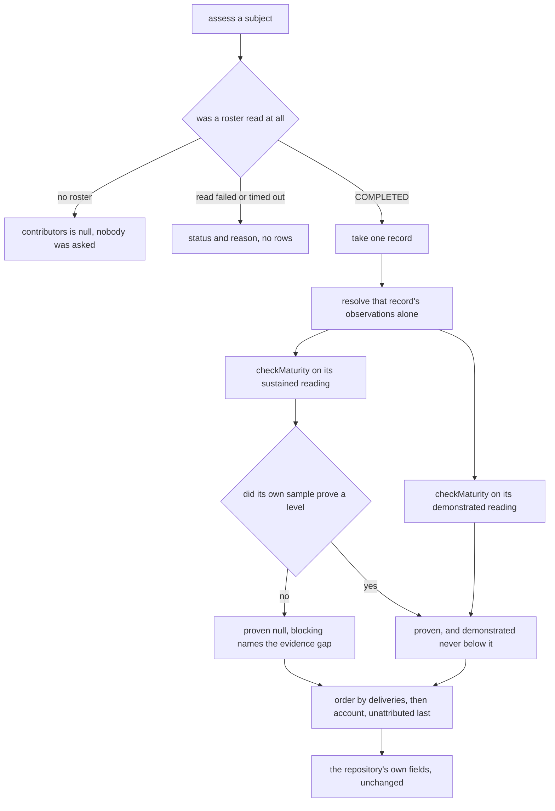
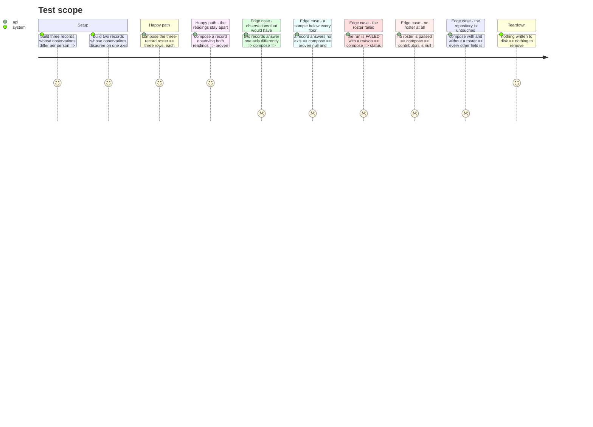

# Instruction: A level per contributor, in the contract

## Architecture projection

```txt
.
├── src/assessment/contracts/
│   └── assessment-report.contract.ts          ✏️ one nullable roster block, additive, schemaVersion stays 1
├── src/assessment/composition/
│   ├── report-projection.ts                   🆕 the level, blocking and demonstrated projections, shared
│   ├── compose-contributor-roster.ts          🆕 one level per record, both readings, projected into the block
│   ├── compose-contributor-roster.test.ts     🆕 isolation, the row with no level, order, a failed roster
│   ├── compose-assessment-report.ts           ✏️ carry the roster's run through; every other field untouched
│   └── compose-assessment-report.test.ts      ✏️ the repository's own fields identical with and without a roster
└── src/assessment/usecases/
    ├── assess-maturity.usecase.ts             ✏️ read an optional roster, and never fail the assessment on it
    └── assess-maturity.usecase.test.ts        ✏️ the roster sequenced, absent, and failing
```

`fake-in-memory-contributor-roster.test-adapter.ts` is absent from that list on purpose: phase 6
files it beside `fake-in-memory-evidence-collector.test-adapter.ts`, and this phase drives it.

## User Journey



## Test Scope



## Tasks to do

### `1)` Put the projection in one place before there are two composers

> One document, one meaning of `MET`: a level projected by two functions is two definitions of the
> word, and nothing would report their divergence.

1. Create `src/assessment/composition/report-projection.ts` and move into it, unchanged:
   `ProjectionContext`, `toObservation`, `reportLevel`, `reportAxis`, `reportRequirement`,
   `unprovenRequirement`, `contradiction`, `labelOf`, `thresholdOf`, `blockersOf`,
   `reportDemonstrated`, `namedLevel` and `highestOf`. Export what the two composers call and keep
   the rest module-private.
2. `reportDemonstrated` takes a `ProjectionContext` it never reads. Drop the parameter in the move;
   it is dead today and carrying it across would make a second caller pass a value for nothing.
3. Leave `composeAssessmentReport`, `requireDeclaredAxes`, `deriveCoverage` and `toProvenanceEntry`
   where they are. What stays is assembly, coverage and provenance; what moves is projection.
4. This is a move and nothing else. `compose-assessment-report.test.ts` is not edited in this task,
   and its staying green unmodified is the proof.
5. Comments travel with the code they explain. The existing `INVARIANT:` and `SAFETY:` blocks move
   verbatim with their functions; write no file-header prose in the new module, and add no docblock.

### `2)` Grow the contract by one nullable block, and state every field's rule in full

> The contract is self-contained on purpose, so a new field that explains itself by reference
> explains itself nowhere.

1. Add to `assessment-report.contract.ts`, above `AssessmentReport`:

   ```ts
   export interface HarnessAuthorship {
     readonly files: number
     readonly commits: number
   }

   export interface ContributorRow {
     readonly account: string | null
     readonly emailAddresses: number
     readonly commits: number
     readonly deliveries: number
     readonly activeDays: number
     readonly harnessAuthorship: HarnessAuthorship | null
     readonly proven: LevelReport | null
     readonly demonstrated: DemonstratedReport | null
     readonly blocking: readonly BlockingRequirement[]
   }

   export type ContributorRosterReport =
     | {
         readonly status: 'COMPLETED'
         readonly windowDays: number
         readonly harnessObserved: ObservedValue | null
         readonly harnessPaths: number
         readonly rows: readonly ContributorRow[]
       }
     | {
         readonly status: 'FAILED' | 'TIMED_OUT'
         readonly windowDays: number
         readonly rows: readonly []
         readonly reason: string
       }
   ```

   `HarnessAuthorship` is spelled here in full even though
   `evidence/models/harness-authorship.model.ts` carries the same two fields. This contract is
   self-contained on purpose and imports nothing from a context, exactly as `ProvenanceEntry`
   restates `CollectorProvenance` and `DemonstrationUnit` restates the unit names beside it. The
   duplication is the price, and the comment says the two must not drift.

2. Add the field to `AssessmentReport`, beside `provenance` and never inside it:
   `readonly contributors: ContributorRosterReport | null`.
3. Three values sit **on the block and never on a row**: `windowDays`, `harnessObserved` and
   `harnessPaths`. Every row is measured over one window, against one harness set, and two rows
   disagreeing about the size of that set must be unrepresentable rather than merely improbable.
   `harnessObserved` and `harnessPaths` sit on the `COMPLETED` arm alone, because a roster that
   failed scanned no tree and a harness value on that arm would be a number a renderer could publish
   about a walk that never ran. `windowDays` sits on both: the span is the model's and is settled
   before anything is walked, so a roster that failed still names the period it was asked about.
4. `schemaVersion` stays 1, for the reason `demonstrated` already established: a consumer reading
   `proven` alone sees exactly what it saw before the field existed. Say so in the field's comment.
5. Write these comments, each an `INVARIANT:` block except where named otherwise:
   * On `account`: `null` is the unattributed bucket, the commits whose email the forge maps to no
     account. It is never merged into a named row, which would be a guess, and never dropped, which
     would shrink a count the roster publishes.
   * A second block on the same field, tagged `LIMITATION:`: bot accounts are excluded by the
     `[bot]` login suffix. `GitActor.user` is typed `User`, so the `__typename` discriminator the
     pull-request walk uses has no counterpart on a commit's author. The suffix is GitHub's own
     convention for app accounts, it is a string rule, and a human account ending in `[bot]` would
     be wrongly dropped.
   * On `emailAddresses`: how many distinct email addresses GitHub collapsed into this one account.
     The join the forge performs is on the address; the author name travels in the query and decides
     nothing, so counting name-and-address pairs would publish a larger number about a mapping
     nobody made. **Two addresses were measured on the subject**, under two name strings, all
     resolving to the one login. A fact about the mapping, never a level input — and a roster keyed
     on the address rather than on the account would have published one person twice and joined to
     nothing.
   * On `commits`, `deliveries` and `activeDays`: all three counted over the same window every floor
     and median in this report uses, ending at the subject's most recent commit and never at
     wall-clock now. `commits` is what the account authored; `deliveries` is what was merged with it
     as author; `activeDays` is the days on which one of that account's own deliveries received a
     commit, and never a day on which only somebody else was active. Only `deliveries` and
     `activeDays` feed a level. All three are published on every row even when `proven` is null,
     because the count is what separates "nothing to measure" from "measured and low", and prose
     prints only the one that explains the row.
   * On `harnessAuthorship`: who authored the files that proved `prompts`, `context-engineering`,
     `behavior` and `loops` — `files`, the distinct proving paths this account committed to in the
     window, and `commits`, the distinct commits it made to them. The two do **not** partition the
     harness set: a file written by one account and later edited by another counts once for each, so
     the sum of `files` across rows may exceed `harnessPaths` and is not a share of anything.
     A second `INVARIANT:` block on the same field: **`null` is a walk that did not run**, and never
     two zeros. `{ files: 0, commits: 0 }` states that this account wrote none of the harness, which
     is an observation; `null` states that local Git refused and nobody looked. Collapsing them
     would publish a claim on the strength of a failure. It is a fact either way, it decides no
     level, and no recommendation is derived from it: a contributor who authored none of the harness
     and relies on all of it daily is not thereby deficient, and `project-brief.md` forbids reading a
     failure to prove a practice as a practice gap.
   * On `windowDays`: the length of the window every count on every row was taken over, carried here
     so that a reader of the block and a reader of `delivery-sample.ts` cannot disagree about it. It
     is present on a failed roster too, because the span is settled before anything is walked.
   * On `harnessObserved`: the harness value the repository proved, which every row carries on the
     harness axis of its own level. It is stated once because it is one value: two contributors of
     one repository share one axis of the four their level is made of, and a copy per row would
     invite two rows disagreeing about a fact neither of them owns.
   * On `harnessPaths`: how many files proved that harness set, and the denominator every row's
     `harnessAuthorship.files` is read against. One number for the same reason — a per-row copy is
     two rows free to disagree about the size of one set.
   * On `proven`: `null` means this account's own sample established no level. Never White, never a
     level below, exactly as the report's own `proven`. A person's sample is a fraction of the
     repository's and clears the sample floors less often, so `null` is the ordinary outcome on a
     shared repository and is an evidence gap, not a verdict on anyone.
   * On `demonstrated`: the same terms the report's own block carries, applied to one account's
     evidence. Never below that row's `proven`, and never an axis without the share that earned it.
   * On `blocking`: what stops the row's next level, on the same footing as the report's own
     `blocking`. Non-empty whenever `proven` is null, so a reader never meets an absent level with
     nothing said about what is missing.
   * On the union's `status`: the roster's own status, and the reason it lives here rather than in
     `provenance`. A `ProvenanceEntry` names a collector and the axes it attempted; the roster is
     not a collector and answers no axis, so filing its failure there would make `collector` mean
     two things. **`COMPLETED` with no rows is the only value entitled to say the window held
     nobody.** A walk that could not be read is `FAILED` with the reason naming it, never a
     completed roster with an empty list — that substitution would state something about people out
     of a read that failed, which is the product's central failure mode.
   * On `contributors`: `null` means no roster was read at all, because the subject has no forge
     origin or none was wired. That is a different statement from `{ status: 'COMPLETED', rows: [] }`,
     a roster that ran and found nobody active in the window. Rows arrive ordered by deliveries
     descending, then by account ascending, with the unattributed bucket last, so the document is
     byte-identical across machines. Additive forever, and the schema version does not move.
6. Do not touch `ASSESSMENT_REPORT_SCHEMA_VERSION`, and do not reshape any existing type.

### `3)` Compose one row per record, each record resolved alone

> Two accounts' observations meeting in one `resolveEvidence` call is what turns every shared axis
> into `CONFLICTING`. Isolation is the whole design, not an optimisation.

1. Create `src/assessment/composition/compose-contributor-roster.ts`:

   ```ts
   export interface ContributorRosterComposition {
     readonly model: MaturityModel
     readonly run: ContributorRosterRun | null
   }

   export function composeContributorRoster(
     input: ContributorRosterComposition,
   ): ContributorRosterReport | null
   ```

2. `run === null` returns `null`. A run of status `FAILED` or `TIMED_OUT` returns
   `{ status, windowDays, rows: [], reason }` and runs no engine. `windowDays` is on both arms of
   the block, so the failed arm carries it too — the span is settled before anything is walked, and
   omitting it here would not typecheck.
3. For each record of a `COMPLETED` run, call `resolveEvidence(record.observations, axes)` with the
   model's axis ids, once per record and over that record's observations only. Never concatenate two
   records' observations, and **never fall back to the repository's evidence for an axis a record did
   not answer, with no exception at all**: an axis nobody observed for this person is `UNKNOWN`, and
   the conservative rule turns that into an evidence gap rather than a borrowed value.
4. A record's observations are the whole of its evidence, harness included. The roster adapter emits
   the harness observation on every record itself, from the same tree scan the live collector reads,
   so the value is deterministically identical without anything being borrowed at composition time.
   That is what lets a row carry a level at all, and it is why the rule above has no exception to
   carve out: composition joins nothing, inherits nothing and adds nothing. **Do not add a join
   here.** A composer reaching into `report.proven` for a harness value would be the fallback the
   line above forbids, wearing a different name.
5. Split the resolved evidence by reading and call `checkMaturity` twice, exactly as
   `composeAssessmentReport` does: the sustained array gives the row's `proven`, `blocking` and its
   projection context; `reportDemonstrated` gives the row's `demonstrated`, with its clamp to the
   row's own proven level and its per-axis fallback to that row's sustained reading.
6. Project through the shared module and nothing else: `reportLevel` for `proven`, `blockersOf` over
   the row's own `next` for `blocking`. A row's `proven` is the same `LevelReport` shape the report
   publishes, so a consumer already reading `report.proven` reads a row with no new code.
7. Copy `account`, `emailAddresses`, `commits`, `deliveries`, `activeDays` and `harnessAuthorship`
   from the record field for field, and carry `windowDays`, `harnessObserved` and `harnessPaths`
   from the run onto the block. Composition counts nothing and recomputes nothing: those are the
   roster's readings and it owns them. A `harnessAuthorship` of `null` is copied as `null` and is
   never substituted with two zeros — the record already drew that distinction and this is not the
   place to lose it.
8. A record naming an axis the model does not declare contributes nothing, because `resolveEvidence`
   maps strictly over the axes it is given. No guard is added here; state it in a single-line
   comment, which needs no tag.
9. The sample floors stay where they are. A row below `MINIMUM_DELIVERED_CHANGES` or
   `MINIMUM_DEMONSTRATED_SAMPLE` simply carries no observation on the axes they guard, and its `null`
   level is that working. **Neither floor is to be lowered so that a given contributor classifies**,
   and this phase reads neither.

### `4)` Order the rows here, and never on the machine's locale

> Determinism reaches the output. A roster in the order the forge happened to page is not
> reproducible, and neither is one sorted the way the host's ICU data happens to sort.

1. Sort in `composeContributorRoster`, after the rows are built, so no adapter's paging order can
   reach the document whatever a later roster implementation does.
2. **This is the only sort in the feature, and the other two are gone.** Phase 3 groups a sample and
   phase 6 assembles records; neither orders anything any more. Three functions each sorting by the
   same rule are three places it can drift, and the last one before the contract is the only one a
   future roster implementation cannot bypass. The adapter's fixture keeps its assertion about the
   order — it is now made against the composed output rather than against the adapter's return.
3. Deliveries descending first, then account ascending, compared with `<` and `>` on the string.
   Never `localeCompare`: it depends on the host's locale and ICU build, which would put two machines'
   output out of order on the same input.
4. A row whose `account` is `null` sorts last whatever its delivery count, because it is not a person
   and reading it among the people would state that it is one.

### `5)` Sequence the roster in the use case, and never fail the assessment on it

> A roster that could not be read is a gap in the document, never a failure of the run. The exit code
> answers *did the assessment run*.

1. Add `readonly roster?: ContributorRoster` to `AssessMaturityRequest`. Import it from
   `evidence/ports/contributor-roster.port.js` — a port, on the same footing as the collector port
   the sequencer already imports, and not an adapter.
2. After `collectEvidence` and before `composeAssessmentReport`, read the roster with
   `{ path: subjectPath, vocabulary, signal }`, then pass the run into `composeAssessmentReport`.
   Sequential rather than concurrent with collection: overlapping the two forge round trips buys a
   latency nobody has measured, and the sequencer's job is order.
3. Wrap the read the way `runCollector` wraps a collector: a throw becomes
   `{ status: signal.aborted ? 'TIMED_OUT' : 'FAILED', records: [], reason }`, so a roster that
   raises produces a report with a named reason rather than an exception reaching the CLI.
4. Add one input field to `composeAssessmentReport`, `readonly roster?: ContributorRosterRun | null`,
   and one line to its returned object, `contributors: composeContributorRoster({ model, run })`.
   Nothing else in that function changes.
5. Edit no file under `src/cli/`. Choosing whether a subject has a roster at all is wiring, and it
   belongs with the adapter rather than with the sequencer. Both renderers stay untouched: `--json`
   projects the contract field by field through an allowlist, so `contributors` is composed and not
   yet published, which is what makes the byte-identity of both renderings trivially true in this
   phase. Rendering it, and the `--json` guard over the shares it carries, is owed to phase 8.
6. The use-case suite needs a double for the roster port, and phase 6 filed it:
   `src/evidence/adapters/fake-in-memory-contributor-roster.test-adapter.ts`, beside
   `fake-in-memory-evidence-collector.test-adapter.ts`. It returns the run it was constructed with
   and records the context it was handed — one alternative implementation of the port, not a
   scenario machine. Use it, and add no second double.

### `6)` Prove the repository's own answer did not move

> Question three of the source brief. If the four reference profiles report anything but what they
> report today, this is not a refinement.

1. In `compose-assessment-report.test.ts`, compose the same input twice, once with no roster and once
   with a `COMPLETED` roster of three records, and assert the two reports are deep equal with
   `contributors` removed from each. `proven`, `demonstrated`, `levels`, `next`, `blocking`,
   `coverage` and `provenance` are all covered by that one assertion, and it fails the day one of them
   learns about the roster.
2. Leave every existing assertion in that suite exactly as it is. They were written against a report
   with no roster and they must keep passing unedited.
3. `tests/cli/reference-profiles.test.ts` is not edited and must stay green: a bundle has no forge
   origin, so no roster reaches it and its four levels are what they were.
4. In `compose-contributor-roster.test.ts`, drive the composer directly with hand-built records and
   the shared `validModel` fixture — no collector, no adapter, no filesystem. Prove, one assertion
   each: three records each getting the level their own sample proves; two records whose observations
   disagree on one axis both keeping a `CONFIRMED` reading of their own value; a record answering no
   axis carrying `proven: null` with a non-empty `blocking` naming an evidence gap; a `FAILED` run
   projecting its status and reason with no rows; a `null` run projecting `null`; a record whose
   `harnessAuthorship` is `null` keeping it; and the order, including the unattributed bucket last.
   Hand the order case its records already out of order, so what is proven is that this composer
   sorts and not that its fixture happened to arrive sorted.

### `7)` Leave the memory bank to phase 9, and check no wall moved

> A rule widened into a folder with no sentinel is a rule nobody has checked. This phase widens none,
> and saying which was checked is the point.

1. `compose-contributor-roster.ts` and `report-projection.ts` land in
   `src/assessment/composition/`, which already carries its own sentinels for
   `domain-has-no-filesystem`, `domain-has-no-processes` and `domain-has-no-vendor-sdk`.
   `assessment-composes-never-adapts` and `assessment-never-depends-on-cli` match from
   `^src/assessment/` as a whole rather than by folder name, and are proven once from
   `src/assessment/usecases/`. No rule reaches a folder it did not already reach, so this phase adds
   no sentinel. Re-run `pnpm architecture` and confirm rather than assume.
2. Record nothing in `aidd_docs/memory/` here. Phase 9 owns that pass, and what it must record from
   this phase is: `assessment/usecases/` now sequences a second port, `assessment/composition/` holds
   a second composer and the shared projection both use, and the contract carries one more nullable
   block at `schemaVersion` 1.
3. Honour the comment rule throughout: no `/** */` anywhere, a run of two or more `//` lines opens
   with `INVARIANT:`, `SAFETY:`, `COMPAT:` or `LIMITATION:`, a single line needs no tag, and no file
   states what a module is for. `pnpm comments` is the verdict.

## Test acceptance criteria

| Task | Acceptance criteria              |
| ---- | -------------------------------- |
| 1 | `compose-assessment-report.test.ts` passes unedited after the move, and `reportDemonstrated` takes no parameter it does not read. |
| 2 | `harnessObserved` is nullable on the `COMPLETED` arm, per R11, and `null` means the model declared no harness axis or the scan was undecidable — never a failed run. Every new field carries a comment stating its rule in full; `ASSESSMENT_REPORT_SCHEMA_VERSION` is still 1 and no existing type changed shape. A row carries `emailAddresses` and `activeDays`, `harnessAuthorship` is nullable, and no per-member breakdown exists on it. `windowDays`, `harnessObserved` and `harnessPaths` are on the block and on no row, and setting a harness value on a `FAILED` roster does not typecheck. |
| 3 | Two records whose observations disagree on one axis each report their own `CONFIRMED` value; neither is `CONFLICTING`. A record answering no axis reports `proven: null` and a non-empty `blocking`, and never a level. A record whose `harnessAuthorship` is `null` composes a row whose `harnessAuthorship` is `null`. |
| 4 | Rows are ordered by deliveries descending, then account ascending by code unit, with `account: null` last; no comparison goes through `localeCompare`. The order survives a run whose records arrive in any order, which is what proves the composer sorts rather than the adapter. |
| 5 | A roster that throws yields a report whose `contributors.status` is `FAILED` with the reason, and the command still exits 0. With no roster passed, `contributors` is `null`. |
| 6 | The report composed with a roster and the report composed without one are deep equal once `contributors` is removed, and the four reference profiles report exactly the levels they reported before this phase. |
| 7 | `pnpm architecture` is green and reports no rule left unproven; `pnpm comments` is green over every new and edited file. |
