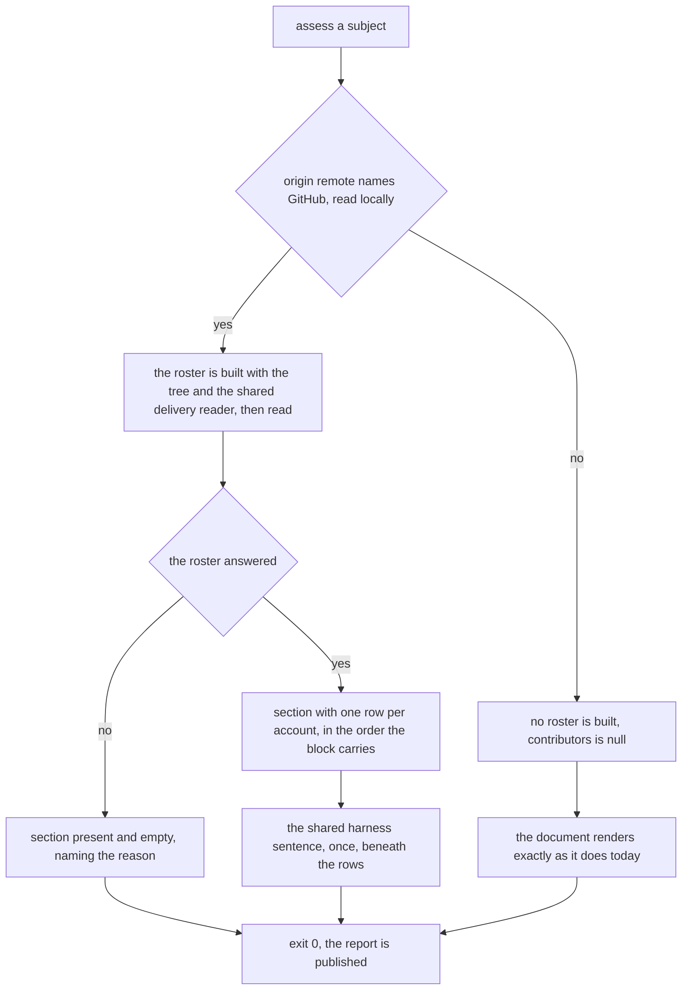
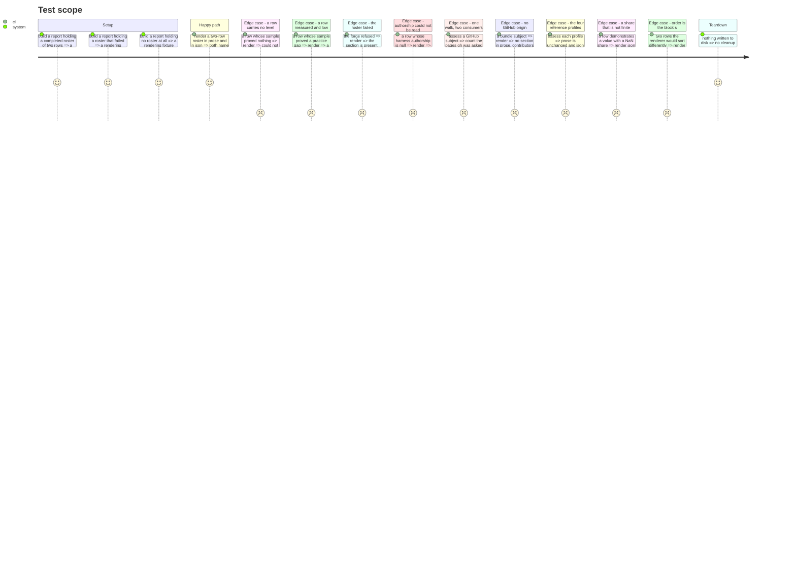

# Instruction: Both renderings, and the section that stays

## Architecture projection

```txt
.
├── src/cli/renderers/
│   ├── human.renderer.ts                    ✏️ the contributors section: header, rows, the shared harness sentence
│   ├── human.renderer.test.ts               ✏️ every reading the section is load-bearing on
│   ├── json.renderer.ts                     ✏️ project the roster block field by field, through the allowlist
│   ├── json.renderer.test.ts                ✏️ the finite-number paths a row opens, and the order it keeps
│   └── assessment-report.test-fixture.ts    ✏️ builders for a roster, a row, and a roster that failed
├── src/evidence/adapters/
│   ├── forge-repository.adapter.ts          ✏️ take the shared delivery reader instead of walking for itself
│   └── forge-repository/
│       └── delivery-reader.ts               🆕 ForgeDeliveryReader: one memoised walk, one slug, one window
├── src/cli/commands/
│   ├── assess.command.ts                    ✏️ build the roster's four arguments, share the walk, hand it to assessMaturity
│   └── assess.command.test.ts               ✏️ a refused roster still exits 0; a bundle is given none
└── tests/cli/
    ├── process-contract.test.ts             ✏️ the section through the built binary, against a refusing gh
    └── reference-profiles.test.ts           ✏️ the four profiles carry a null roster and no prose section
```

One file is created, and it is the seam two constructors share: `delivery-reader.ts`. Everything
else reaches this phase already shaped — the port and its adapter are phase 6's, the contract block
and its composition are phase 7's. This phase publishes what they produced and wires the adapter at
the composition root — including the one walk two sources share, which nothing below the root can
arrange — and it is the last one that can still make the document lie.

## What this phase reads from the contract

Phase 7 settles `ContributorRosterReport`; this phase is its only consumer. Everything below is on
the block or on a row, and nothing is derived, imported or inferred:

* on the block — `windowDays`, the roster's own `status` with its `reason` where it has one, and on
  a `COMPLETED` roster `harnessObserved` and `harnessPaths` beside the `rows` in the order the block
  carries them;
* on a row — `account`, `null` for the unattributed bucket; `commits`, `deliveries` and `activeDays`;
  `proven`; `demonstrated`, with the share that earned it; `harnessAuthorship`, two counts or `null`;
  and `blocking`, the same `BlockingRequirement` shape the repository already publishes, which is
  what lets a row tell an evidence gap from a practice gap in the vocabulary the reader already met.

Every value the session's rendering names is now a field, so this phase reads no adapter and
re-derives nothing.

**The window length travels in the block, and is not imported.** `WINDOW_DAYS` lives in
`evidence/adapters/delivery-sample.ts`, and `cli/renderers/` reaching into an adapter for it would
put the same number in two places with nothing to keep them equal. No dependency-cruiser rule stops
that import — `cli/` is the composition root and imports adapters by design — so the wall here is
the contract itself, and this phase does not open a hole in it for one integer.

**The shared harness value travels the same way, for a stronger reason.** A renderer that reached
for `report.proven` and picked out the harness axis would be deciding *which of the four axes is the
repository's rather than the person's* — domain knowledge in a driving adapter, which `cli.md`
forbids outright. `harnessObserved` and `harnessPaths` exist so the renderer prints a value it was
handed instead of re-deriving a rule it has no business holding.

## User Journey



## Test Scope



## Tasks to do

### `1)` Render the section, and render it on the subject rather than on the network

> The shape of the document depends on what the subject declares, never on whether a query
> succeeded.

1. Add `renderContributorsSection(report)` to `human.renderer.ts` and place it **last** in the
   `sections` list, after `renderBlockingSection`. The repository's verdict and its blockers are the
   answer a reader quoting the first thing they meet must quote; a row is a narrower and weaker
   claim, on the same footing `demonstrated` already sits below `proven`.
2. Key the section's existence on `report.contributors === null` alone. Null renders nothing; a
   non-null block always renders a section, whatever its status and however few rows it holds.
   Tag the comment `INVARIANT:` and state the rule it protects: falling back to the repository-only
   rendering when the roster failed would make one subject produce two documents depending on
   credentials, and `cli.md` promises the same bytes on any machine, on any day.
3. Head a completed roster with the account count, the window, and the sentence that tells a reader
   which of the two answers covers what:

   ```text
   Contributors: 2 accounts active in the last 180 days. The level above covers every delivery in
   the window, whoever made it; each row below covers one account's own.
   ```

   The count is of rows carrying an account, singular or plural as the count requires. Where the
   unattributed bucket is present it is named in a second clause of the same sentence — `, plus
   commits GitHub maps to no account` — because it is a row and not an account, and a header
   counting it as one would state a person who does not exist.
4. Head a roster that did not answer with its status and its reason, and say the level is untouched:
   `Contributors: could not be read — gh: no credentials in this run. The level above is unchanged.`
   Head a completed roster holding no row with `Contributors: no account was active in the last 180
   days.`
5. Gloss the roster's status with its own function, never with `glossProvenanceStatus`. That one is
   typed on a provenance entry, and the plan keeps the two vocabularies apart on purpose: the roster
   is not a collector and answers no axis, so sharing the gloss is the first step to sharing the
   type.
6. Take the window length from the block. No import of `delivery-sample.ts` reaches a renderer.

### `2)` Render one row, in the shape the session agreed

> A row states what was measured before it states what was concluded.

1. Two spaces for a row, four for its details, matching `renderLevelAxes`:

   ```text
     BlandineRdl — proven: Copper (rank 4)
       87 deliveries · 12 active days
       demonstrated: XL on 34% of delivered changes
       harness: authored 41 of the 41 files in this repository's harness set
   ```
2. Name the unattributed bucket `unattributed`, never a blank and never a plausible-looking login,
   and let its sample line say what it is: `0 deliveries · 12 commits whose author address GitHub
   maps to no account`.
3. **The sample line always names the deliveries, and always names the second measure that explains
   the row** — `activeDays` where the sample supported a reading, `commits` where it did not. The
   commit count is the whole reason a reader can tell "nothing to measure" from "measured and low",
   and it is the clause most likely to be dropped by a later edit for reading as noise beside a
   level. Nothing is lost to a consumer either way: `--json` carries all three counts on every row,
   unconditionally, and the conditional is prose's alone. This is the rendering `cli.md` must be
   written against in phase 9 — the plan's shorter sentence, which names the commit count on every
   row, describes a document this phase does not produce.
4. Render the demonstrated reading on exactly the terms the repository's own already uses — never a
   value without the share that earned it, and through the existing `occasionsOf` gloss, so
   `DELIVERIES` reads `delivered changes` in a row as it does above it. The session's sample wrote
   `34% of deliveries`; it is folded into the existing wording rather than kept, because one
   document naming one unit two ways is a difference a reader will look for and not find.
5. Omit the demonstrated line entirely when the row demonstrates nothing, or demonstrates no more
   than it proves, on the same rule the repository section already applies.
6. **A row names no next level.** "What would raise this person's level" is a recommendation about a
   person, and the plan puts recommending anything from a row out of scope.
7. **No cap on the number of rows.** A repository with two hundred contributors prints two hundred
   rows. Truncating would introduce a constant nobody measured and hide the row a reader came for;
   the plan says the table states every row, and it does.

### `3)` A row that carries no level says why, and never reads as low

> `NOT_MET` is a practice gap and `UNPROVEN` an evidence gap; a row splits them exactly as the
> repository does, and recommends from neither.

1. Render a row with no level as `<account> — proven: could not be established`. The repository's
   second sentence, `No level's requirements were fully proven.`, is not repeated: the line beneath
   says it in the row's own terms.
2. Where every blocker on the row is an evidence gap, render the sentence the session agreed, axis
   labels taken through the existing `labelFor` helper so a row speaks the model's own vocabulary:

   ```text
       [evidence gap] no delivery was observable, so Taille, Intervention and En parallèle
       are UNKNOWN for this account. This is not a statement about their practice.
   ```
3. **Where a blocker on the row is a practice gap, render a practice gap instead.** The agreed prose
   block shows only the evidence case, and settling it as the only case would publish an evidence
   gap over a measurement that did say something — the product's central failure mode, inverted. A
   person with twelve small deliveries is measured and low, and the row must read that way.
4. **Neither line recommends anything.** Do not reuse `renderPracticeGap`: its fallback ends
   `Improve ${axisLabel} to close the gap.`, which is a recommendation aimed at a named human. The
   row's practice line is its own sentence and carries no imperative. Tag the comment `SAFETY:` and
   name the two rules it serves — `project-brief.md` forbids recommending a practice change from a
   failure to prove one, and the plan forbids reading a thin row as a performance problem at all.
5. Keep the `[evidence gap]` and `[practice gap]` markers exactly as the repository's blockers spell
   them. The suite already pins that the two never read alike, and a row inventing a third spelling
   would put the same distinction under two vocabularies.

### `4)` Print the harness sentence once, beneath the rows

> A shared axis read as a personal one is the misreading this whole section exists to prevent.

1. After the last row, and only when at least one row was rendered:

   ```text
     Harness is the repository's, not a person's: prompts, context-engineering and behavior
     are available to every account above, and each carries that same value.
   ```
2. Render the shared value through the same `formatSet` as everywhere else, so an empty harness set
   reads `an empty set` on both sides of the document and never `none` and never a blank.
3. Take the value from the block, not from the repository's own harness axis. A renderer re-deriving
   which axis is shared, and from where, would be a renderer holding domain knowledge, and `cli.md`
   forbids exactly that.
4. The row's own authorship line is a fact and never an outcome: it carries no `MET`, no `NOT_MET`,
   no gap marker and no imperative. It renders from `{ files, commits } | null` against the block's
   `harnessPaths`. `authored none of the 41 files` is admissible there because it quantifies files
   and never names a value on an axis; `0 of the 41` was weighed and rejected for reading as a
   score. Where the harness set is empty the line reads `harness: this repository's harness set is
   empty`, rather than `none of the 0 files`.
5. **A `null` authorship renders as a walk that did not run, and never as "authored none".** The
   line reads `harness: authorship could not be read`, on the same footing as every other evidence
   gap in this document: `null` means local Git refused and nobody looked, and printing `authored
   none of the 41 files` for it would publish a claim about a person on the strength of a `git` that
   failed. The two are one keystroke apart in a renderer and one accusation apart in the document.
   Tag the comment `SAFETY:` and say which of the two it is protecting.

### `5)` Project the roster field by field, and say which paths the guard now reaches

> The allowlist is what keeps an undeclared field out; the guard is what keeps a fabricated absence
> out. A field dropped by the first escapes the second.

1. Add `contributors` to `projectReport`'s object literal, `null` for null, and a
   `projectContributors` beside the existing projectors otherwise. Project the block member by
   member and each row member by member. **Never spread a row**: the whole reason `json.renderer`
   projects rather than stringifies is that a field the contract does not declare must not reach the
   published output.
2. Keep the key present holding `null`, exactly as `proven` and `observed` are. `demonstrated`
   shipped on the same rule and `schemaVersion` did not move: a consumer reading `proven` alone sees
   what it saw before the field existed.
3. Branch on the roster's status the way `projectProvenanceEntry` branches. The two arms differ by
   more than one key: a failed roster emits `reason` and no `harnessObserved` or `harnessPaths`,
   because it scanned no tree; a completed one emits both and no `reason`. Neither arm may emit the
   other's keys as `undefined`, and `windowDays` is on both. Tag it `SAFETY:`.
4. `assertEveryNumberFinite` walks the projected document, so the roster's numbers are guarded for
   free — but only those that are projected. Record the paths it now reaches, because they are what
   a producer will be sent to when it refuses:

   ```text
   $.contributors.windowDays
   $.contributors.harnessPaths
   $.contributors.rows[i].emailAddresses
   $.contributors.rows[i].commits
   $.contributors.rows[i].deliveries
   $.contributors.rows[i].activeDays
   $.contributors.rows[i].harnessAuthorship.files
   $.contributors.rows[i].harnessAuthorship.commits
   $.contributors.rows[i].proven.rank
   $.contributors.rows[i].demonstrated.level.rank
   $.contributors.rows[i].demonstrated.axes[j].share
   ```

   Every one of those is a field phase 7 declares under that exact name, and the list is the whole
   of the block's numbers: `windowDays` and `harnessPaths` on the block, six per row, and the ranks
   and shares the row shares with the report above it. `harnessAuthorship` contributes two paths and
   not a wildcard — a `null` authorship holds no number for the walk to reach, and writing it as
   `.*` would suggest a shape that varies.
5. **These paths are not theoretical.** A share is a division, and splitting a sample per person is
   what first makes a denominator plausibly zero here: a repository whose harness set is empty gives
   an authorship share of `0/0`, and a row with no occasion gives a demonstrated share the same way.
   The renderer refuses and names the path; the fix belongs to the producer that computed it. Prose
   holds no such guard and prints the value, visibly wrong and misleading nobody — the same split
   `cli.md` already draws, for the same reason.

### `6)` Build the roster at the composition root, with everything construction cannot reach

> Choosing a source is wiring, and so is deciding that two sources share one walk. `AssessOptions`
> exists so a suite can choose its own without moving production wiring an inch.

1. Resolve `forgeFor(args.subjectPath, budget.signal)` once into a local, and use it for both the
   collector set and the roster. The remote is read once, as it is today.
2. **The roster adapter is constructed with four things, and this phase is where all four come
   from**: the `RepositorySlug` already resolved above; `args.subjectPath`, which the local reads
   need; a `ForgeDeliveryReader`; and a `HarnessTree` from
   `trackedTree(args.subjectPath, budget.signal)`, which the roster runs `scanHarness` over to obtain the proving paths and the harness set it
   publishes. Nothing else in the tree can supply them: the adapter's constructor cannot reach a
   walk, and no neighbour of it is entitled to decide what the subject path is.
3. **One delivery reader, memoised on its walk, handed to the forge collector and to the roster.**
   Write `src/evidence/adapters/forge-repository/delivery-reader.ts`: it declares
   `ForgeDeliveryReader` — the type phase 6's adapter is already written against — and holds the
   memoised `readDeliveredChanges` result for one slug and one window, so the second caller gets the
   sample the first walked rather than a second round trip. It decides nothing and derives nothing;
   `deriveForgeMetrics` and `readContributorDeliveries` are what read the sample it hands out.
   Phase 1 split `readForgeDerivedMetrics` into `readDeliveredChanges` and `deriveForgeMetrics`
   precisely so the windowed sample could be read once and derived twice; a roster that walked the
   pages again would make that split decorative — the same cut, the same two exports, and still two
   round trips. Sharing one instance is what turns "one walk" into a fact of the call graph rather
   than a sentence in a plan. Without it a GitHub subject is walked three times: the pull requests
   for the repository line, the pull requests again for the rows, and the commit history once,
   where two walks answer everything. Both `ForgeRepositoryEvidenceCollector` and
   `ForgeContributorRosterAdapter` take that one instance; the collector's constructor takes it
   alongside the slug, and it is the only production constructor this feature moves.
4. Build the tree and the reader **only when a slug was found**, inside `rosterFor`. A subject with
   no GitHub origin gets no roster, spends no `git ls-files` it would not have spent, and renders
   exactly as it does today.
5. `rosterFor(forge)` returns the roster adapter when a slug was found and `null` otherwise. This is
   the whole of "the section exists whenever the subject has a GitHub origin", and it is decided by
   a local `git remote get-url` before any network call is attempted.
6. Extend `AssessOptions` with `roster` and select it with `'roster' in options ? options.roster :
   rosterFor(forge)`, never with `??`. `null` is a meaningful value here — a suite proving the
   no-roster document must be able to pass it — and `??` would silently fall back to the production
   wiring on exactly that call. Tag the comment `SAFETY:`.
7. Pass the roster to `assessMaturity` beside the collector set. Nothing else in `runAssess` moves.
8. **Exit codes do not change.** A roster that fails is a status inside the block, on the same
   footing as a collector that fails: exit `0`, with the report published. The roster adapter does
   not reject; if it ever did, that would be a phase 6 fault and not a new exit code here.

### `7)` Prove the readings agree, the profiles do not move, and the order is the block's

> A rendering is proven by the reader it serves, and there are two of them.

1. In `assessment-report.test-fixture.ts`, add builders for a roster, a row and a roster that
   failed, and give `validReport` its `contributors: null`. The file carries a `.test-fixture.ts`
   suffix and is outside the production graph; keep it that way.
2. Agreement is asserted as facts, not as a diff: every account named in prose appears in the JSON
   rows, in the same order; the level named in a row's prose is the level that row carries in JSON;
   the header's count equals the number of JSON rows holding an account.
3. **Neither renderer sorts.** Order is `composeContributorRoster`'s alone — deliveries descending,
   then login, the unattributed bucket last — and two sorts that could disagree are worse than one.
   Pin it with two rows a renderer would order differently on its own, in the describe block
   `json.renderer.test.ts` already keeps for arrays never being sorted or deduped.
4. Pin the four reference profiles in `reference-profiles.test.ts`: each carries `contributors` as a
   present key holding `null`, and its prose names no contributor section anywhere. **Byte-identical
   means byte-identical prose, and JSON differing by exactly the one additive key holding null** —
   the same and only change `demonstrated` made, under the same rule that left `schemaVersion` at 1.
   The existing level and demonstration assertions in that file are the guard on everything else and
   are not touched.
5. In `assess.command.test.ts`, prove a bundle subject is given no roster, and that a roster which
   refused still exits `0` with a published report carrying the section and its reason.
6. Prove the walk is shared, not described. Count the pull-request pages the stub `gh` is asked for
   across one assessment of a GitHub subject and assert the repository line and the rows came out of
   the same one. A reader built per consumer passes every other assertion in this suite and fails
   only this one, which is why it is worth an assertion of its own.
7. Pin the two authorship renderings apart: a row whose `harnessAuthorship` is `{ files: 0, commits: 0 }` reads
   `authored none`, and a row whose `harnessAuthorship` is `null` reads that authorship could not be
   read. Assert that neither string appears in the other's case — this is the pair a later edit
   collapses, and one assertion on one of them would not notice.
8. In `process-contract.test.ts`, assert the section through the built binary. The spawn fixture
   already puts a refusing `gh` ahead of any real one, so the failed-roster path is the ordinary one
   inside the gate and needs nothing new to reach it. Guard the assertion the way that suite already
   guards the forge — `vcs.md` says no part of the gate may depend on the remote, and the suite must
   stay green in a clone that has none.
9. Neuter each new guard and watch its test go red before believing it: the section under a null
   block, the recommendation-free practice line, the `null` authorship line, the `'roster' in
   options` selection, and the row order.

## What this phase does not introduce

**No constant.** Every floor a row is judged against is `delivery-sample.ts`'s, applied per person
by phase 3 — `MINIMUM_DELIVERED_CHANGES` at 5, `MINIMUM_ACTIVE_DAYS` at 5,
`MINIMUM_DEMONSTRATED_SAMPLE` at 10, `WINDOW_DAYS` at 180. None is read, copied or lowered here, and
none is to be lowered so that a given contributor classifies. A row falling under one of them is the
conservative rule working, and this phase's whole duty is to render that as the evidence gap it is.

**No memory-bank edit.** `cli.md` and `testing.md` are phase 9's, so that one file does not take two
authors in one plan.

## Test acceptance criteria

| Task | Acceptance criteria              |
| ---- | -------------------------------- |
| 1 | A report whose roster failed renders the section, empty, naming the reason, and a report whose roster is null renders no section at all. The two are told apart with no reference to whether a network call was made. |
| 2 | A row names its deliveries and, beside them, its active days where the sample supported a reading and its commit count where it did not. `--json` carries `commits`, `deliveries` and `activeDays` on every row regardless. A demonstrated value never appears in a row without the share that earned it, and the unit is glossed as it is above. |
| 3 | A row with no level and only evidence gaps says `could not be established`, names the unknown axes by the model's labels, and states it is not a statement about the person's practice. A row whose sample proved a practice gap says so instead. Neither line contains `improve`, `fix` or any other imperative. |
| 4 | The harness sentence appears exactly once beneath the rows, never inside one, rendered from the block's `harnessObserved` — and omitted entirely when that is `null`, which per R11 means no harness value was established rather than that the run failed. Rendered from the block, and an empty harness set renders `an empty set` rather than a blank. A row's authorship line reads against `harnessPaths`, carries no outcome token and no gap marker, and a `null` authorship renders as a walk that did not run rather than as `authored none`. |
| 5 | A row carrying a NaN share is refused under `--json` with `UnrenderableReportError` naming `$.contributors.rows[0].demonstrated.axes[0].share`, and the same report renders as prose at exit `0`. Every path in the recorded list resolves to a field phase 7 declares under that name. A field the contract does not declare, set on a row, never reaches the output. |
| 6 | A GitHub work-tree root is given a roster built with the slug, the subject path, the shared delivery reader and a `HarnessTree`, and a bundle is given none, with the collector set unchanged in both. One assessment of a GitHub subject asks `gh` for the pull-request pages once, not twice. `runAssess(argv, io, { roster: null })` renders no section, proving the option is honoured rather than overridden by the default. A refused roster exits `0`. |
| 7 | Prose and `--json` name the same accounts, in the same order, with the same levels. The four reference profiles keep their prose unchanged and their levels unchanged, and publish `contributors: null` as a present key. Removing the order guard turns a test red, and neither renderer holds a sort. |
