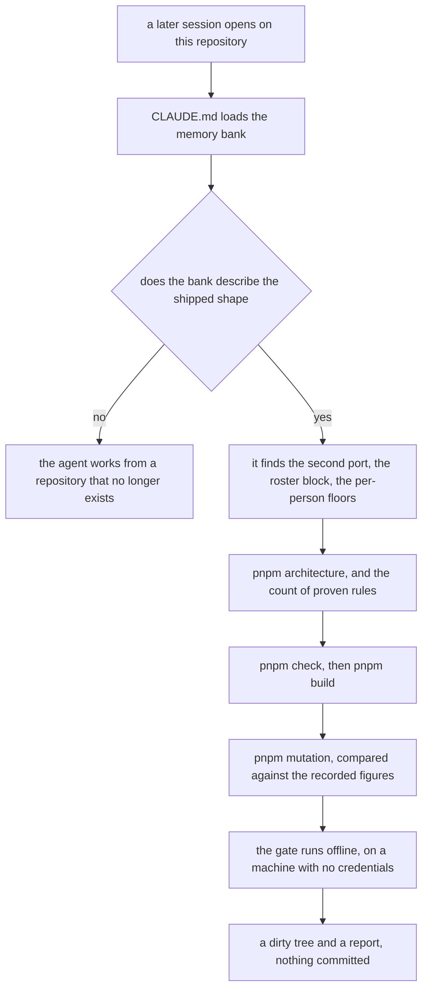
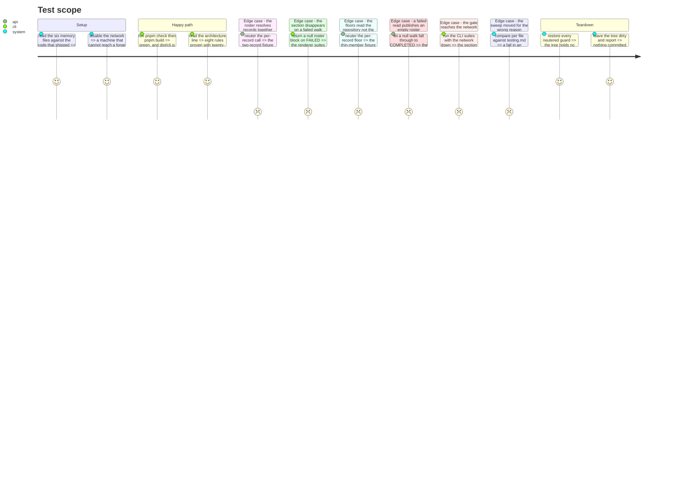

# Instruction: Memory, sentinels, and the gate

This phase changes no behaviour and it is not optional. `CLAUDE.md` loads the whole of
`aidd_docs/memory/` into every session's context, so a bank describing the shape before this feature
is not a stale document a reader may discount — it is the brief every later agent works from. A bank
that describes the previous shape is worse than no bank at all.

It introduces no constant. Every threshold this feature relies on was chosen and justified where it
is declared, in `delivery-sample.ts`, and none of them moves here.

**One acceptance criterion below will not be met, and shipping without it is a decision rather than
an oversight.** No multi-contributor subject has been assessed end to end. `measurements.md` records
why: windowed at 180 days ending at its last commit, `mc-tracker` holds one human row, so its roster
and its repository line state the same thing and the feature's whole point — two people, two levels,
one repository — is never exercised. Darkwaters, or any repository with two accounts opening pull
requests inside one window, is what proves it. That work is owed, it is written into `testing.md` as
owed, and it is **never** closed by lowering a sample floor so that a second row appears.

## Architecture projection

```txt
.
├── aidd_docs/memory/
│   ├── architecture.md               ✏️ a second port, its adapter, its runtime reach, its frozen duties
│   ├── cli.md                        ✏️ the roster's rendering, the section that always exists, its exit code
│   ├── testing.md                    ✏️ the new suites, the sweep's real scope, the acceptance that is owed
│   ├── codebase-map.md               ✏️ the five new files, the third field on HarnessScan, the areas that hold them
│   ├── project-brief.md              ✏️ contributor, roster, unattributed, harness authorship
│   └── coding-assertions.md          ✏️ one line recording the folders no sentinel reaches
├── stryker.config.json               ✏️ three forge modules join the swept decision logic
└── tests/cli/self-assessment.test.ts ✏️ the roster section under a forge that refuses
```

`.dependency-cruiser.cjs` and `scripts/prove-boundary-rules.mjs` are **not** edited, and that is a
finding this phase must reach rather than assume: task `6)` is what establishes it.

## User Journey



## Test Scope



## Tasks to do

### `1)` Record the second port in `architecture.md`

> A port a parallel worktree cannot see is a port it will duplicate as a collector, which is the one
> mistake the whole design exists to prevent.

1. In **Contexts**, extend `evidence`: it owns observation collection and evidence resolution, and
   now also the enumeration of the people a forge attributes work to. State that the roster answers
   no axis, that nothing it returns reaches `resolveEvidence`, and that no collector learns of it.
2. In **Contexts**, extend `assessment`: `composition/compose-contributor-roster.ts` runs
   `checkMaturity` once per record, twice per record for the sustained and the demonstrated reading,
   and projects the result into the contract. Say why the projection belongs here, on the same
   footing as the existing `CollectorProvenance` to `ProvenanceEntry` sentence — `evidence` was kept
   from importing `assessment/contracts` on purpose, so the mapping is `assessment`'s.
3. In the **Shape** diagram, add the roster port beside the collector ports and
   `forge-contributor-roster.adapter.ts` as its one implementation. Keep the block's existing
   `id="wjrf9s"`, so the rendered diagram is replaced rather than duplicated beside the old one.
4. In **Runtime boundaries**, state what the roster adapter may reach: `gh` for the commit walk and
   the account dictionary, and local Git for harness authorship. State the ordering that follows
   from it — no dictionary means no key, so a forge walk that failed ends the roster and the local
   authorship walk is **not** run at all. Spending a `git log` whose result nothing can attribute is
   work for nothing, and the empty section already says what a reader needs.
5. In the same section, record **what the composition root hands the roster and why nothing else
   could**. The adapter is constructed with four things — the repository slug, the subject path, a
   delivery reader memoised on its walk, and a `HarnessTree` from `trackedTree` — because a
   constructor cannot reach a walk and no context below `cli/` is entitled to decide what the
   subject is. The reader is the same object the forge collector holds: phase 1's split of
   `readForgeDerivedMetrics` exists so one windowed sample can be derived twice, and a roster
   walking the pages a second time would make that split decorative and cost a third forge round
   trip. Record the cost this leaves standing rather than hiding it: the tracked tree is scanned
   twice per assessment, once by the live collector and once by the roster, because handing one scan
   to both would move `LiveRepositoryEvidenceCollector`'s constructor, which nothing else in this
   feature touches. Revisit it when a measurement says the second scan costs something.
6. In **Frozen before the split**, add `evidence/ports/contributor-roster.port.ts` with the duties
   the type cannot express, exactly as `evidence-collector.port.ts` carries its own:
   * **a read that failed is `FAILED`, and never a `COMPLETED` roster holding no rows.** Both walks
     behind the adapter answer `null` for a refusal rather than throwing — `commit-history.ts` for
     an unparseable page, a payload with no connection, the page cap reached with more offered, or a
     window end that is not finite; `harness-authorship.ts` when `git` refuses — so classifying only
     what was *thrown* assembles zero records and publishes a document saying no account was active
     in the window. That is a statement about people made out of a read that nobody completed, which
     is this product's central failure mode reached by an omission. `null` from either walk is
     `FAILED` with a reason naming which walk returned it; only an abort is `TIMED_OUT`; and
     `COMPLETED` with no records is the one value entitled to say the window held nobody;
   * a collector emits observations for one subject; a roster emits one record per account, and
     **each record resolves alone**. Two contributors are never resolved together, because N people
     answering one axis is N observations of that axis, which `resolveEvidence` turns into
     `CONFLICTING` and destroys for everyone. This is the reason the roster is a second port rather
     than a second collector, and it belongs where a worktree agent will read it;
   * `read` must honour `context.signal`, reporting `TIMED_OUT` rather than hanging, on the same
     terms the collector port already freezes;
   * `account: null` is the unattributed bucket — commits whose email GitHub maps to no account. It
     is never merged into a named row, which would be a guess, and never dropped, which would
     silently shrink a count the roster publishes;
   * bots are excluded on the `[bot]` login suffix. It is a **string rule, not a typed fact**:
     `GitActor.user` is typed `User`, so the `__typename` discriminator the pull-request walk uses
     has no counterpart on a commit's author, and a human account ending in `[bot]` would be wrongly
     dropped.
7. In **Public boundary**, record that `AssessmentReport` gains `contributors`, that it is nullable
   and additive, and that `schemaVersion` stays 1 for the reason `demonstrated` already shipped
   under — a consumer reading `proven` alone sees what it saw before the field existed. Record the
   three values that sit on the block rather than on a row — `windowDays`, `harnessObserved` and
   `harnessPaths` — and why: every row is measured over one window against one harness set, and a
   per-row copy is two rows free to disagree about a fact neither of them owns.

### `2)` Record the roster's output and its exit code in `cli.md`

> `cli.md` is where a caller learns what the tool promises. A roster it does not describe is a
> promise nobody made and anybody may break.

1. Under **Commands**, state that the roster is built at the composition root under the same gate as
   the forge collector: the subject is the root of a work tree and `git remote get-url origin` names
   GitHub. That gate is local, which is what makes the shape of the document depend on the subject
   and never on whether the network answered. Record in the same place what the composition root
   hands it — the slug, the subject path, the delivery reader the forge collector already holds, and
   a `HarnessTree` from `trackedTree` — and that sharing the reader is why a GitHub subject is
   walked twice and not three times.
2. **Write this section against the renderer, not against the plan.** `plan.md` says a row prints
   its commit count and its demonstrated reading; phase 8 ships something narrower and better, and
   copying the plan's shorter sentence into the memory bank would put a promise in `cli.md` that the
   renderer does not keep — which is exactly the failure this whole phase exists to prevent, with
   the direction reversed. Under **Interface**, write the rendering as a rule per line, each one
   load-bearing:
   * one row per account active in the window, ordered by deliveries descending then by login, with
     the unattributed bucket last. The order is `composeContributorRoster`'s and neither renderer
     holds a sort. Determinism reaches the output, and a roster in the order the forge happened to
     page is not reproducible;
   * the header names the span — active in the last 180 days — so an absence is explained by the
     scope rather than read as a verdict on a former contributor. The span is read from the block's
     `windowDays`, never imported from `delivery-sample.ts`, so the number the prose names and the
     number the rows were measured over cannot drift;
   * **every row names its deliveries, and beside them the one measure that explains it**: its
     active days where its sample supported a reading, its commit count where it did not. The commit
     count is what separates "nothing to measure" from "measured and low", and that is why it
     appears on exactly the rows where nothing else says it. Prose picks; `--json` does not —
     `commits`, `deliveries` and `activeDays` are on every row of the block unconditionally, so a
     consumer loses nothing to the choice a reader gains from;
   * the demonstrated reading is rendered per row on exactly the repository's terms, and **never
     without the share that earned it**;
   * every row carries the repository's value on the harness axis, printed once beneath the rows
     from the block's own `harnessObserved` rather than re-derived from the level above. Two
     contributors of one repository share one axis of the four their level is made of, and hiding
     that would publish four independent axes where three are;
   * harness authorship is printed as a fact: how many of the harness's proving paths the account
     committed to, against the block's `harnessPaths`. It is not a level, it decides nothing, and no
     recommendation is derived from it — `project-brief.md` forbids recommending a practice change
     from a failure to prove one, and "has never touched the harness" proves nothing. **An
     authorship that could not be read says so**, and never that the account authored none: the
     first is an evidence gap and the second is an observation about a person.
3. Record the **section-always-present** rule as its own paragraph, with its reason. Whenever the
   subject has a GitHub origin the section exists; when the forge refuses it is present and empty
   and names the reason. It never falls back to the repository-only rendering, because that would
   make one subject produce two different documents depending on credentials, against this file's
   own promise of the same bytes on any machine, on any day.
4. Record, in the same paragraph, **the sentence only one status may print**. `no account was active
   in the last 180 days` is a completed roster's alone: it states that both walks succeeded and the
   window held nobody. A walk that could not be read publishes the reason instead, because a read
   that failed has said nothing about anybody. The two are one classification apart in the adapter
   and the difference is the whole product — a reader who meets the first sentence over a refused
   forge has been told something nobody observed.
5. Record the sample floors now applying **per person**: `MINIMUM_DELIVERED_CHANGES` and
   `MINIMUM_DEMONSTRATED_SAMPLE` are unchanged in value and are read over one account's sample. A
   member below one carries an evidence gap where the repository line carries a level, and that is
   the conservative rule working rather than a regression. **Not to be lowered so that a given
   contributor classifies.**
6. Record that `--author` is not built, and why: the table states every row, so a flag selecting one
   would add a surface with nothing behind it.
7. Under **Process contract**, place the roster in the taxonomy:
   * a roster that failed or timed out is exit `0`, on the same footing as a collector that did. The
     report was published;
   * the roster is not a collector and gets **no `provenance` entry**. `ProvenanceEntry` names a
     collector and the axes it attempted; filing a source that answers no axis there would make the
     word mean two things. Its status and its reason sit on its own block;
   * `--json` refuses a non-finite number anywhere in the roster block exactly as it refuses one
     anywhere else, throwing `UnrenderableReportError` and exiting `1`. State that `json.renderer`
     projects the block field by field like the rest of the contract, so a field the contract does
     not declare never reaches the published output;
   * the roster's reason is on stdout inside the document, not on stderr. It is part of the report,
     not an error, and stderr stays for failures that stopped the run.
8. Record that a subject with no GitHub origin has no roster and renders byte for byte as today,
   the four reference profiles included.

### `3)` Record the new suites in `testing.md`, and correct what the sweep actually covers

> The table of behaviours under test is how a later agent finds the boundary it should be driving,
> and this feature adds four of them.

1. Add a row per new subject to **Behaviors under test, and what each one fakes**, keeping the
   column's discipline — what it proves, and what is faked in it:
   * `forge-repository/commit-history` — the commit walk, the email to account dictionary, the
     windowed counts per account, bots dropped by login suffix, the unattributed bucket. Faked:
     none, recorded payloads answered by a stub `gh` on the child's PATH;
   * `harness/harness-authorship` — who authored the paths that proved each harness member, keyed
     through the dictionary. Faked: none, real temporary Git repositories and the real filesystem;
   * `forge-contributor-roster.adapter` — the records the roster answers, its failure, its
     cancellation. Faked: none;
   * `composition/compose-contributor-roster` — a level per record, both readings, the ordering, the
     floors read per person. Faked: none, real `checkMaturity` over real records.
2. State plainly that **nothing internal is faked in any of them**. Every double this feature adds is
   at a boundary — a stub `gh` on PATH, a temporary Git repository — and no internal collaborator is
   mocked, per the Chicago-style rule the section already states.
3. Extend the `tests/cli/self-assessment.test.ts` paragraph: the suite gains the roster section
   under a refusing forge, and **must assert no login, no row count and no level**. It tests the
   capability and its invariants, never the state of this checkout. `BlandineRdl` must not appear in
   any suite, on the same footing as the level, the harness member and the commit count the file
   already forbids pinning there.
4. Correct the mutation paragraph's scope. It names five paths; `stryker.config.json` mutates
   twelve, and has since the forge collector landed. Make the prose read the config, and add the
   three modules this phase puts into it — the commit walk, the per-person delivery reading and the
   observation projection. Say in the same breath why `forge-repository/` costs three entries where
   `harness/` costs none: that folder is swept **file by file** and not by glob, so a module added
   beside `pull-request-history.ts` is mutated by nothing until it is named.
5. Record the new mutation figures produced by task `8)` as a dated baseline beside the existing
   two, in the same table shape, with the wall time. A baseline nobody can re-run is what this
   section exists to prevent.
6. Under **Integration and acceptance**, record the owed acceptance in full: the roster has been
   proven per module and never end to end, because `mc-tracker` holds one human row inside the
   window and its roster therefore restates its repository line. Name what would close it — a
   repository with two accounts opening pull requests inside one window — and name what would not:
   lowering a floor so that a second row appears.

### `4)` Record the new files in `codebase-map.md`

> The map is how an agent finds a file it has never opened. A file it does not list is a file that
> gets written a second time.

1. Extend the `src/evidence/` entry with `ports/contributor-roster.port.ts`,
   `adapters/forge-contributor-roster.adapter.ts`, `adapters/forge-repository/commit-history.ts`,
   `adapters/forge-repository/contributor-deliveries.ts`,
   `adapters/forge-repository/derived-observations.ts`,
   `adapters/forge-repository/delivery-reader.ts` and
   `adapters/harness/harness-authorship.ts`, each named for the question it answers, in the register
   the entry already uses. Say of `delivery-reader.ts` what it is for: it declares
   `ForgeDeliveryReader` and holds the memoised windowed sample for one slug, and the forge
   collector and the roster adapter are handed the same instance, which is what makes one walk a
   fact of the call graph rather than a sentence in a plan. Say of the last one what makes it unlike its neighbours: it sits beside
   `harness-scan.ts` and imports nothing from it, because only a Git work tree can answer it and the
   scan must keep answering for a bundle.
2. **Correct the `harness-scan.ts` sentence, which this phase alone owns.** It reads that the module
   "orders the four capability decisions over the `harness-tree.ts` seam each adapter supplies and
   holds nothing else"; `HarnessScan` now carries a third field beside `capabilities` and
   `undecidable` — `provenBy`, what proved each member, as files, a commit trailer, or nothing — and
   the paths it names are what harness authorship is read over. Phase 4 introduces the field and
   edits no memory file, so a sentence describing two fields where three exist survives to here or
   not at all.
3. Extend the `src/assessment/` entry with `composition/compose-contributor-roster.ts` and
   `composition/report-projection.ts`, the projection both composers share.
4. Extend `src/cli/` with the roster's place at the composition root, beside the collector set: the
   slug, the subject path, the delivery reader shared with the forge collector, and a `HarnessTree`.
5. Update the **Status** paragraph: the tree now holds three collectors behind one port and one
   roster behind a second.

### `5)` Record the vocabulary in `project-brief.md`

> The domain language table is what stops two files calling one thing two names, and this feature
> introduces four terms and one new kind of answer.

1. Add to **Domain language**:
   * **Contributor** — an account the forge attributes work to inside the window. A person is an
     account; a git identity is never the key, because two addresses under two name strings resolve
     to one login and no local heuristic recovers that mapping;
   * **Roster** — one row per contributor, each with its own sample and its own levels. Not
     evidence: it answers no axis and reaches no resolution;
   * **`emailAddresses`** — how many distinct email addresses the forge collapsed into one account.
     **Addresses, not identities**: GitHub joins on the address, and the author name travels in the
     query and decides nothing, so counting name-and-address pairs would publish a larger number
     about a mapping nobody made. The measured subject reads 2, under two name strings;
   * **Unattributed** — the row for commits whose email GitHub maps to no account. Attributed to
     nobody, on purpose, and stated rather than hidden;
   * **Harness authorship** — who wrote the files that proved a harness member, as **two counts that
     may be absent**: the distinct proving paths an account committed to in the window, and the
     distinct commits it made to them. They do not partition the harness set, so their sum across
     rows may exceed it and neither is a share of anything. Absent — `null` — is a walk that did not
     run, and is never two zeros: zero is an observation that a person wrote none of the harness,
     and `null` is local Git refusing. A published fact either way, never a level.
2. Under **What it is** or **Key features**, state that a level can now name a person: the report
   carries a level per contributor beside the repository's, and the repository line is unchanged and
   covers all deliveries whoever made them. Without that sentence a reader meets two answers and no
   rule for choosing between them.
3. Extend **The conservative rule**: a thin row is an evidence gap, and AIDD recommends nothing from
   a row. Reading one as a performance problem is a human act on a human's own team, and the tool
   must not do it for them.

### `6)` Prove the boundary rules still bite, and read the count

> A dependency-cruiser rule that matches nothing reports success, and a green exit code is therefore
> ambiguous on its own.

1. Establish where every new file lands and which rules reach it:
   * `src/evidence/ports/contributor-roster.port.ts` — reached by `domain-has-no-filesystem`,
     `domain-has-no-processes` and `domain-has-no-vendor-sdk`. That folder already carries one
     sentinel per rule, so the port is covered by construction and **no sentinel is owed**;
   * `src/assessment/composition/compose-contributor-roster.ts` — the same three rules, and
     `assessment/composition/` likewise already carries one sentinel per rule;
   * `src/evidence/adapters/forge-contributor-roster.adapter.ts`,
     `adapters/forge-repository/commit-history.ts` and `adapters/harness/harness-authorship.ts` —
     `adapters/` is reached by none of the `domain-has-no-*` rules, by design, since that is where
     concrete infrastructure is allowed to live.
2. Conclude, and write the conclusion into the phase's report: **no rule is widened into a folder
   that has none**, no file moves out from under a rule it was guarded by, and
   `scripts/prove-boundary-rules.mjs` is not edited. `coding-assertions.md` records that a rule
   widened without its own sentinel is a rule nobody has checked, and that each rule needs its own
   sentinel per folder — one rule's sentinel proves nothing about another sharing the path — so this
   conclusion is what earns the file being left alone.
3. Check the one import that could breach a wall: `assess-maturity.usecase.ts` reaching
   `evidence/ports/contributor-roster.port.ts`. `assessment-composes-never-adapts` names `adapters/`
   and `loading/`, never `ports/`, so this is allowed and stays allowed. The rule that would fire is
   a use case reaching the roster **adapter**, which only the composition root may build.
4. Run `pnpm architecture` and **read its last line, not its exit code**. It must print
   `✔ 8 boundary rules proven with 25 deliberate violations`. Either number falling is the finding —
   a rule silently stopped matching where its sentinel sits — and the exit code will not say so.
5. Run it with nothing else writing to the tree. The script writes sentinel files into `src/` and
   sweeps them, so a concurrent run or a concurrent agent makes it fail for nothing.
6. Record as **owed, not fixed**, one line in `coding-assertions.md`: the three `domain-has-no-*`
   rules name `models/` and `contracts/` in their `from.path`, and no sentinel sits in any folder of
   either kind. The gap is pre-existing and this feature adds no file to either, so it is not closed
   here — but a gap nobody has written down is a gap everybody assumes is closed.

### `7)` Neuter four guards before believing any of them

> The model loader shipped **three times** with a live guard nothing held and a green suite each
> round. The pattern never varies: the test names the rule and asserts something weaker.

1. **The roster's isolation.** In `compose-contributor-roster.ts`, replace the per-record call with
   one `checkMaturity` over every record's observations together. A fixture holding two records
   whose samples reach different levels must go red. If it stays green the suite is driving one
   record and has never proven isolation, which is the single property that separates this design
   from the `CONFLICTING` trap it exists to avoid. Restore.
2. **The section-always-present rule.** Return `contributors: null` when the roster run's status is
   `FAILED`. The contract suite and both renderer suites must go red. If only one of them fires,
   the other is asserting the happy path and calling it the rule. Restore.
3. **The floors read per person.** Replace the per-record sample count with the roster-wide total. A
   fixture holding four deliveries for one member and thirty across the roster must go red on that
   member's row carrying a level it has not earned. Restore.
4. **A failed read is `FAILED`, never an empty roster.** In the roster adapter, classify only what
   was thrown and let a `null` from either walk fall through to `{ status: 'COMPLETED', records: []
   }`. The adapter suite must go red, and so must whichever renderer assertion pins the two
   sentences apart. If only the adapter fires, the rendering is asserting a status it was handed and
   has never proven which sentence a refused forge produces. This is the one guard on the list that
   was reached by an omission rather than a decision — `commit-history.ts` answers `null` for five
   refusals and `harness-authorship.ts` for one, and every one of them would have published "no
   account was active in the last 180 days" over a forge nobody could read. Restore.
5. Restore each guard the moment its test has gone red, and confirm the suite is green again before
   moving to the next. A neuter left in the tree is worse than one never run.

### `8)` Run the gate, then the sweep, and compare the sweep against what is recorded

> `pnpm check` is the single source of truth, and a mutation figure read in isolation says nothing.

1. `pnpm check` — `typecheck`, `test`, `architecture`, `comments`, in that order, fail-fast. Then
   `pnpm build`: tsup must produce `dist/cli.js`, which is the one run that proves the published
   entry point and reports a bundling fault as a bundling fault.
2. Before running either, confirm every new and edited file honours
   `.claude/rules/01-standards/1-comments.md`: no `/** */`, ever; a run of two or more consecutive
   `//` lines opens with `INVARIANT:`, `SAFETY:`, `COMPAT:` or `LIMITATION:`; a single `//` line
   takes no tag; no file-header prose saying what a module is for. `pnpm comments` judges every
   governed file in the tree, tracked or not, so a new file is caught before it is ever added.
3. Add three paths to `mutate` in `stryker.config.json`, beside `pull-request-history.ts`:
   `src/evidence/adapters/forge-repository/commit-history.ts`,
   `src/evidence/adapters/forge-repository/contributor-deliveries.ts` and
   `src/evidence/adapters/forge-repository/derived-observations.ts`. All three are decision logic —
   the email dictionary and the windowed counts, the sample floors applied per person and the
   per-account active-day count, and the guards that drop a value the loaded scale has no name for —
   and decision logic is what the sweep exists to interrogate. **`forge-repository/` is swept file by
   file and not by glob**, so leaving any of the three out mutates it with nothing, and this
   project's known weak spot was found precisely that way. `harness-authorship.ts` and
   `compose-contributor-roster.ts` need no entry — the existing
   `src/evidence/adapters/harness/**/*.ts` and `src/assessment/composition/**/*.ts` globs already
   reach them.
4. Run `pnpm mutation`. It is minutes, not seconds, and it is a report to read rather than a gate to
   pass — `thresholds.break` is null on purpose, so that a survivor gets a stronger test rather than
   a looser config.
5. **Compare per file against the figures `testing.md` records**, never against a number read alone.
   The last recorded sweep is 83.51% total and 86.60% of covered code, 1381 killed, 221 survived, 61
   uncovered, with `harness/` overall at 79.51, `shell-tokens.ts` at 81.01 and `shell-loop.ts` at
   79.15. Phase 4 edits `harness-scan.ts` and phase 5 adds a file inside the same folder, so the
   folder's figure moving is expected; **a fall in `shell-tokens.ts` or `shell-loop.ts` is the
   finding**, because neither is touched by this feature and a drop there means a suite was disturbed
   rather than that new code is thin.
6. Stop when the curve flattens. The second pass over the harness layer bought 0.7 points for 25
   tests, and chasing distinctions that are not observable from outside a function means exporting
   internals to test them, which buys a number and loses the rule.
7. Record the wall time beside the new figures. If it grew materially, name why — the authorship
   walk drives real temporary Git repositories, which is slower per mutant than anything else in the
   swept set — and say whether that file was kept in the sweep or taken out, with the reason.

### `9)` Prove the gate stays offline

> The gate must be green on a machine with no credentials, and a feature that walks a forge is the
> one most likely to break that.

1. `tests/cli/spawn-cli.test-fixture.ts` puts a refusing `gh` ahead of any real one on the child's
   PATH, so the two CLI suites stay offline and deterministic. The roster's commit walk goes through
   `gh-process.ts` and therefore meets the same refusal. **Confirm this rather than assume it**: run
   the CLI suites with the network disabled and observe the section present, empty, and naming the
   refusal.
2. Add that observation to `tests/cli/self-assessment.test.ts` as an assertion — the section exists,
   it carries a reason, and it holds no row — keeping the suite's own discipline of asserting the
   capability and never the state. No login, no count, no level.
3. Confirm the authorship walk did not run. With no dictionary there is nothing to key it on, so a
   forge that refused ends the roster before any local `git log` is spent.
4. Verify by hand with the network disabled, as the **Tools** section of `testing.md` instructs, on
   both subject kinds and in both renderings:

   ```bash
   aidd-audit assess ./profiles/arthur   # and --json
   aidd-audit assess .                   # and --json
   ```

   The profiles have no GitHub origin, so they carry no roster and must render byte for byte as they
   do today; `tests/cli/reference-profiles.test.ts` pins the four levels and
   `coverage.axesConfirmed === 4` and must be green, unedited by this phase. Phase 8 is what edits
   it, adding `contributors: null` as a present key on each profile's `--json`; nothing here touches
   it again.
5. Run `assess .` twice and diff the two outputs, in both renderings. The roster is inside the
   determinism promise like everything else on stdout: the same subject and the same model produce
   the same bytes, on any machine, on any day.

### `10)` Stop without committing

> `vcs.md` sets AI auto-commit to `never`, and the one exception needs a human word given in this
> session.

1. Do not commit, do not push, and open no pull request. A green gate is not validation, and neither
   is an approving reviewer: the pipeline reviews its own work, so the last word belongs to someone
   outside it.
2. `/aidd-orchestrator:01-sdlc` ending in "a draft pull request" does not override this rule, and
   `vcs.md` names that skill specifically.
3. End with a dirty tree and a report: what each memory file now asserts, the architecture line's two
   numbers, the gate's result, the sweep's figures against the recorded ones, and the one acceptance
   criterion that is owed rather than met.

## Test acceptance criteria

| Task | Acceptance criteria              |
| ---- | -------------------------------- |
| 1 | `architecture.md` names `contributor-roster.port.ts` as a second frozen port, states that each record resolves alone and why resolving them together would be `CONFLICTING`, states that a `null` from either walk is `FAILED` and never an empty roster, records the four things the composition root hands the adapter and the walk it shares with the forge collector, and its Shape diagram carries the port and its one adapter under the same block id. |
| 2 | `cli.md` states the section exists whenever the subject has a GitHub origin, that a refusing forge yields it present and empty with a reason and that only a completed roster may say the window held nobody, that a roster failure is exit `0` and gets no `provenance` entry, and that the floors now read per person and are not to be lowered. Its rendering rules match `human.renderer.ts` and not `plan.md`: a row names its active days or its commit count as the sample decides, while `--json` carries all three counts on every row. |
| 3 | `testing.md` carries a row for each of the four new subjects with what is faked in each, records the owed multi-contributor acceptance, and its mutation scope matches `stryker.config.json` rather than naming five of its paths — including why `forge-repository/` is named file by file. |
| 4 | `codebase-map.md` names every new file under the area that holds it, describes `HarnessScan` as three fields with `provenBy` named and no sentence left saying two, and its Status paragraph says three collectors behind one port and one roster behind a second. |
| 5 | `project-brief.md` defines contributor, roster, `emailAddresses`, unattributed and harness authorship — the first counting addresses and not identities, the last two counts that may be absent, with absent distinguished from zero — states that a level can now name a person, and states that nothing is recommended from a row. |
| 6 | `pnpm architecture` prints `✔ 8 boundary rules proven with 25 deliberate violations`, with `.dependency-cruiser.cjs` and `scripts/prove-boundary-rules.mjs` unedited, and `coding-assertions.md` records the `models/` and `contracts/` gap as owed. |
| 7 | Each of the four guards, neutered in turn, turns a named test red — the isolation, the always-present section, the per-person floors, and the `null`-to-`FAILED` classification, that last one turning both an adapter test and a rendering test red. Every one is restored with the suite green before the next is attempted. |
| 8 | `pnpm check` is green and `pnpm build` produces `dist/cli.js`. `stryker.config.json` names `commit-history.ts`, `contributor-deliveries.ts` and `derived-observations.ts`, and the report carries a figure for each. The sweep's figures are compared per file against those recorded, `shell-tokens.ts` and `shell-loop.ts` have not fallen, and the new baseline is dated and written down with its wall time. |
| 9 | The CLI suites pass with the network disabled, the self-assessment asserts the roster section is present, empty and reasoned without naming a login, and the four reference profiles render unchanged. |
| 10 | The tree is dirty, nothing is committed, pushed or opened as a pull request, and the report names the acceptance criterion that is owed. |
