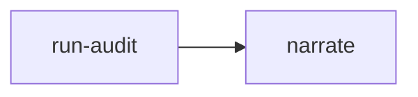

# AIDD Harness

## Actions

Read only the next action's file before running it.

| # | Action | Does |
| --- | --- | --- |
| 01 | `run-audit` | Publishes the bundled harness contract for the current repository. |
| 02 | `narrate` | Explains the findings without modifying the repository. |

## Transversal rules

- Audit only the repository open in the current session.
- Use the plugin's bundled binary, never a checkout binary.
- Never edit a harness file, a rule, or a machine configuration as part of this skill.
